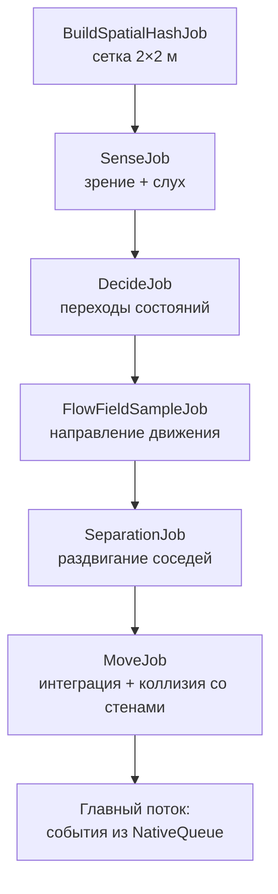
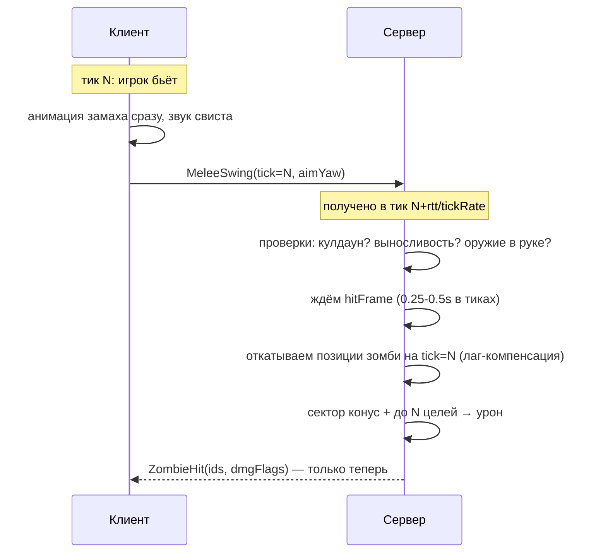
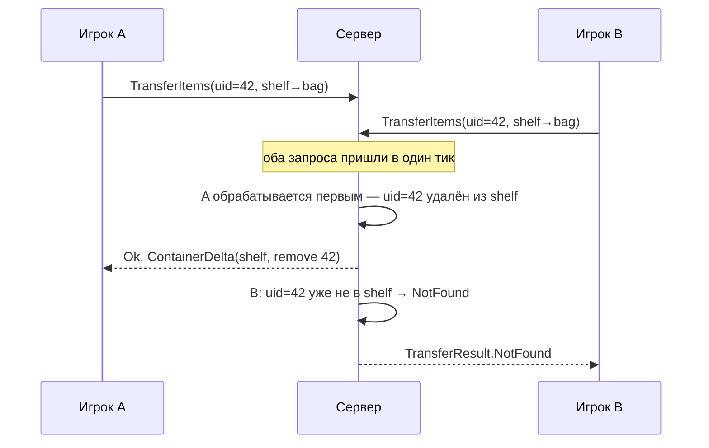
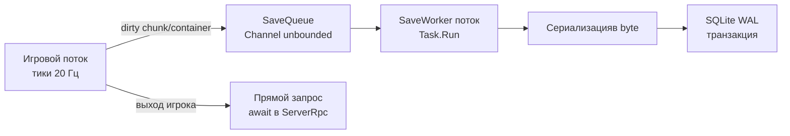
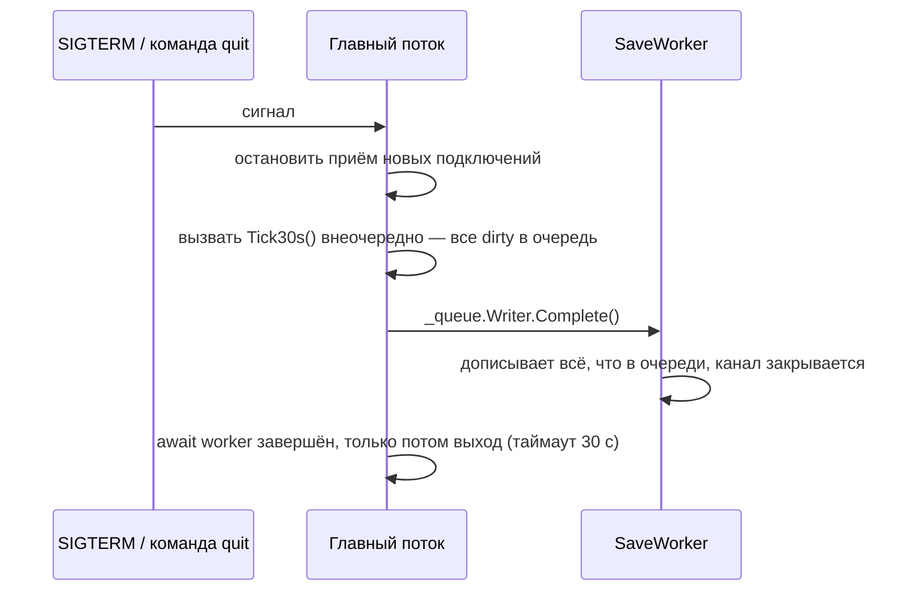
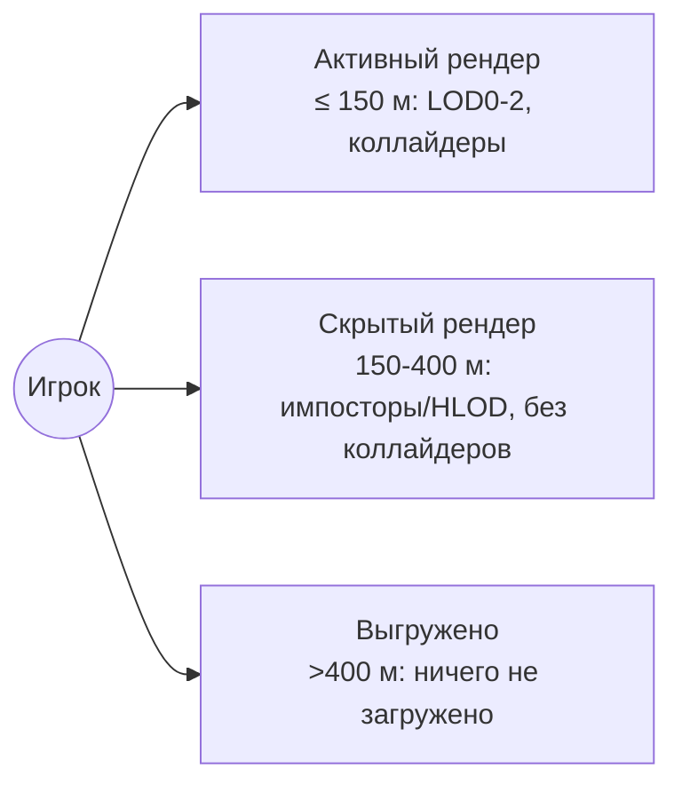
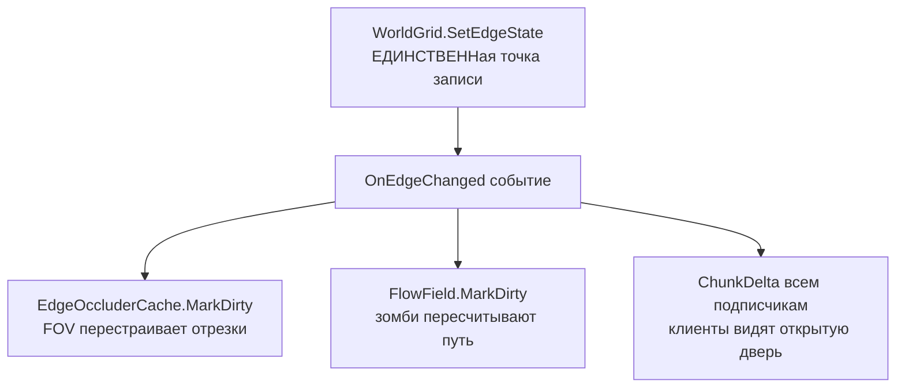
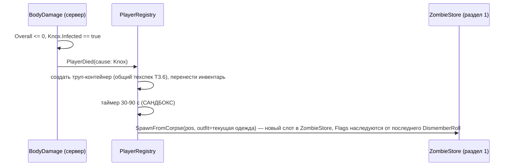
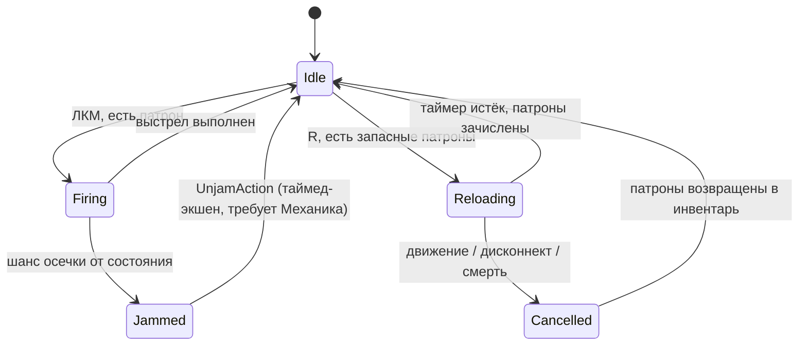

# Сложные механики — техдизайн

Sep 24, 2026 · онлайн-версия: https://claude.ai/code/artifact/3981f2db-b091-49da-9566-9d586f615969

Семнадцать механик из GDD, которые легко сломать на 200 игроках: ошибка в них даёт не баг, а либо дупликат предметов, либо падение сервера под нагрузкой. Оценка — в сумме 7–9 недель на всё, включая пять новых разделов 12–16 (голосовой чат, права на постройки, транспорт, фермерство, погода).

## 0. Почему именно эти механики

| № | Механика | Почему сложная | Что сломается, если сделать наивно |
| --- | --- | --- | --- |
| 1. Зомби-орда | Тысячи автономных агентов в реальном времени на CPU сервера | `NavMeshAgent` на 3000 юнитов кладёт тик сервера за секунды |  |
| 2. Предсказание и сверка | Клиент должен чувствоваться отзывчиво при пинге 100–150 мс, но сервер никогда не доверяет | Спидхак, телепорты через стены, удары «через полсекунды», рассинхрон камеры |  |
| 3. Транзакции инвентаря | 200 игроков тянут один и тот же лут из одного шкафа | Двоение предметов, потеря вещей при рассинхроне, дюп через повторный запрос |  |
| 4. Расчленёнка | Сервер хранит только 1 байт на зомби, клиент рисует кровь и оторванные части | У разных игроков разные руки/ноги у одного зомби, десинх с анимацией |  |
| 5. Сохранения | Мир на 4×4 км не помещается в один snapshot, сервер никогда не останавливается | Потеря прогресса при краше, битая БД при патче |  |

Остальные системы из GDD (готовка, фермерство, погода) — обычный состояния и таймеры, там нечего бояться. Здесь — только то, где ошибка в архитектуре дорого стоит переделать.

## 1. Зомби-орда: ИИ на тысячах юнитов

Самая тяжёлая задача проекта. `NavMeshAgent` и `Physics.Raycast` на каждого зомби умирают сервер уже на 200–300 активных; надо 3000+.

### 1.1 Почему NavMesh не подходит

|  | NavMeshAgent | Наше решение |
| --- | --- | --- |
| Стоимость одного агента | \~0.02–0.05 мс на поиск пути + стоимость авойданса | без A\* на юнит, один расчёт поля на толпу |
| Память | GameObject + Transform + компоненты ≈ 1–2 КБ на зомби | struct в NativeArray, 32–64 байта на зомби |
| Многопоточность | главный поток, нельзя распараллелить | Jobs + Burst, все ядра CPU |
| Runtime-стоимость обхода | считает каждый агент сам | один flow-филд на всех, кто идёт к одному игроку |

### 1.2 Архитектура данных (ссылка на T6.1 техспеки, здесь — детали)

```csharp
// Structure of Arrays: каждое поле в своём NativeArray — job читает только нужные массивы, кэш попадает лучше
public sealed class ZombieStore {
    public NativeArray<float2> Pos;         // горячие: читают каждый job каждый тик
    public NativeArray<float> Yaw;
    public NativeArray<byte> State;         // ZState: Idle, Wander, Investigate, Chase, Attack, Search, Stagger, Fallen, Thump, Crawl
    public NativeArray<float> StateTimer;
    public NativeArray<int> TargetPlayer;   // -1 = нет
    public NativeArray<byte> SimLevel;      // 0 вирт, 1 спящий, 2 активный — определяет, какие job его трогают
    public NativeArray<int3> ChunkFloor;    // для пространственного хеша и запросов к тайлам
    // холодные, читаются редко: Health, OutfitId, LootSeed, Generation — в отдельном массиве ZombieCold
    public NativeQueue<int> FreeSlots;      // переиспользование слотов вместо Destroy/Instantiate
}
```

Главное правило: **зомби не GameObject, пока они не в радиусе визуала какого-то клиента**. Клиентский GameObject создаётся только для рендера, и то из пула (см. T6.6).

### 1.3 Цепочка job'ов за тик



Все job цепляются через `JobHandle` без синхронных `Complete()` между ними; только в конце тика `handle.Complete()` перед чтением результата главным потоком.

### 1.4 Flow-филды: один расчёт на тысячи зомби

Главная идея: не считать путь для каждого зомби, а один раз посчитать поле направлений «куда идти, чтобы прийти к цели» для всей окрестности, а каждый зомби просто читает вектор из своей клетки.

```csharp
public struct FlowField {
    public int2 Origin; public int2 Size;             // окно 128×128 тайлов вокруг цели
    public NativeArray<ushort> Cost;                   // стоимость от цели (Dijkstra), 65535 = недостижимо
    public NativeArray<byte> Dir;                       // 8 направлений, предвычислено из Cost
    public int Floor; public int TargetPlayerId;        // кому принадлежит
}
```

**Построение (BFS от цели, а не к ней):**

1. Старт в клетке игрока, стоимость 0.
2. Широта BFS по 4 соседям, штраф через `BlocksSight`-грани (те же данные, что и у FOV — один источник правды о стенах) или закрытую дверь блокируются, но с меньшим приоритетом (зомби предпочитают открытый путь, но всё равно ломится, если открытого нет).
3. Стоимость тайла с закрытой дверью = 40 (вместо 1) — так BFS естественно огибает вокруг, если есть другой вход.
4. `Dir[i]` = направление к соседу с минимальным Cost (8-связность для диагоналей, чтобы зомби не шли только по клеткам).

**Сложность:** BFS на 128×128 = 16384 клетки — порядка 0.3–0.5 мс в Burst. На 200 игроков не считаем 200 полей каждый тик:

- Поле пересчитывается только если игрок сдвинулся больше чем на 8 м или сменилась геометрия (открылась дверь) в его окне.
- Игроки, стоящие близко друг к другу (< 32 м), делят одно поле на группу (multi-source BFS с несколькими стартами).
- Пересчёт размазан по тикам: не больше 8 полей за тик (`RebuildQueue`, FIFO), остальные ждут своей очереди — зомби просто идут по старому полю ещё несколько тиков, это незаметно.
- Зомби вне всех полей (нет цели рядом) в состоянии Idle/Wander — простой случайный блужд без поиска пути.

### 1.5 Сепарация без физики

Стадность из 500 зомби в коридоре не должна превратиться в кашу из коллайдеров. Вместо Rigidbody — `SeparationJob` через тот же пространственный хеш (клетки 2×2 м из 1.3):

```csharp
[BurstCompile]
struct SeparationJob : IJobParallelFor {
    [ReadOnly] public NativeParallelMultiHashMap<int2, int> SpatialHash;
    [ReadOnly] public NativeArray<float2> Pos;
    public NativeArray<float2> DesiredVel;          // вход: из flow-филда; выход: скорректировано
    public void Execute(int i) {
        float2 push = 0;
        foreach (var j in NeighboursOf(SpatialHash, Pos[i]))            // только 9 соседних клеток
            if (j != i) {
                float2 d = Pos[i] - Pos[j]; float dist = math.length(d);
                if (dist < 0.6f && dist > 1e-4f) push += d / dist * (0.6f - dist);  // радиус зомби ~0.3 м
            }
        DesiredVel[i] = math.normalizesafe(DesiredVel[i] + push * 2f) * math.length(DesiredVel[i]);
    }
}
```

Запрос только в 9 соседних ячейках хеша — не перебор всех 3000. Честное превышение плотности — не баг, а механика: в толпе труднее пробиться, как в PZ.

### 1.6 Столкновение со стенами

Без PhysX. После применения скорости — проверка пересечения с `BlocksSight`-гранью на пути из T6.2 (тот же DDA-примитив, что и в FOV): если новая позиция пересекает стену, зомби скользит вдоль неё (проекция скорости на касательную). Закрытая дверь останавливает → `State = Thump`.

### 1.7 Уровни симуляции — где экономить

Ссылка на T6.4, здесь — что конкретно отключается на каждом уровне:

| Уровень | Частота тика | Что считается |
| --- | --- | --- |
| Virtual | 1 раз в 10 с | Только числоо значение в `ChunkPopulation`, без позиций отдельных зомби |
| Sparse | 1–2 Гц | Pos, грубое блуждание к flow-филду, без SenseJob и без атаки |
| Active | 20 Гц | Полный конвейер из 1.3, включая атаку и сепарацию |

Переход Virtual → Sparse происходит не по дистанции до ближайшего игрока напрямую, а по принадлежности чанка к чьей-то AOI — так нет постоянного пересчёта дистанций для каждого зомби каждый игроковой тик.

### 1.8 Подводные камни

| Симптом | Причина | Решение |
| --- | --- | --- |
| Зомби застревают в тупике без открытого пути | Cost = 65535, все соседи тоже | `Dir = None` → состояние Idle, не дёргаются на месте |
| При открытии двери вся толпа резко дёргается | поле пересчиталось за 1 тик | дебаунс 0.3–0.5 с на применение нового направления (как в PZ — не мгновенная реакция) |
| Два игрока рядом — два поля конкурируют, зомби дёргаются между ними | оба поля валидны, цель меняется каждый тик | гистерезис выбора цели: смена только если новая цель ближе текущей минимум на 20% |
| Burst-job крашится на делении на 0 или NaN | `math.normalizesafe` не всюду | все нормализации только через `normalizesafe`, unit-тест на нулевой вектор в CI |
| 200 игроков в одной точке → 3000 активных одновременно | худший случай — все в Active | жёсткий лимит Active на сервер (напр. 2500), сверху — в Sparse даже в радиусе видимости |

### 1.9 План по дням (внутри M5 роадмапа GDD)

- [ ] День 1 — `ZombieStore` (NativeArray-поля), `FreeSlots`, миграция существующего `ZombieController` на данные без поведения.
- [ ] День 2 — `BuildSpatialHashJob` + `SeparationJob`, тест на 1000 статичных точек в одном месте.
- [ ] День 3–4 — `FlowField`: построение BFS, чтение `BlocksSight`, gizmo-визуализация стрелок.
- [ ] День 5 — `RebuildQueue`, очередной пересчёт, тест “открыл дверь → через 0.5 с зомби повернули”.
- [ ] День 6 — `DecideJob`: состояния из T6.3, переходы, таймеры.
- [ ] День 7 — `MoveJob` со столкновением стен, связка всех job в цепочку.
- [ ] День 8 — Уровни симуляции, переходы Virtual/Sparse/Active по AOI-чанкам.
- [ ] День 9–10 — Нагрузочный тест: 3000 активных зомби + 32 бота, замер таблицы из T6.2 техспеки.

**Готово, когда:** 3000 активных зомби дают тик сервера меньше 25 мс; орда обходит закрытую дверь за другим входом; два игрока в разных частях дома не делят одну толпу.

## 2. Предсказание и серверная сверка

Сервер — единственный источник правды (GDD 13). Но если клиент просто ждёт ответа сервера перед каждым шагом, игра ощущается как тягучая на пинге 100–150 мс. FishNet даёт готовый Prediction v2 (Replicate/Reconcile), но бой и зомби требуют своей логики сверху.

### 2.1 Движение: Replicate/Reconcile

```csharp
public struct MoveReplicateData : IReplicateData {
    public float2 Dir; public bool Sprint, Crouch; public byte Tick;   // ввод, не результат
}
public struct MoveReconcileData : IReconcileData {
    public float3 Position; public float Yaw; public float Endurance;  // только числа, влияющие на движение
}

// Оба метода вызываются ИОДНОЙ и той же логикой — иначе клиент и сервер разойдутся
[Replicate]
private void Move(MoveReplicateData data, ReplicateState state = ReplicateState.Invalid, Channel channel = Channel.Unreliable) {
    float speed = ComputeSpeed(data.Sprint, data.Crouch, _endurance, _mods);  // ЧИСТАЯ функция, без side-effects
    _controller.Move(new float3(data.Dir.x, 0, data.Dir.y) * speed * (float)base.TimeManager.TickDelta);
    if (data.Sprint) _endurance -= SprintDrainRate * (float)base.TimeManager.TickDelta;
}

[Reconcile]
private void ReconcileMove(MoveReconcileData data, Channel channel = Channel.Unreliable) {
    transform.position = data.Position; transform.eulerAngles = new float3(0, data.Yaw, 0);
    _endurance = data.Endurance;
}
```

- Сервер выполняет тот же `Move()` из пришедшего ввода, клиент — из своего локального сразу после нажатия кнопки. FishNet автоматически хранит историю ввода и ресимулирует все тики после `Reconcile`, если серверная позиция расходится с предсказанной.
- **Главное правило:** `Move()` — чистая функция без `Random`, без чтения внешнего состояния кроме `Reconcile`-полей. Если в нёй просочится `WorldGrid.IsWalkable` — клиент и сервер должны видеть одинаковые данные в этот момент времени — иначе постоянный rubber-banding на границах комнат.
- `MoveReconcileData` маленькая намеренно: в неё НЕ кладётся инвентарь или здоровье — только то, что влияет на траекторию этого тика.

### 2.2 Бой: предсказание без урона, урон только с сервера

Удар не предсказывается как `Replicate` — это открыло бы дверь для читерского клиента: он мог бы сам себе прислать урон. Вместо этого — **косметика сразу, урон позже**.



Сервер откатывает позиции зомби на момент удара игрока, а не на момент получения пакета. Иначе при пинге 100 мс игрок видит удар по цели, а сервер говорит «мимо».

### 2.3 Лаг-компенсация: откат времени без раздувания памяти

```csharp
public sealed class LagCompensationBuffer {
    const int HistoryTicks = 8;                          // 400 мс при 20 Гц — потолкает пинг до ~350 мс
    NativeArray<float2>[] _posHistory;                    // кольцевой буфер на 8 кадров, рядом с ZombieStore
    int _head;

    public void SnapshotTick() {                          // в конце каждого тика сервера
        _posHistory[_head].CopyFrom(ZombieStore.Pos);
        _head = (_head + 1) % HistoryTicks;
    }

    public NativeArray<float2> GetPositionsAt(int ticksAgo) =>
        _posHistory[(_head - 1 - math.clamp(ticksAgo, 0, HistoryTicks - 1) + HistoryTicks) % HistoryTicks];
}
```

- Когда приходит `MeleeSwing(tick=N)`, сервер считает `ticksAgo = CurrentTick - N` (с клампом до 8, иначе старый tick отклоняется с `InvalidTick`) и берёт позиции зомби из `GetPositionsAt(ticksAgo)`, а не текущие.
- Память не растёт: буфер фиксированного размера на весь `ZombieStore` целиком, а не по игрокам — восемь копий по 3000 × 8 × 8 байт ≈ 192 КБ.
- **Побочный эффект:** цель может быть уже убита к моменту, когда сервер обрабатывает удар (два игрока бьют одного зомби одновременно). Проверка `IsAlive` прямо перед нанесением урона, не в момент приёма запроса.
- **Граница:** лаг-компенсация даёт атакующему преимущество (он видит цель там, где она была для него), поэтому кламп в 8 тиков — баланс между «честно для атакующего» и «не даёт бить то, что уже секунду назад убежало».

### 2.4 Стелтеринг камеры и чужие персонажи

- Свой игрок: камера (`CameraController`) следует за предсказанным `transform`, который FishNet Prediction исправляет без видимых скачков (`Graphical Smoothing`, встроен в FishNet, сглаживает расхождение за 2–3 кадра).
- Чужие игроки: `NetworkTickSmoother` или свой интерполятор между двумя последними SyncVar-позициями с буфером в 100 мс (как interpolation delay в Source-подобных сетевых моделях) — иначе чужие либо дёргаются по тикам, либо проскакивают сквозь геометрию при резком телепорте.

### 2.5 Защита от читерства внутри предсказания

| Атака | Проблема | Защита |
| --- | --- | --- |
| Спидхак | клиент присылает `Dir` больше 1 | `Move()` нормализует `Dir` перед использованием — одинаково на клиенте и сервере |
| Телепорт через стены | клиент шлёт позицию вместо ввода | `Replicate` никогда не принимает позицию от клиента — только Dir/флаги |
| Скорость движения | выносливость/износ/вес подделываются | все источники скорости — только в `ModifierStack`, который считает только сервер |
| Рейт-хиты в бою | клиент шлёт бесконечные `MeleeSwing` | rate limit на RPC (GDD 13.4), минимальный интервал = `SwingTime` оружия минус 5% |
| Бессмертный клиент | отключил шейдер FOV/геометрию | видимость читается только на сервере (`ServerLosFilter` из дока FOV) — клиентская тень не влияет на результат |

### 2.6 Тесты

- **Latency Simulator FishNet** (встроен, включается в настройках Transport) — искусственный пинг 50/150/300 мс + потеря пакетов 2–5% на каждой PR с сетевым кодом.
- Автоматический тест: бот бьёт зомби при пинге 200 мс → урон должен прийти в 90%+ случаев, когда визуально клинок попал по цели.

**Готово, когда:** движение ощущается мгновенным при пинге 150 мс; удар по видимой цели попадает даже при её движении; чит-трейнер со скоростью ×5 или безконечными ударами не даёт эффекта.

## 3. Конкурентные транзакции инвентаря

На 200 игроках два человека у одного шкафа — норма, не редкий случай. Без защиты от гонок предмет может удвоиться, или исчезнуть вовсе.

### 3.1 Где рождаются гонка



Проблема не в этом кейсе — он корректен. Проблема в трёх других:

1. **Составные действия.** Крафт читает 3 предмета из шкафа, а затем списывает их после таймера — между проверкой и списанием проходит время, за которое кто-то ещё заберёт один из них.
2. **Параллельные изменения веса.** Два игрока кладут в один рюкзак одновременно — оба проверяют вместимость по текущему `TotalWeight`, оба проходят, в итоге рюкзак переполнен.
3. **События не видят чужих изменений.** Игрок A открыл контейнер и видит его состояние на момент открытия. Если игрок B забрал предмет без `ContainerDelta` игроку A — A пытается взять уже не существующий предмет.

### 3.2 Решение: все операции с контейнерами — атомарные и однопоточные

Главное правило: **любая транзакция над `ItemContainer` выполняется целиком в одном методе, без `await` внутри и без чтения-паузы-записи**. Сервер однопоточный внутри тика — это даёт атомарность бесплатно, только не нарушать это асинхронным кодом внутри обработчика.

```csharp
public sealed class InventoryService {
    // ОДИН метод на всё: взять с земли, переложить между сумками, забрать из трупа — всё через этот метод
    public TransferResult Transfer(PlayerSim who, uint itemUid, ContainerId from, ContainerId to, ushort count) {
        var fromC = Resolve(from); var toC = Resolve(to);
        if (fromC == null || toC == null) return TransferResult.NotFound;

        // 1. ПРОВЕРКИ — читают свежий серверный состояние, не то, что видел клиент при открытии
        int idx = fromC.IndexOf(itemUid);
        if (idx < 0) return TransferResult.NotFound;
        var item = fromC.Items[idx];
        if (item.Count < count) return TransferResult.NotFound;
        if (!HasAccess(who, fromC) || !HasAccess(who, toC)) return TransferResult.NoAccess;
        if (Distance(who, fromC) > MaxReachM || Distance(who, toC) > MaxReachM) return TransferResult.TooFar;
        float addedWeight = ItemWeight(item, count);
        if (toC.TotalWeight + addedWeight > toC.Capacity) return TransferResult.NoSpace;

        // 2. МУТАЦИЯ — в пределах этого же вызова, никто другой не вмешается между шагами
        fromC.RemoveAt(idx, count);            // обновляет TotalWeight и Version
        toC.Add(item, count);                    // то же

        // 3. УВЕДОМЛЕНИЕ — обоим сторонам и ВСЕМ подписчикам каждого контейнера (могут быть другие игроки!)
        BroadcastDelta(fromC, ContainerOp.Remove(itemUid, count));
        BroadcastDelta(toC, ContainerOp.Add(item, count));
        return TransferResult.Ok;
    }
}
```

Важно: метод вызывается синхронно из `ServerRpc`-хендлера (тот же поток, что и тик FishNet) — никаких корутин, никаких `Task`. Второй запрос на тот же `itemUid` в том же тике просто обработается вторым и получит `NotFound` на шаге 1 — гонка решается порядком очереди RPC, без локов.

### 3.3 Таймед-экшены над инвентарём: резервирование вместо поздней проверки

Крафт, готовка, читьё — всё через `TimedAction` (см. общий техспек T0.4). Чтобы избежать пуанса из 3.1.1 — ингредиенты резервируются СРАЗУ, не перед завершением:

```csharp
public sealed class CraftAction : TimedAction {
    RecipeDef _recipe; List<(ItemContainer c, uint uid, ushort count)> _reserved;

    public override bool IsValid(PlayerSim p) {
        // каждый тик проверяет: резервация ещё действует, предметы на месте
        return _reserved.All(r => r.c.Items[r.c.IndexOf(r.uid)].ReservedBy == p.PlayerId);
    }
    public override void OnStart(PlayerSim p) {
        // ОДИН атомарный проход: пометить каждый предмет ReservedBy=p, без удаления
        _reserved = InventoryService.ReserveForRecipe(p, _recipe);   // всё или откат — без частичного успеха
        if (_reserved == null) { Cancel(p); return; }
    }
    public override void OnComplete(PlayerSim p) {
        foreach (var r in _reserved) InventoryService.ConsumeReserved(r.c, r.uid, r.count);  // теперь удалить
        InventoryService.SpawnOutputs(p, _recipe.Outputs);
    }
    public override void OnCancel(PlayerSim p) => InventoryService.ReleaseReservation(_reserved);
}
```

- `ReservedBy` делает предмет невидимым для `Transfer` других игроков (шаг 1 `Transfer` тоже проверяет `ReservedBy == 0 || == who`), но не удаляет — если крафт отменится, предмет никуда не девается.
- Зависание или дисконнект во время таймед-экшена → `OnCancel` вызывается гарантированно (сервер чистит очередь действий игрока при `OnStopConnection`), иначе резервация зависнет навсегда.

### 3.4 Репликация изменений чужого контейнера

```csharp
// Каждый ItemContainer держит список тех, кто его открыл
 public HashSet<int> Watchers;    // clientId, добавляется при OpenContainer, убирается через 3 м или при CloseContainer

 void BroadcastDelta(ItemContainer c, ContainerOp op) {
     c.Version++;
     foreach (var clientId in c.Watchers)
         TargetRpc_ContainerDelta(clientId, c.Id, c.Version, op);
 }
```

- Контейнер без `Watchers` никому ничего не шлёт — так 200 игроков не генерируют трафик для чужих шкафов на карте.
- Клиент хранит `LocalVersion` для каждого открытого контейнера. `ContainerDelta` с `fromVersion != LocalVersion` → клиент запрашивает `ContainerFull` заново — пропущенная дельта (падение пакета) не рассинхронит UI навсегда.

### 3.5 Подводные камни

| Симптом | Причина | Решение |
| --- | --- | --- |
| Предмет дублируется | `Add` до `Remove` в разных вызовах | всё в одном методе `Transfer`, никаких отдельных `RemoveItem`/`AddItem` через RPC (3.2) |
| UI игрока показывает предмет, которого уже нет | клиент не получил чужой дельте | `Watchers`-подписка (3.4), не polling |
| Зависший игрок навсегда заблокировал рецепт | `ReservedBy` не сброшен при дисконнекте | глобальный `OnStopConnection` отменяет все активные `TimedAction` игрока (тест-обязателен) |
| Стак предметов в одном тике (100 гвоздей взяли два игрока) | `Count` тоже часть одного `ItemInstance` | частичное списание стака — внутри того же одного метода `Transfer`, атомарно |
| Сервер читает асинхронно (напр. из file I/O в точке crafting) | `await` внутри транзакции отдаёт поток | правило код-ревью: `Transfer`, `Craft`, все методы `InventoryService` — только синхронный код |

### 3.6 Тесты

- **PlayMode:** 2 бота одновременно шлют `Transfer` на один `itemUid` 1000 раз — итоговое кол-во предмета в мире всегда = 1.
- **EditMode:** `ReserveForRecipe` возвращает null и ничего не трогает, если хотя бы один ингредиент недоступен.

**Готово, когда:** два игрока одновременно тянут один предмет без дупликата; отменённый крафт возвращает ингредиенты; дисконнект во время действия не зависит чужие предметы навсегда.

## 4. Расчленёнка: серверная правда против клиентского визуала

Серверу важен только геймплейный эффект (без руки — только укус, без ног — ползёт). Сама анимация отрыва — чисто клиентская, и она не должна влиять на то, что видит сервер. Сложность в том, чтобы эти две картины не расошлись и не требовали лишний сетевой трафик на 3000 зомби.

### 4.1 Две независимые системы, один бит между ними

```mermaid
flowchart LR
  subgraph Server[Сервер — геймплей]
    HP[BodyPartHealth] -->|≤ 0| Flag[ZombieCore.Flags |= NoArmL]
    Flag --> Msg[ZombieDismember tick, mask]
  end
  subgraph Client[Клиент — визуал]
    Msg --> Pick[выбрать точку разрыва из анимации удара]
    Pick --> Hide[скрыть меш руки]
    Pick --> Spawn[спавн куска с Rigidbody]
    Pick --> VFX[кровь: декали + частицы]
  end
```

**Сервер не знает про куски, геометрию и частицы.** Геймплейные последствия (без ног — ползёт, без рук — только укус) читают только одно поле — `ZombieCore.Flags` из T6.1 техспеки (тот же байт, что даёт `Crawler`, `Sprinter` и т.д.). Никаких трансформов костей на сервере.

### 4.2 Конвейер отрыва на сервере

```csharp
public struct DismemberRoll {
    // вызывается в тот же момент, что и обычный урон в конвейере удара (см. раздел 2.2)
    public static byte? TryDismember(in WeaponMeleeComp w, BodyPartId hitPart, float finalDamage, ref Random rng) {
        if (!w.CanDismember || hitPart is BodyPartId.Head or BodyPartId.TorsoUpper) return null;   // витальные части не отрываются
            var chance = w.DismemberMul * (finalDamage / MaxHealthOf(hitPart));
        if (rng.NextFloat() > chance) return null;
        return FlagFor(hitPart);              // BodyPartId.ForearmL -> ZombieFlags.NoArmL
    }
}
```

- Шанс растёт с уроном удара и типом оружия (рубящее ×3, как в GDD 9.7). Голова и верх торса не отрываются — отрыв головы обрабатывается как смерть, без отдельного флага.
- `Flags` входит в `ZombieMoveMsg`/`ZombieEventBatch` (T6.5 техспеки) — отдельного сообщения не нужно, оно уже часть пакета о зомби.

### 4.3 Что делает клиент, получив флаг

```csharp
// Существующий GoreSystem/BodyPart — остаётся как чисто клиентский визуал, но триггерится не от TakeDamage, а от сети
void OnZombieDismember(int zombieId, ZombieFlags newFlags, ZombieFlags oldFlags) {
    var changed = newFlags & ~oldFlags;                              // что именно отвалилось в этом пакете
    if ((changed & ZombieFlags.NoArmL) != 0) {
        view.HidePart(BodyPartId.ForearmL);                          // выключить SkinnedMesh части
        var severed = _limbPool.Get();                                // пул, не Instantiate (T6.7)
        severed.transform.SetPositionAndRotation(view.GetBoneWorldPos(BodyPartId.ForearmL), view.GetBoneWorldRot(...));
        severed.Rigidbody.AddExplosionForce(4f, view.transform.position, 1.5f);
        severed.DespawnIn(60f);                                        // возврат в пул через 60 с, лимит 50 на клиенте
        BloodVfx.PlayAt(severed.transform.position);
    }
}
```

Точка разрыва берётся из кости анимации на клиенте — на сервере скелета нет вообще. Если зомби виртуальный (см. техспека T6.4) и у него нет GameObject на клиенте в момент отрыва — флаг просто сохраняется, и при материализации модель сразу создаётся без части, без проигрывания анимации отрыва (она бы была ненаглядна).

### 4.4 VAT-зомби (инстансинг) не умеют расчленяться — и это архитектурное решение, не баг

Vertex Animation Texture запекает анимацию целого меша в текстуру заранее, она не умеет отдельно скрывать часть без перезапекания. Правило: **расчленёнка только у зомби в `SimLevel.Active`** (T6.7 техспеки — полный Animator + регдолл). Следствия:

- Зомби в `Sparse` или `Virtual` всё равно могут получить `DismemberRoll` (так как бой возможен только в ближнем контакте, а ближний контакт всегда означает `Active` в радиусе игрока) — конфликта нет.
- Переход `Active → Sparse` (игрок отошёл) не сбрасывает `Flags` — виртуальный зомби помнят без руки, просто без визуального куска на земле.

### 4.5 Кровь: литры данных в обмен на лимиты

Кровь — целиком визуал: нет сообщения «BloodDecal», её создание выводится из `ZombieHit`/`ZombieDismember`, которые уже идут за уроном.

```csharp
public sealed class BloodDecalPool {          // GDD 15.6: URP Decal Projector, лимит 200
    readonly Queue<DecalProjector> _active = new();
    public void Spawn(float3 pos, float3 normal) {
        if (_active.Count >= MaxDecals) { var old = _active.Dequeue(); old.gameObject.SetActive(false); _pool.Push(old); }
        var d = _pool.Count > 0 ? _pool.Pop() : Instantiate(_prefab);
        d.transform.SetPositionAndRotation(pos, Quaternion.LookRotation(-normal));
        d.gameObject.SetActive(true); _active.Enqueue(d);
    }
}
```

Старые декали вытесняются в пул, а не `Destroy` — та же схема, что и с оторванными конечностями.

### 4.6 Подводные камни

| Симптом | Причина | Решение |
| --- | --- | --- |
| У разных игроков разные конечности у одного зомби | точка разрыва выбрана локально из своей анимации | не баг: `Flags` — объективная правда (без руки у всех), визуальный момент — косметика |
| Сервер считает урон без руки, но игрок видит руку (десинх пакета) | устаревшийся `ZombieFlags` | как и для позиций — читает текущий серверный `Flags`, не кеш клиента; урон от части без HP просто не применяется |
| Кусок отлетает сквозь стену, застревает в текстуре | чистая физика без ограничений | `AddExplosionForce` с малой силой (4) и коротким радиусом (1.5 м), коллайдер куска на слое Environment, макс. скорость клампится |
| 50 зомби расчленёны одновременно → скачок FPS от 200 кусков с Rigidbody | физика кусков не бесплатная | лимит 50 на клиенте, старые вытесняются в пул, `Rigidbody.Sleep()` через 2 с покоя |

### 4.7 Тесты

- **PlayMode:** ударить зомби до отрыва при выключенном клиенте — серверный `Flags` выставлен корректно без рендера.
- **EditMode:** `DismemberRoll` никогда не возвращает флаг для головы/торса; детерминированный `Random` с фиксированным сидом — один и тот же результат на CI.

**Готово, когда:** визуально оторванная рука всегда совпадает с тем, что зомби больше не бьёт ею; виртуальный зомби помнят потери конечности без визуала; FPS не падает при массовом отстреле орды.

## 5. Сохранения: dirty-чанки, версии, краши

Сервер никогда не встаёт на паузу для сохранения (200 игроков не простят), но всё равно должен пережить краш без потери часов прогресса.

### 5.1 Почему нельзя просто «сохранить всё»

Мир 4×4 км ≈ 48 МБ тайлов (T7.1 техспеки) + инвентари 200 игроков + тысячи контейнеров с лутом. Синхронный dump всего этого раз в 5 мину заморозит тик на секунды. Решение — три принципа:

1. **Dirty-флаги, а не полный снимок.** Пишется только то, что изменилось с прошлого сохранения.
2. **Сериализация в игровом потоке, запись — в фоновом.** Сервер никогда не ждёт диск.
3. **Атомарная замена файла, а не правка на месте.** Краш в середине записи не должен разбить БД.

### 5.2 Два потока и канал между ними



Главное правило: игровой поток **никогда** не вызывает SQLite напрямую и не блокируется на дисковом I/O. Он только ставит задачу в очередь и идёт дальше.

```csharp
public readonly struct SaveJob { public SaveJobKind Kind; public object Key; public byte[] Payload; public double GameMinutes; }

public sealed class SaveWorker {
    readonly Channel<SaveJob> _queue = Channel.CreateUnbounded<SaveJob>();
    readonly HashSet<int3> _pendingChunks = new();     // дедупликация: чанк изменился 10 раз — запишем 1

    public void MarkChunkDirty(int3 chunk) {           // вызывается из игрового потока, неблокирующий
        _pendingChunks.Add(chunk);                     // только пометка, без сериализации
    }

    public void Tick30s() {                             // вызывается из IIntervalSystem (общий техспек T0.3)
        foreach (var chunk in _pendingChunks) {
            var data = WorldGrid.GetChunk(chunk);
            _queue.Writer.TryWrite(new SaveJob { Kind = SaveJobKind.Chunk, Key = chunk,
                Payload = ChunkSerializer.Serialize(data, SaveVersion.Current), GameMinutes = Clock.WorldMinutes });
        }
        _pendingChunks.Clear();
    }

    async Task RunAsync(CancellationToken ct) {         // единственный потребитель — пишет SQLite только он
        await foreach (var job in _queue.Reader.ReadAllAsync(ct)) {
            using var tx = _db.BeginTransaction();
            _db.Execute("INSERT OR REPLACE INTO chunk_deltas (cx, cy, floor, data) VALUES (?, ?, ?, ?)", ...);
            tx.Commit();
        }
    }
}
```

Снапшот `data` берётся в игровом потоке в `Tick30s()` — в этот момент данные точно не изменятся другим потоком, потому что он один. Сериализованный `byte[]` уже иммутабелен — его можно безопасно передать в другой поток.

### 5.3 Когда надо ждать запись — и как это не блокирует игроков

Сохранение персонажа при выходе — единственный случай, когда ждать надо: игрок вышел — важно, чтобы его вещи точно сохранились до того, как сервер ответит клиенту.

```csharp
// Единственный метод, где игровой поток ждёт завершения записи конкретного jobа
public async Task SaveCharacterOnDisconnect(PlayerSim p) {
    var payload = CharacterSerializer.Serialize(p);
    var tcs = new TaskCompletionSource();
    _queue.Writer.TryWrite(new SaveJob { Kind = SaveJobKind.Character, Key = p.AccountId, Payload = payload,
        OnDone = tcs });                                 // воркер вызывает tcs.SetResult() после Commit
    await tcs.Task;                                       // блокирует ТОЛЬКО этот выход, другие 199 игроков идут дальше
}
```

Всё остальное (чанки, контейнеры, машины) — файр-анд-форгет, никто его не ждёт.

### 5.4 Атомарная запись и выключение сервера



Атомарность отдельной записи даёт SQLite в режиме WAL: транзакция либо коммитится целиком, либо вовсе нет — обрыв питания посреди записи не портит БД — это гарантия движка, не нашего кода, но её надо знать и не ломать: никаких ручных `INSERT` вне транзакции.

### 5.5 Версии и миграции

Формат блоба меняется почти каждый милестоун (новое поле в `ItemInstance`, новый флаг у зомби). Без версий каждый патч вынуждает вайп мира.

```csharp
public static class ChunkSerializer {
    const ushort CurrentVersion = 4;

    public static byte[] Serialize(ChunkData c, ushort version) {   // всегда пишет текущей версией
        using var w = new BinaryWriter(...);
        w.Write(CurrentVersion); WriteBody(w, c); return stream.ToArray();
    }

    public static ChunkData Deserialize(byte[] data) {
        using var r = new BinaryReader(...);
        ushort v = r.ReadUInt16();
        return v switch {
            1 => UpgradeFrom1(ReadV1(r)),        // каждый шаг — чистая функция старые данные -> новая структура
            2 => UpgradeFrom2(ReadV2(r)),        // цепочка: v1 -> v2 -> v3 -> v4, не прямой прыжок v1 -> v4
            3 => UpgradeFrom3(ReadV3(r)),
            CurrentVersion => ReadCurrent(r),
            _ => throw new UnsupportedSaveVersionException(v)
        };
    }
}
```

- Миграция — цепочка шагов (`v1→v2→v3→v4`), каждый шаг — отдельный метод, покрыт тестом с замороженными файлами-примерами каждой версии. Никогда не удалять старый `UpgradeFromN` код, даже когда кажется никто им не пользуется — тестовый мир может лежать забытым месяц на старой версии.
- `DefId` (T0.1 общего техспека) никогда не переиспользуется — иначе старый сейв после патча будет ссылаться на чужой предмет. Удалённый предмет помечается `Deprecated` в `DefRegistry`, а не удаляется.

### 5.6 Бэкапы: защита от плохого патча, а не только от краша диска

```csharp
// Раз в час; ОБЯЗАТЕЛЬНо перед запуском новой версии сервера
db.Execute($"VACUUM INTO 'backups/backup_{DateTime.UtcNow:yyyyMMdd_HH}.db'");
RotateOldBackups(keep: 48);   // часовые бэкапы за 48 ч — можно откатиться на день назад, если миграция сломала данные
```

Бэкап перед выкаткой новой версии — не автоматический, а обязательный шаг чеклиста деплоя (GDD 18.5): если миграция повредила данные, откат на предыдущую версию должен быть возможен без потери часов.

### 5.7 Подводные камни

| Симптом | Причина | Решение |
| --- | --- | --- |
| Игровой поток иногда зависает на долю секунды | `db.Execute(...)` вызван напрямую из игрового кода вместо `SaveQueue` | линт-правило: вызовы `SqliteConnection` запрещены везде, кроме `SaveWorker.RunAsync` |
| При высокой нагрузке очередь растёт быстрее, чем опустошается | тысячи dirty-чанков за раз (например при обвале орды) | метрика `_queue.Reader.Count` в мониторинг, алерт при > 5000 — честно признаться, что диск не успевает, а не терять данные молча |
| Два выхода без выхода из-за краша сервера → два `SaveJob` на одного `AccountId` в очереди | повторный вход до завершения записи | `INSERT OR REPLACE` идемпотентен, выигрывает последний в очереди |
| Миграция падает на половине большого мира | исключение в одном чанке из тысячи | миграция почанково, каждый чанк в своей транзакции; сломанный — в `corrupt_chunks` с логом, не останавливает весь процесс |
| Version числовое поле вместо `switch` со всеми версиями | соблазн добавить v5 и забыть об v2 | code review правило: каждый PR с новой версией добавляет тест миграции со всех предыдущих версий |

### 5.8 Тесты

- **PlayMode:** выключить процесс сервера (kill -9, без graceful shutdown) во время активной записи — после перезапуска БД не повреждена (может потеряться последний незакоммиченный батч, но не всю БД).
- **EditMode:** каждая версия блоба читается и апгрейдится до текущей без исключений на замороженных файлах-примерах.

**Готово, когда:** сервер не просаживает ни на один тик из-за сохранения; выключение по sudden power loss не портит БД; обновление формата данных не требует вайпа мира.

## 6. Стриминг мира 4×4 км

Сервер держит весь мир в памяти постоянно (T7.1 техспеки, ≈ 48 МБ тайлов — это нормально). Сложная часть — клиент: он не может держать весь город в видеопамяти, и загрузка/выгрузка чанков не должна давать заметные просадки FPS.

### 6.1 Три радиуса вокруг игрока



Сервер шлёт геометрию только когда она нужна для рендера; данные о тайлах (стены, двери, лут) клиент знает только в радиусе AOI (T7.3), независимо от визуальной дальности.

### 6.2 Клиент: асинхронная загрузка без статтеров

```csharp
public sealed class ChunkStreamer : MonoBehaviour {
    readonly Dictionary<int2, AsyncOperationHandle<GameObject>> _loaded = new();
    readonly Queue<int2> _loadQueue = new(); const int MaxConcurrentLoads = 3;

    void Tick() {   // вызывается раз в 0.5 с, НЕ каждый кадр
        foreach (var c in ChunksInRadius(playerPos, LoadRadius))
            if (!_loaded.ContainsKey(c) && !_loadQueue.Contains(c)) _loadQueue.Enqueue(c);
        foreach (var c in _loaded.Keys.Where(c => Dist(c, playerPos) > UnloadRadius).ToList())
            Unload(c);                                              // гистерезис: UnloadRadius > LoadRadius
        while (_activeLoads < MaxConcurrentLoads && _loadQueue.Count > 0)
            StartLoad(_loadQueue.Dequeue());
    }

    async void StartLoad(int2 chunk) {
        _activeLoads++;
        var handle = Addressables.LoadSceneAsync($"Chunk_{chunk.x}_{chunk.y}", LoadSceneMode.Additive);
        await handle.Task;                                          // не блокирует главный поток, но и не гарантирует 1 кадр
        _loaded[chunk] = handle; _activeLoads--;
    }
}
```

- **Не больше 3 одновременных загрузок.** Без лимита быстрое движение (спринт, машина) запустит десятки загрузок сразу — все они делят CPU и I/O, кадр проседает.
- `UnloadRadius > LoadRadius` (напр. 400 и 300 м) — иначе на границе радиуса чанк выгружается и загружается каждый кадр при шагании туда-сюда.
- Приоритет в очереди — по направлению движения (чанки впереди игрока грузятся первыми), иначе при быстрой езде видны пустые дыры в домах впереди.
- Сам объект сцены чанка собирается в редакторе бейкером (см. T7.2), а не в runtime, чтобы загрузка была простым `LoadSceneAsync`.

### 6.3 Сервер: всё в памяти, но тяжёлые вычисления — только вокруг игроков

Сервер не выгружает чанки из памяти (нужны всегда для сохранений и античита), но ограничивает, где тратит CPU:

| Что | Где считается | Почему так |
| --- | --- | --- |
| Флоу-филды (раздел 1.4) | только окно 128×128 вокруг каждого игрока | всё поле на 4×4 км — избыточно, никто туда не идёт |
| Зомби Active (раздел 1.7) | только в чанках в чьём-то AOI | виртуальные зомби — число, не симуляция |
| Растения, погода | ленивый пересчёт по времени (T8.4) | не зависит от того, в памяти чанк или нет |
| Лут-таблицы | ленивая генерация (T7.4) | генерируется только при первом открытии, не при загрузке |

**Главное правило сервера:** любая периодическая система (гниение контейнеров, рост растений) итерирует не по «всем тайлам мира», а по `Dirty`-множеству, как и в сохранениях (раздел 5) — тот же паттерн повторяется везде в проекте, потому что цена обхода всего мира одинакова везде.

### 6.4 Выгрузка чанка на клиенте: незаконченные действия

Самая частая ошибка стриминга: игрок открыл контейнер в чанке, вышел из радиуса (в машине), чанк выгружается с открытым UI на экране.

```csharp
void Unload(int2 chunk) {
    if (_openContainersInChunk[chunk].Count > 0) { _pendingUnload.Add(chunk); return; }   // отложить, не рвать связь
    if (_activeTimedActionsInChunk[chunk].Count > 0) { _pendingUnload.Add(chunk); return; } // крафт/постройка в этом чанке
    Addressables.UnloadSceneAsync(_loaded[chunk]); _loaded.Remove(chunk);
}
```

Проверка повторяется каждый `Tick()`, пока чанк не освободится и игрок всё ещё вне радиуса. Сервер ждёт того же — не отправляет `ContainerDelta` игроку, который только что вышел из AOI, но и не разрывает подписку мгновенно (гистерезис выхода из T7.3).

### 6.5 Подводные камни

| Симптом | Причина | Решение |
| --- | --- | --- |
| Фриз раз в несколько секунд при быстрой езде | много чанков входят в радиус за раз | лимит 3 одновременных загрузок + очередь по направлению (6.2) |
| Чанк выгружается и тут же грузится заново на границе радиуса | `LoadRadius == UnloadRadius` | разные радиусы с гистерезисом (6.2) |
| Игрок выгружает чанк с открытым шкафом — UI зависает | выгрузка не знала про открытые контейнеры | проверка `_openContainersInChunk` перед выгрузкой (6.4) |
| Сервер тратит CPU на пустые районы | считает всё одинаково | ленивые системы + флоу-филды только у игроков (6.3) |

**Готово, когда:** быстрая езда на машине через весь город не даёт фризов; открытый шкаф не исчезает при выгрузке чанка; сервер держит CPU-нагрузку пропорционально числу игроков, а не площади карты.

## 7. Синхронизация дверей/окон/баррикад между тремя системами

Одно и то же состояние тайла — закрыта дверь — одновременно нужно трём разным системам: FOV (док `FOV.md`, раздел 3.1–3.2 — закрытая дверь блокирует взгляд), зомби-орде (раздел 1 выше — блокирует flow-филд) и системе постройки (меняет состояние). Без единой точки истины они рассинхронизуются: зомби бьют в косяк, а FOV ещё считает его закрытым.

### 7.1 Один источник правды, три подписчика



```csharp
// Единственный вход для ЛЮБОГО изменения грани — ни одна система не пишет в TileData напрямую
public void SetEdgeState(int x, int z, int floor, Dir dir, EdgeState state) {
    var tile = GetTile(x, z, floor);
    tile.SetEdge(dir, state);
    SetTile(x, z, floor, tile);
    OnEdgeChanged?.Invoke(new int3(x, z, floor));      // ОДНО событие, три подписчика — никакой очередности между ними не требуется
}
```

Главное правило: **`OpenDoorAction`, `BuildAction`, `SmashWindowAction` никогда не пишут в `TileData` напрямую** — только через `SetEdgeState`. Иначе кто-то обязателно забудет разослать событие подписчикам.

### 7.2 Почему нельзя пересчитывать всё мгновенно

Подписчики тяжёлые по-разному. Если вызывать их синхронно прямо в `SetEdgeState`, открытие двери в толпе из 50 игроков завалит тик.

| Подписчик | Стоимость | Когда реагирует |
| --- | --- | --- |
| `EdgeOccluderCache` (FOV, раздел 5 дока FOV) | пересборка отрезков чанка, лёгко | при следующей отрисовке маски (до 20 Гц) |
| `FlowField` (раздел 1.4) | BFS на 128×128, тяжёло | через `RebuildQueue`, ≤ 8 полей за тик |
| `ChunkDelta` игрокам | сеть, дешёво | сразу, всем `Watchers` чанка |

Оба тяжёлых потребителя читают dirty-чанки батчами, а не подписываются на событие напрямую — тот же паттерн, что и в 3.3 дока FOV, повторяется здесь без изменений.

### 7.3 Окно особо опасно: три состояния в одной грани

У двери только «закрыто/открыто», а у окна — комбинация: целое/разбитое × занавеска/без × забито досками/нет. Каждая система смотрит на свою комбинацию:

```csharp
// Общий техспек T0—Sight.BlocksSight уже даёт правило для взгляда (док FOV 3.1). Для проходимости — СВОЁ правило, тот же бит может блокировать взгляд, но не ходьбу, и наоборот
public static bool BlocksWalk(in TileData t, Dir d) {
    if (t.Has(WallFlag(d))) return true;
    if (!t.Has(WindowFlag(d))) return Sight.BlocksSight(t, d);      // дверь и глухая стена — одинаково для взгляда и ходьбы
    var s = t.Edge(d);                                              // окно — исключение: занавеска блокирует взгляд, но не ходьбу
    return (s & EdgeState.Boarded) != 0;                            // забитое ≥ 2 досками окно блокирует и ходьбу
}
```

Занавеска на окне закрывает взгляд (FOV и зрение зомби), но не мешает зомби лезть через него при штурме из соседней комнаты — это разные биты того же `EdgeState`, и путаются в разные функции.

### 7.4 Баррикады: градация, а не бинарное состояние

Баррикада — до 4 досок (GDD 11.3), каждая добавляет HP и не меняет `EdgeState` до тех пор, пока не выбита полностью:

```csharp
public sealed class BarricadeState {
    public byte PlankCount;         // 0-4
    public ushort Hp; public ushort MaxHp;    // MaxHp = f(PlankCount)
    public bool BlocksSight => PlankCount > 0;             // видимость падает сразу от первой доски
    public bool BlocksWalk  => PlankCount >= 2;             // но пролезть труднее только с 2+ досок
}

// Зомби бьют по 15 HP в 1.5 с в Thump (раздел 1.6), Hp достигает 0 → PlankCount-- и SetEdgeState заново
```

Сервер пересчитывает `BlocksSight`/`BlocksWalk` только когда `PlankCount` пересекает порог (0→1, 1→2), а не на каждом ударе по HP.

### 7.5 Подводные камни

| Симптом | Причина | Решение |
| --- | --- | --- |
| Зомби видят игрока через только что открытую дверь ещё полсекунды | flow-филд не пересчитан, LOS уже прошёл | ожидаемо — flow-филды обновляются с задержкой, как в PZ (1.8); LOS для зрения читает грань напрямую |
| Игрок ломает баррикаду, а FOV ещё считает окно закрытым | изменение HP баррикады не вызвало `SetEdgeState` | вызывать только при пересечении порога `PlankCount` (7.4), не на каждом ударе |
| Два игрока одновременно строят окно и дверь в одном месте | два `BuildRequest` на одну грань | та же гарантия, что и в разделе 3.2: обработка запроса — один синхронный метод, второй запрос видит уже изменённую грань |

**Готово, когда:** открытая дверь одновременно открывает взгляд, пускает зомби и показывается у других игроков без рассинхрона; сбитая баррикаду не пересчитывает flow-филды на каждом ударе.

## 8. Инфекция Knox: серверное состояние, которого нет на клиенте

В PZ игрок никогда не знает наверняка, что заражён вирусом (GDD 6.5). Сложность — не в самой инфекции, а в том, чтобы игра выглядела честно: любой бит об инфекции на клиенте — это дыра для читера, который читает память процесса.

### 8.1 Разделение: что видит сервер, что — владелец

```csharp
// Живёт ТОЛЬКО на сервере, в BodyDamage (общий техспек T3.1) — никакого SyncVar/[Reconcile]
public sealed class KnoxState {
    public bool Infected;
    public double InfectedAtGameMinutes;
    public byte Stage;                 // 0 скрыто, 1 "тошнота", 2 "лихорадка", 3 урон в час до смерти
    public InfectionSource Source;     // Bite / Scratch(редко) / Laceration(редко) — для лога и античита
}

// То, что действительно уходит владельцу — намеренно РАЗМЫТО
public struct VisibleSymptoms {          // TargetRpc клиенту, часть StatsSnapshot (общий тезспек T2.4)
    public bool Nauseous; public bool Feverish; public bool Unexplained;  // общие симптомы простуды/отравления тоже их дают
}
```

Клиент никогда не получает `Infected` или `Stage` напрямую — только те же симптомы, что дают обычная простуда или болезнь от грязной воды (GDD 6.6). Игрока нарочно вводят в заблуждение: «Tashi тошнит» может означать как Knox, так и просто просроченную банку.

### 8.2 Где протекают честные игры

| Точка | Утечка | Защита |
| --- | --- | --- |
| Логи сервера | серверный лог пишет «Player X infected» в открытый файл | отдельный уровень лога `Sensitive`, не пишется в общий файл, доступен только админу |
| Сериализация в сохранениях | `CharacterSerializer` кладёт весь `BodyDamage` целиком | блоб шифруется на диске (общий техспек T11 — блоб в SQLite; AES над blob'ом, ключ только у сервера) |
| Сетевой сниффер | читер ловит все пакеты и ищет поле Infected | поле просто не покидается — наблюдателя нет, анализировать нечего |
| UI и анимации на клиенте | артист случайно добавил отдельную анимацию/иконку «только для Knox» | code review правило: любой визуальный эффект на клиенте обязан быть объясним и без инфекции (напр. от высокой температуры) |

### 8.3 Переход в симптомы: один метод, два выхода

```csharp
public void TickKnox(PlayerSim p, float dtHours) {          // вызывается в тике здоровья (общий техспек T3.4)
    var knox = p.Body.Knox; if (!knox.Infected) return;
    var hoursSince = (Clock.WorldMinutes - knox.InfectedAtGameMinutes) / 60.0;
    knox.Stage = hoursSince switch { < 24 => 0, < 48 => 1, < 72 => 2, _ => 3 };

    // СИМПТОМЫ: общий пул с обычными болезнями — чтобы игрок не отличил по логике "появился без причины = Knox"
    if (knox.Stage >= 1) SetSymptom(p, Symptom.Nauseous, chance: 0.7f);
    if (knox.Stage >= 2) SetSymptom(p, Symptom.Feverish, chance: 0.9f);
    if (knox.Stage == 3) p.Body.ApplyGenericDamage(HourlyKnoxDamage * dtHours);   // тот же путь, что голод/жажда (общий техспек T3.2)
}
```

Стадии — только для внутренней логики, не для отображения. То, что видит игрок, проходит через тот же `VisibleSymptoms`, что и обычные болезни.

### 8.4 Смерть от Knox → спавн зомби без видимого шва между системами



Новый зомби входит в `ZombieStore` через тот же `FreeSlots.Dequeue()`, что и любой другой зомби — отдельного пути для трансформации игрок → зомби не нужно.

### 8.5 Подводные камни

| Симптом | Причина | Решение |
| --- | --- | --- |
| Игроки обсуждают в чате «у тебя точно Knox» по анимации/звуку | какой-то визуальный триггер отличается от обычной болезни | дизайн-правило (не код): все анимации симптомов общие для Knox и болезней, как в PZ |
| Админ-команда отладки показывает Knox всем подряд | `debug player info` пишет всё в консоль | Knox-поля показываются только в отдельной admin-команде с логированием вызова |
| PvP-выстрел может «случайно» заразить Knox | пуля в ране так же триггерит инфекцию | намеренно: `InfectionSource` в GDD не отключает Bite/Scratch для PvP-ран; баланс выносить в SandboxSettings отдельным флагом |

### 8.6 Тесты

- **EditMode:** `TickKnox` никогда не выставляет `Stage` назад при откате времени (миграция часов назад при загрузке).
- **Ручной:** просмотреть сетевой трафик в Wireshark во время Knox-теста и проверить, что байты `Infected`/`Stage` нигде не ушли владельцу.

**Готово, когда:** игрок не может узнать свой Knox-статус через чтение памяти или сети; симптомы неразличимы от обычной болезни; смерть от Knox всегда приводит к корректному спавну зомби.

## 9. Перелезание через заборы и спуск из окна

Движение игрока предсказывается (раздел 2.1) и не может телепортироваться. Но перелезание через забор и вылез из окна второго этажа — это и есть контролируемый скачок позиции. Сложность — совместить это с Replicate/Reconcile, не сломав предсказание.

### 9.1 Почему это не обычное движение

`Move()` из 2.1 — чистая функция от ввода. Перелезание же — это заранее заданная траектория (кадр анимации → смещение), и её нельзя вывести из `Dir`. Если делать её как `TimedAction` (раздел T0.4 общего техспека) — она блокирует ввод, и во 0.4 с прыжка игрок видит своё тело как чужого — отстающее от ввода на весь пинг.

### 9.2 Решение: отдельный тип `Replicate`, а не `TimedAction`

```csharp
public struct VaultReplicateData : IReplicateData {
    public byte Kind;      // None, ClimbFence, ClimbThroughWindow, RopeDescent
    public sbyte StartTick; // -1 = не начато
}
public struct VaultReconcileData : IReconcileData { public float3 Position; public byte Phase; }

[Replicate]
private void Vault(VaultReplicateData data, ReplicateState state = ReplicateState.Invalid, Channel channel = Channel.Unreliable) {
    if (data.Kind == VaultKind.None) { _vaultElapsed = 0; return; }
    if (_vaultElapsed == 0) {   // первый тик действия — валидация как в обычном TimedAction.IsValid, но внутри чистой функции
        if (!CanVault(data.Kind, transform.position, out _vaultCurve)) return;   // грань есть/высока подходит/нет зомби вплотную (раздел 9.3)
    }
    _vaultElapsed += (float)base.TimeManager.TickDelta;
    transform.position = _vaultCurve.Evaluate(_vaultElapsed / VaultDuration(data.Kind));  // чистая функция от времени, детерминирована
}
```

Главное отличие от `Move()`: `_vaultCurve` вычисляется ОДИН раз на первом тике действия, дальше позиция — чистая функция от времени и этой кривой. При `Reconcile` кривая перевычисляется заново из тех же детерминированных входных, а не хранится в `ReconcileData` — иначе ресимуляция после сверки даст другую кривую.

### 9.3 Геометрическая проверка без физики

```csharp
bool CanVault(byte kind, float3 pos, out AnimationCurve3 curve) {
    var (tile, dir) = TileAndDirFacing(pos);
    switch (kind) {
        case VaultKind.ClimbFence:
            if (!tile.Has(LowFenceFlag(dir))) return Fail(out curve);        // та же система граней, что в T7.1/разделе 7
            curve = ArcOverEdge(pos, dir, height: 1.1f); return true;         // высота забора = высота дуги
        case VaultKind.ClimbThroughWindow:
            if (!tile.Has(WindowFlag(dir)) || tile.Edge(dir).HasFlag(EdgeState.Boarded)) return Fail(out curve);
            curve = ArcOverEdge(pos, dir, height: 1.0f); return true;
        case VaultKind.RopeDescent:
            if (Floor(pos) == 0 || !HasSheetRopeTiedAt(TileAbove(pos, dir))) return Fail(out curve);
            curve = VerticalDrop(pos, floors: 1); return true;
        default: return Fail(out curve);
    }
}
```

Важно: грань читается из той же `TileData`, что и FOV и зомби-орда (раздел 7.1) — нет отдельной «таблицы проходимости для перелезания». Клиент и сервер вызывают один и тот же `CanVault` — если они расходятся, будет скачок при резолве.

### 9.4 Подводные камни

| Симптом | Причина | Решение |
| --- | --- | --- |
| Игрока телепортирует при каждом перелезании | `Reconcile` пересчитывает кривую случайно иначе | кривая только из детерминированных входных (9.2) |
| Зомби идут через тот же забор без анимации | зомби не умеют перелезать | `LowFenceFlag` блокирует проход в flow-филде (раздел 1.4) так же, как обычная стена |
| Игрок атакует во время перелезания, отменяет его в воздухе | очередь действий не знает про Vault | `MeleeSwing` и `FireWeapon` (раздел 2.2) проверяют `_vaultElapsed == 0` перед обработкой |

**Готово, когда:** перелезание через забор не даёт rubber-band ни при пинге 150 мс; зомби не перелезают через те же заборы; атака во время перелезания отклоняется сервером.

## 10. Огнестрел: перезарядка и осечки как прерываемая машина состояний

Выстрел (раздел 2.2) — одноразовое действие. Перезарядка растянута на несколько секунд, её можно отменить выстрелом, её мог перебить зомби. Сложность — не дать патронам исчезнуть или удвоиться, если прервать действие посередине.

### 10.1 Состояния и точки прерывания



### 10.2 Серверная машина состояний

```csharp
public enum FirearmState : byte { Idle, Firing, Reloading, Jammed }

public sealed class FirearmSim {   // часть PlayerSim.Inventory (общий техспек T4), живёт только на сервере
    public FirearmState State; public float StateTimer;
    public uint HeldItemUid;                                    // какой предмет в руке в момент старта действия
    List<(ItemContainer c, uint magUid)> _reservedMag;          // тот же паттерн резервации, что в 3.3

    public ReloadResult TryStartReload(PlayerSim p, ItemInstance gun) {
        if (State != FirearmState.Idle) return ReloadResult.Busy;
        var mag = InventoryService.FindBestMagazine(p, gun.DefId);   // самый полный магазин в инвентаре
        if (mag == null) return ReloadResult.NoAmmo;
        InventoryService.ReserveItem(mag.container, mag.uid);       // РЕЗЕРВИРУЕМ, не забираем — как в 3.3
        HeldItemUid = gun.Uid; _reservedMag = new() { (mag.container, mag.uid) };
        State = FirearmState.Reloading; StateTimer = ReloadTimeOf(gun) * (1 - 0.05f * ReloadingSkill(p));
        return ReloadResult.Started;
    }

    public void Tick(PlayerSim p, float dt) {
        if (State != FirearmState.Reloading) return;
        StateTimer -= dt;
        if (StateTimer <= 0) CompleteReload(p);                     // АТОМАРНО: списать старый магазин, вставить новый и вернуть старый в инвентарь одним вызовом
    }

    public void Interrupt(PlayerSim p) {    // движение/атака/дисконнект во время Reloading
        if (State != FirearmState.Reloading) return;
        InventoryService.ReleaseReservation(_reservedMag);          // магазин НЕ теряется, как в 3.3 OnCancel
        State = FirearmState.Idle; StateTimer = 0;
    }
}
```

Заметь: архитектура дословно копирует `TimedAction` из общего техспека (валидация → резерв → таймер → атомарное завершение или откат), но не наследует его напрямую, потому что `FirearmSim` живёт дольше одного действия (хранит `Jammed` между выстрелами). Если кодинг-агент попытается втиснуть её в `TimedAction` напрямую — это ошибка, проверять на code review.

### 10.3 Осечки

```csharp
// Вызывается в конвейере выстрела (раздел 2.2), ДО того как патрон списан
public static bool RollJam(in FirearmComp f, byte condition, ref Random rng) {
    float chance = f.JamChanceAtZeroCondition * (1f - condition / 100f);
    return rng.NextFloat() < chance;
}
// Если осечка: патрон НЕ списывается, выстрела НЕ происходит, State = Jammed, входные флаги игнорируются
```

`UnjamAction` — обычный `TimedAction`, требует навык Механика ≥ 1 (как `RemoveObjectAction` в общем техспеке T3.5), отменяем обычным `OnCancel` (остаётся в `Jammed`, не в `Idle`).

### 10.4 Репликация и античит

- Сервер шлёт владельцу `TargetRpc FirearmStateChanged(state, timer)` — клиент играет анимацию перезарядки/досылания локально, но не решает, когда патроны реально заменятся (та же граница косметика/правда, что в разделе 4).
- `FireWeapon` (раздел 2.2) проверяет `State == Idle` ПЕРВЫМ делом — выстрел во время `Reloading`/`Jammed` отклоняется тихо, без лога чита (частая попытка спаммить входом).

### 10.5 Подводные камни

| Симптом | Причина | Решение |
| --- | --- | --- |
| Два быстрых нажатия R забирают два магазина | второй вызов `TryStartReload` не проверил `State != Idle` | проверка стоит первой строкой метода, как и в `Transfer` (3.2) |
| Перезарядка зависает навсегда после дисконнекта | `Interrupt` не вызван при выходе | тот же глобальный `OnStopConnection`-хук, что и в 3.5, теперь вызывает и `FirearmSim.Interrupt` |
| Клиент играет анимацию перезарядки без конца (осечка во время анимации) | клиент не получил `FirearmStateChanged` с Jammed | сообщение — reliable, как все `ActionStarted/Ended` в общем техспеке T10.2 |

**Готово, когда:** перезарядка, прерванная движением, возвращает магазин без дубликата; осечка требует отдельного действия и не сбрасывается сама собой; два быстрых R подряд не тратят два магазина.

## 11. Шпаргалка для кодинг-агента

Каждый раздел этого документа описывал одну механику. Но под ними лежит один и тот же набор паттернов — если агент пишет код по одному разделу без общей картины, он изобретает эти паттерны заново иначе и ломает согласованность. Перед началом любой задачи — свериться сюда.

### 11.1 Семь инвариантов, которые повторяются во всех разделах

| № | Правило | Примеры, где оно уже применено |
| --- | --- | --- |
| 1 | **Один писатель на ресурс.** Сервер однопоточный внутри тика — это даёт атомарность бесплатно, но только если в методе нет `await`/`Task` внутри. | `InventoryService.Transfer` (3.2), `SetEdgeState` (7.1) |
| 2 | **Резервировать, потом потратить.** Для любого таймед-действия над ресурсами: пометить «занято» в `OnStart`, списать в `OnComplete`, освободить в `OnCancel`. Никогда не проверять в начале и списывать в конце. | `CraftAction` (3.3), `FirearmSim.TryStartReload` (10.2) |
| 3 | **`OnStopConnection`/выход всегда отменяет активные действия игрока.** Любой новый `TimedAction`-подобный объект регистрируется в этом хуке, иначе ресурс зависнет навсегда. | 3.5, 10.5 |
| 4 | **`Dirty`-множество, а не полный пересчёт.** Любая периодическая система над большим миром итерирует только изменившееся. Никогда не «обойти все чанки» / «пересчитать все флоу-филды» каждый тик. | Сохранения (5.2), стриминг (6.3), FOV-отрезки (док FOV 3.3), flow-филды (1.4) |
| 5 | **`Watchers`/`Observers`, а не broadcast всем 200.** Любое событие о локальном объекте (контейнер, чанк) идёт только тем, кто подписан. | `ContainerDelta` (3.4), `ChunkDelta`/AOI (общий техспек T7.3) |
| 6 | **`Version`-счётчик при частичных обновлениях.** Если клиент может пропустить дельту — он должен заметить рассинхрон и запросить полный снапшот, а не молча расходиться с сервером. | `Container.Version` (3.4), `ChunkData.Version` (общий T7.1) |
| 7 | **`SetEdgeState` — единственная точка записи в `TileData`.** Ни одна система (FOV, зомби, постройка, перелезание) не меняет грани напрямую. | раздел 7.1, 9.3 |

### 11.2 Карта «где что живёт» (чтобы не искать по всему репозиторию)

| Данные | Где | Кто пишет |
| --- | --- | --- |
| Грани тайлов (`TileData`, `EdgeState`) | `WorldGrid`, клиент + сервер | только `SetEdgeState` |
| Отрезки стен для FOV | `EdgeOccluderCache`, только клиент | перестраивается сам от `OnEdgeChanged` |
| Пути для зомби | `FlowField`, только сервер | перестраивается сам от `OnEdgeChanged` |
| Данные зомби | `ZombieStore` (NativeArray), только сервер | тик-цепочка job'ов (раздел 1.3) |
| Геймплейный флаг расчленёнки | `ZombieCore.Flags`, только сервер | `DismemberRoll` в конвейере удара |
| Визуал расчленёнки (куски, кровь) | `GoreSystem`, только клиент | реагирует на изменение `Flags` из сети, никогда наоборот |
| Предметы в контейнерах | `ItemContainer` внутри `InventoryService`, только сервер | только `Transfer`/`Add`/`RemoveAt` |
| Состояние заражения (`KnoxState`) | `BodyDamage`, только сервер | никогда не в SyncVar/Reconcile напрямую |
| Состояние оружия (`FirearmSim`) | внутри `PlayerSim.Inventory`, только сервер | `TryStartReload`/`Tick`/`Interrupt` |
| Снимок предметов для сохранения | `SaveQueue`/`SaveWorker`, единственный поток | игровой поток только ставит в очередь |

### 11.3 Чеклист перед коммитом любого нового сетевого действия

- [ ] Сервер-хендлер не доверяет ничему, кроме «намерения»: проверяет владельца, дистанцию, наличие предмета/состояния заново (раздел 2.5).
- [ ] Если действие длится больше одного тика — что происходит при дисконнекте/атаке/втором таком же запросе прописано явно (правила 2—3 выше).
- [ ] Если действие меняет `TileData` — только через `SetEdgeState`, никаких прямых присваиваний полей.
- [ ] Если состояние должно быть скрыто от игрока (заражение, чужая видимость) — никаких SyncVar/Reconcile, только `TargetRpc` с уже отфильтрованными данными.
- [ ] Если система работает над «всем миром» (гниение, сохранение, респавн) — через `Dirty`-множество и лимит работы за тик, никогда не полный проход.
- [ ] Сетевое сообщение — в T10.1/T10.2 общего техспека, а не самодельное; канал и частота выбраны по аналогии с ближайшим существующим.

### 11.4 Пять вещей, которые никогда не делать

1. Не вызывать блокирующий I/O (файлы, БД, `await Task.Delay`) в игровом тике сервера — только через очередь в фоновый поток (5.2, 6.3).
2. Не доверять позицию/результат, пришедший от клиента, без пересчёта на сервере — клиент шлёт только намерение (2.5, 9.2–9.3).
3. Не делать GameObject/NetworkObject для того, что есть только в радиусе видимости одного игрока (зомби, предметы, трупы) — только данные + клиентский пул (1.2, 4.3, 5.6).
4. Не писать в общие данные (`TileData`, `ItemContainer`, `ZombieStore`) из двух разных мест кода — всегда один метод (таблица 11.2).
5. Не делать предсказуемым (`[Replicate]`) действие, результат которого необратимой (урон, трата ресурса) — только `ServerRpc` с ответом (2.2, 10.4).
6. Не считать тяжёлые вещи (BFS, полигон видимости, физика тысяч зомби) каждый кадр без гистерезиса и без размазывания по тикам (1.4, док FOV 4.2).
7. Не выключать/включать рендерер мгновенно без растворения — и не забывать про `shadowCastingMode` отдельно (док FOV 6.2, раздел 6.2 здесь).

### 11.5 Как искать нужный контекст перед задачей

1. Найти раздел в GDD.md (что делать) → тот же номер в Techspec.md (как структуры данных).
2. Если задача касается зрения/видимости — всегда смотреть FOV.md целиком, даже если задача кажется про что-то другое (двери, окна, этажи).
3. Если задача касается зомби — всегда смотреть раздел 1 этого дока целиком, даже для мелкой правки — там все инварианты памяти и job'ов.
4. Если задача касается любого действия игрока с таймером или ресурсами — сначала читать T0.4 общего техспека и раздел 3, потом уже писать.
5. Если задача касается движения/боя игрока — читать раздел 2 целиком, даже если кажется очевидным.

**Главное:** этот документ, GDD.md, Techspec.md и FOV.md — один корпус, не четыре независимых текста. Если новый код противоречит чему-то из другого дока — это не «другой модуль, можно игнорировать», а повод остановиться и спросить.

## 12. Голосовой и текстовый чат по дистанции

Проксимити-чат — must-have для survival-геймплея (услышал шаги/выстрел через стену — начал паниковать), но наивная реализация («слать голос всем в радиусе N») на 200 игроках — это до 200×200 потенциальных RTC-соединений или широковещательная рассылка аудио-пакетов всем подряд. Нужен тот же паттерн Watchers/AOI, что уже применяется для инвентаря и чанков (раздел 6), но с более жёсткими требованиями по задержке.

### 12.1 Архитектура: сервер как маршрутизатор, не как транскодер

Сервер НЕ декодирует и не микширует аудио. Он получает Opus-пакеты от клиента по ненадёжному каналу (UDP/unreliable, как позиционные Replicate), смотрит список слушателей и пересылает пакет каждому из них без изменений — чистый relay. Микс нескольких голосов делает клиент через Unity `AudioSource` (пространственный звук от позиции говорящего), не сервер.

```csharp
// Сервер: только маршрутизация, без декодинга
public void OnVoicePacket(NetworkConnection sender, VoicePacket packet)
{
    var speaker = _players[sender];
    foreach (var listenerConn in _voiceWatchers.GetListeners(speaker.TileId))
    {
        ServerManager.Broadcast(listenerConn, packet, Channel.Unreliable);
    }
}
```

### 12.2 Список слушателей — переиспользуем ObserverManager, а не считаем заново

Главное правило: не заводить отдельную систему подписки для голоса. FishNet уже поддерживает для каждого NetworkObject список наблюдателей (`ObserverManager` / кастомный `ObserverCondition`, тот же механизм, что решает «кому реплицировать это существо»). Голосовой радиус (обычно 15–20 м, больше чем радиус видимости зомби) регистрируется как ещё один `ObserverCondition` на объекте игрока — сервер получает delta списка слушателей бесплатно через тот же тик, что уже считает наблюдение.

### 12.3 Приглушение через стены — не физический рейкаст на пакет

Project Zomboid приглушает голос через стены/двери. Вместо того чтобы делать `Physics.Raycast` на каждый голосовой пакет, приглушение считается НЕ на пакет, а на изменение топологии — раз в тик слушателя пересчитывается булевый флаг `IsMuffled` через тот же `TileData.BlocksSight`-грид, что и FOV (`SetEdgeState`). Флаг живёт в watcher-записи и применяется клиентом как понижение громкости (`AudioLowPassFilter`), а не пересчитывается заново на каждый пакет.

### 12.4 Текстовый чат — тот же радиус, другой канал

Локальный текст — reliable RPC с тем же списком слушателей из 12.2. Команда `/yell` временно расширяет радиус — просто другой `ObserverCondition` с радиусом на 3 секунды. Глобальный чат (админ/OOC) — отдельный broadcast-канал без привязки к позиции, помечен, чтобы не путать с игровым текстом при логировании инцидентов.

### 12.5 Подводные камни

| Проблема | Симптом | Решение |
| --- | --- | --- |
| Отдельный голосовой AOI-пересчёт | Двойная нагрузка на тик | Один `ObserverCondition`, голос читает тот же список |
| Рейкаст на каждый пакет | CPU-шип у стены | Кэшированный `IsMuffled`, пересчёт по `OnEdgeChanged` |
| Голос по reliable-каналу | Очередь растёт при потере пакета | Только unreliable |
| Микс на сервере | Сервер становится аудио-DSP | Микс всегда на клиенте через `AudioSource` |

**Готово, когда:** 20 игроков в одной комнате говорят одновременно без потери FPS на сервере, голос глушится через закрытую дверь, `/yell` слышно на всю дистанцию по крику.

## 13. Убежища: права доступа и групповое владение

Building — не просто «поставить стену», это создание разделяемого ресурса с владельцем. Ошибка здесь — не крэш, а раздражающий геймплейный баг: чужой сломал твою баррикаду, или после выхода владельца из игры никто не может открыть дверь дома.

### 13.1 Модель прав — зона + роль, не ACL на каждый объект

Хранить список «кто может строить» на каждом объекте неприемлемо на масштабе. Вместо этого — `Safehouse` с `Zone` (набор `TileId`, тот же грид, что у FOV/зомби), списком `Members` (`SyncList` из `ClientId` + `Role`) и ссылкой `SafehouseId` на каждом тайле зоны. Проверка прав всегда через `player.HasRole(tile.SafehouseId, RequiredRole)`.

```csharp
public enum SafehouseRole { None, Guest, Member, Owner }

public bool CanModify(PlayerId player, TileId tile)
{
    if (!_safehouseByTile.TryGetValue(tile, out var safehouseId)) return true;
    var role = _safehouses[safehouseId].GetRole(player);
    return role >= SafehouseRole.Member;
}
```

### 13.2 Захват территории — тот же атомарный паттерн, что и инвентарь

Два игрока одновременно заявляют соседние тайлы одной комнаты — нужна атомарная проверка-и-запись в одном синхронном методе на сервере (тот же принцип, что в разделе 3.2: без `await` внутри), иначе получим два независимых Safehouse на одну комнату.

### 13.3 Офлайн-владелец — не блокировать дом навсегда

Если `Owner` не заходил N игровых дней, `Role` понижается до `Member` для оставшихся, любой `Member` может стать `Owner`. Это не таймер на каждый Safehouse — дешёвый lazy-проверка `LastSeen` владельца при следующей попытке действия члена в этом Safehouse — тот же ленивый паттерн, что у грядок (раздел 15) и dirty-чанков (раздел 5).

### 13.4 Подводные камни

| Проблема | Симптом | Решение |
| --- | --- | --- |
| ACL на каждый объект | Память и проверка не масштабируются | Зона + Role на Safehouse |
| Захват без атомарности | Дублирующиеся зоны | Один синхронный ServerRpc, без await |
| Владелец вышел навсегда | Дом заблокирован | LastSeen + auto-promote, ленивая проверка |

**Готово, когда:** два игрока одновременно клеймят соседние тайлы → ровно один Safehouse, гость не может открыть чужой сундук, дом переходит следующему участнику через N дней отсутствия владельца.

## 14. Транспорт: физика и сеть глубже, чем в Техспеке T9

Техспек T9 даёт верхнеуровневый контракт. Здесь — почему наивная реализация ломается на 200 игроках и как это чинить.

### 14.1 Почему WheelCollider — плохая идея на масштабе

Unity `WheelCollider` — полноценная PhysX-симуляция, 4 колеса × N машин. На 30-50 одновременно активных машинах это ощутимая нагрузка на тот же PhysX-поток, где считаются коллизии зомби-орды (раздел 1.6). Решение — двухуровневая модель: аркадная кинематика (формулы, не PhysX) для машин без пассажиров дальше видимости, полноценный `WheelCollider` только для машины, которую водит игрок в радиусе активной симуляции (тот же принцип `SimLevel`, раздел 1.7).

### 14.2 Сетевая модель — не Replicate на каждое колесо

Машина реплицируется как единый `Rigidbody`-подобный объект: ввод в одном `Replicate`-пакете от водителя (client-authoritative ТОЛЬКО для водителя, остальные пассажиры — чистые наблюдатели). Сервер валидирует ввод так же, как ходьбу (раздел 2).

```csharp
public struct VehicleReplicateData : IReplicateData
{
    public float Steer, Throttle, Brake;
    private uint _tick;
    public void Dispose() {}
    public uint GetTick() => _tick;
    public void SetTick(uint value) => _tick = value;
}

[Replicate]
void MoveVehicle(VehicleReplicateData data, ReplicateState state = ReplicateState.Invalid, Channel channel = Channel.Unreliable)
{
    if (!IsDriver(data)) return; // защита от инъекции ввода не-водителем
    ApplyArcadePhysics(data.Steer, data.Throttle, data.Brake);
}
```

### 14.3 Посадка/высадка и столкновения с ордой

Сесть водителя — тот же атомарный паттерн (раздел 3.2): `TryClaimSeat` — единственный синхронный метод. Смена водителя — переключение `Owner` NetworkObject'а, не пересоздание (иначе рвётся Reconcile-история у пассажиров). Наезд на орду из 50 зомби считается batch geometry-check через spatial hash (тот же `NativeParallelMultiHashMap` из 1.2) вместо PhysX-коллизий на каждого.

### 14.4 Подводные камни

| Проблема | Симптом | Решение |
| --- | --- | --- |
| WheelCollider на каждую машину | Просадка FPS сервера | Аркадная кинематика вне радиуса водителя |
| Пассажир шлёт Replicate-ввод | Читер телепортирует машину | Проверка IsDriver в каждом хендлере |
| Пересоздание объекта при смене водителя | Пассажиры телепортируются | Смена Owner через FishNet API |
| PhysX-коллизия на каждого зомби | Просадка при въезде в орду | Batch geometry-check через spatial hash |

**Готово, когда:** 30 машин на карте не проседают FPS, наезд на орду из 50 зомби не лагает, гонка за место водителя не дублирует посадку.

## 15. Фермерство: ленивый пересчёт роста и гонка за грядку

Похоже на T8.4 из Техспека (offline-прогресс через таймстамп), но здесь — что происходит, когда несколько игроков трогают одну грядку одновременно.

### 15.1 Растение не тикает — оно вычисляется по запросу

Стадия роста — чистая функция от `PlantedAtTick` и текущего тика (плюс модификаторы: полив, погода), читается лениво — только когда клиент смотрит на грядку или взаимодействует. Тысяча грядок не требует Update-вызовов каждый кадр.

```csharp
public GrowthStage GetStage(PlantData plant, uint currentTick)
{
    float elapsedHours = TicksToHours(currentTick - plant.PlantedAtTick);
    float effectiveHours = elapsedHours * plant.WaterMultiplier * WeatherService.GrowthMultiplier(plant.TileId);
    return StageFromHours(plant.CropType, effectiveHours);
}
```

### 15.2 Полив — та же гонка, что инвентарь

Два игрока одновременно поливают одну грядку — без защиты она получит двойной модификатор полива. `WaterPlant` — тот же атомарный паттерн раздела 3.2: синхронный метод, читает текущий `WaterMultiplier`, клэмпит к максимуму, пишет один раз без `await` внутри.

### 15.3 Погода как разделяемый читаемый параметр

`WeatherService.GrowthMultiplier` читается каждой грядкой при её ленивом пересчёте, но сам считается один раз за тик погоды (не на грядку). Тот же принцип «один источник истины, много читателей», что и `SetEdgeState` (раздел 7).

### 15.4 Подводные камни

| Проблема | Симптом | Решение |
| --- | --- | --- |
| Update() на каждое растение | CPU не масштабируется | Ленивый пересчёт по формуле |
| Двойной полив без атомарности | Растения растут быстрее задуманного | Синхронный `WaterPlant` |
| Каждая грядка сама считает погоду | Дублирующиеся вычисления | Один расчёт погоды за тик, грядки читают кэш |

**Готово, когда:** 5000 грядок не создают заметной нагрузки, одновременный полив не даёт двойного бонуса.

## 16. Погода: один параметр, который читают четыре системы

Погода влияет на FOV, звук, температуру и рост растений. Опасность та же, что с дверями (раздел 7): если каждая система хранит свою копию погодных данных, они расходятся.

### 16.1 Один источник, dirty-событие на смену

`WeatherService` — единственный владелец текущего состояния (`WeatherType`, `Intensity`, `WindDirection`), обновляется по расписанию. При смене публикует `OnWeatherChanged`, на который подписаны FOV-рендер, аудио, фермерство (15.3), температура — тот же fan-out паттерн, что `OnEdgeChanged` у дверей.

### 16.2 Региональность — не один глобальный дождь на весь мир

Погода считается по регионам (сетка крупнее чанков стриминга, раздел 6), каждый регион — свой `WeatherCell` с независимым переходом состояний, но с общим ветром. Активно (тикающе) считаются только регионы с онлайн-игроками внутри, остальные лениво доигрывают переход при следующем наблюдении.

### 16.3 Клиент только интерполирует, не решает

Клиент плавно интерполирует визуал между `PreviousIntensity` и `TargetIntensity`, полученными от сервера с таймстампом перехода — тот же принцип, что Reconcile в движении (раздел 2).

### 16.4 Подводные камни

| Проблема | Симптом | Решение |
| --- | --- | --- |
| Каждая система свой расчёт погоды | FOV и звук рассинхроняются | Один `WeatherService`, fan-out |
| Глобальная погода на весь мир | Дорого тикать всё сразу | Региональные WeatherCell |
| Клиент сам решает погоду | Рассинхрон визуала | Только интерполяция серверных значений |

**Готово, когда:** смена погоды видна синхронно у всех игроков одного региона, тикают только регионы с живыми игроками.

## 17. Обновлённая шпаргалка для кодинг-агента

Разделы 12–16 добавляют новые инварианты поверх шпаргалки раздела 11 — не дублируют её, а расширяют:

- **Голос/текст (12)** — переиспользуй существующий `ObserverCondition`, не заводи вторую систему подписки.
- **Права на постройку (13)** — проверка прав всегда через `Safehouse.GetRole()`, никогда не ACL на объекте.
- **Транспорт (14)** — Replicate-ввод машины только от текущего `Owner`; смена водителя = смена `Owner`, не пересоздание объекта.
- **Фермерство (15)** и **погода (16)** — оба следуют правилу «состояние — функция от времени, не тикающийся объект»: если тянет написать `Update()` на тысячи экземпляров — это сигнал остановиться и посчитать лениво.

Общий принцип для всех пяти новых разделов тот же, что и для первых одиннадцати: у каждого разделяемого параметра — ровно один держатель и явное dirty/событийное оповещение подписчиков, никогда не дублирование данных «на всякий случай» в разных системах.
