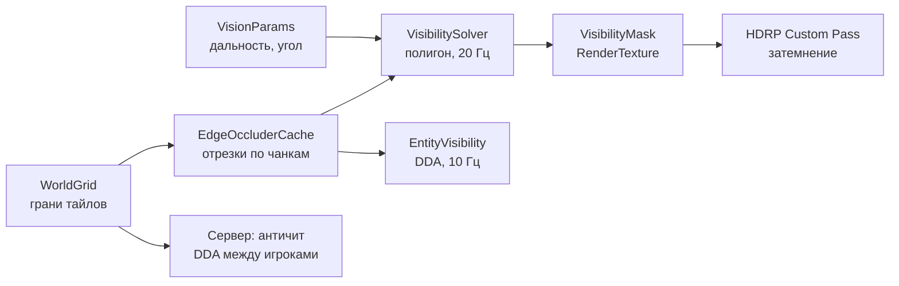

# FOV как в Project Zomboid — техдизайн (HDRP)

Sep 24, 2026 · онлайн-версия: https://claude.ai/code/artifact/c001f228-fa5e-424e-848c-16fcce76a995

Видимость считается по сетке граней тайлов, а не физикой: полигон видимости → маска в RenderTexture → полноэкранный HDRP Custom Pass затемняет невидимое. Те же данные прячут зомби и игроков и защищают от wallhack на сервере. Оценка — 10 рабочих дней.

## 1. Цель и исходная точка

### 1.1 Что делает FOV в Project Zomboid

| № | Поведение | Как выглядит |
| --- | --- | --- |
| 1 | Конус взгляда | Перед персонажем мир яркий, вне конуса — затемнён и обесцвечен, но карта остаётся видна |
| 2 | Стены дают «тень зрения» | За стеной темно; через окно и открытую дверь видно |
| 3 | Живое прячется, статика остаётся | Зомби и игроки вне видимости не рисуются; пол, стены, мебель — затемнены |
| 4 | Круг чутья | Зомби вплотную сзади видно, даже вне конуса |
| 5 | Дальность от состояния | Ночь, фонарик, туман, дождь, черты, паника, усталость |
| 6 | Плавность | При повороте тень переползает, а не прыгает |

### 1.2 Что есть в проекте сейчас

| Файл | Что делает | Вердикт |
| --- | --- | --- |
| `Client/FieldOfView.cs` | 10 Гц `Physics.Linecast` к каждой цели, конус и радиус чутья | Переписать: DDA по сетке вместо физики (шаг 7) |
| `Client/VisibilityTarget.cs` | `renderer.enabled` вкл/выкл | Заменить на растворение + отдельное выключение теней |
| `Simulation/World/TileData.cs` | Стены/двери/окна по 4 граням | Основа хорошая; нужны этажи и состояние дверей/окон |
| `Simulation/World/WorldGrid.cs` | Чанки 16×16, один этаж | Добавить этаж и `BlocksSight` (шаг 1) |
| `Editor/WorldGridBaker.cs` | Рейкасты от центра тайла | Дополнить: двери, окна, этажи |
| `Simulation/World/Building.cs` | Триггеры: прячет крышу и «блокирующие стены» | Оставить только крышу и этажи |
| `Simulation/World/WindowPeekTrigger.cs` | «Заглядывание» в окно по углу | Удалить: полигон видимости делает это сам |
| `Client/CameraController.cs` | Перспектива FOV 25°, pitch 50°, yaw 45° | Оставить; даёт данные для прохода |

## 2. Архитектура

Семь слоёв, один источник правды — сетка граней тайлов. Физика и коллайдеры стен в расчёте видимости не участвуют.



Левая часть схемы — данные, правая — три потребителя: картинка, скрытие сущностей и сервер.

| Слой | Класс | Где | Частота | Сборка |
| --- | --- | --- | --- | --- |
| 1. Данные окклюзии | `WorldGrid` + `EdgeOccluderCache` | клиент + сервер | при изменении | Simulation |
| 2. Параметры зрения | `VisionParams`, `VisionConfig` | клиент + сервер | 2 Гц | Simulation |
| 3. Полигон видимости | `VisibilitySolver` | клиент | 20 Гц | Simulation (без UnityEngine) |
| 4. Маска и затемнение | `VisibilityMaskRenderer`, `FovCustomPass` | клиент | каждый кадр | Client |
| 5. Скрытие сущностей | `EntityVisibilitySystem`, `VisibilityTarget` | клиент | 10 Гц | Client |
| 6. Здания и этажи | `Building` (упрощённый) | клиент | при смене комнаты | Client |
| 7. Античит | `ServerLosFilter` | сервер | 2–4 Гц | Server |

Решатель и DDA лежат в Simulation, потому что тот же код нужен серверу для античита и зрения зомби.

## 3. Слои 1–2: данные окклюзии и параметры зрения

### 3.1 Грань закрывает взгляд, если…

| Грань | Закрывает | Не закрывает |
| --- | --- | --- |
| Стена | всегда | — |
| Дверь | закрыта | открыта, выломана |
| Окно | занавеска задернута / забито ≥ 2 досками / металлом | стекло цело или разбито, без занавески |
| Низкий забор, живая изгородь, машины, мебель | — | никогда (v1) |
| Высокий деревянный забор | да | — |

### 3.2 Изменения в данных

```csharp
// TileData: добавить состояние проёмов по граням (статика из запекания + динамика из игры)
[Flags] public enum EdgeState : byte { None = 0, Open = 1, Curtain = 2, Boarded = 4, Broken = 8 }
public struct TileData {
    public TileFlags Flags; public ushort RoomID;
    public EdgeState North, East, South, West;       // смысл зависит от того, дверь там или окно
}

public enum Dir : byte { North, East, South, West }

public static class Sight {
    public static bool BlocksSight(in TileData t, Dir d) {
        if (t.Has(WallFlag(d))) return true;
        var s = t.Edge(d);
        if (t.Has(DoorFlag(d)))   return (s & (EdgeState.Open | EdgeState.Broken)) == 0;
        if (t.Has(WindowFlag(d))) return (s & (EdgeState.Curtain | EdgeState.Boarded)) != 0;
        return false;
    }
}
```

- **Этажи.** `WorldGrid` сейчас плоский. Ключ чанка → `(cx, cz, floor)` или `Chunk.Floors[floor].Tiles`. Высота этажа 3 м, `floor = floor(y / 3)`.
- **Симметрия граней.** Бейкер пишет стену и в `WallNorth` тайла, и в `WallSouth` соседа. Запрос считает грань закрытой, если закрыта хотя бы с одной стороны. Двери и окна меняют состояние сразу у обоих тайлов.
- **Бейкер.** Добавить слои Door и Window: рейкаст от центра тайла попал в дверь → `DoorN` вместо `WallN`. Бейк — по этажам (y = floor × 3 + 1).
- **Динамика.** Любое изменение двери/окна идёт через `WorldGrid.SetEdgeState(x, z, floor, dir, state)` → событие `OnEdgeChanged(chunk)` → чанк помечается dirty в `EdgeOccluderCache`. На клиенте это приходит через `ChunkDelta`.

### 3.3 EdgeOccluderCache: грани → отрезки

```csharp
public struct Segment { public float2 A, B; }               // мировые XZ

public sealed class EdgeOccluderCache {
    // chunk+floor → слитые отрезки стен
    readonly Dictionary<int3, NativeList<Segment>> _byChunk;
    readonly HashSet<int3> _dirty;
    public void Collect(float2 center, float radius, int floor, NativeList<Segment> result);
    void Rebuild(int3 chunkKey);
}
```

Алгоритм `Rebuild` для чанка:

1. Горизонтальные грани (северные): для каждой строки z идём по x; подряд идущие закрывающие грани склеиваем в один отрезок.
2. Вертикальные (западные) — то же по столбцам.
3. Каждый отрезок удлиняем на ε = 0.02 м с обоих концов — иначе в углах дома луч проскакивает между двумя стенами.
4. Стены имеют толщину 0.2 м, но для зрения считаем их линией на грани тайла. Толщину компенсирует сдвиг по нормали в шейдере (раздел 5).

Ожидаемо: дом на 6 комнат ≈ 30–60 отрезков, радиус 40 м в городе ≈ 200–500.

### 3.4 Параметры зрения

```csharp
public struct VisionParams {
    public float2 Eye; public float2 Forward; public int Floor;
    public float Range;        // дальность конуса, м
    public float HalfAngleCos; // cos(угол/2)
    public float AwareRadius;  // круг чутья, м
    public float MaxRadius;    // max(Range, AwareRadius) + 2 — радиус сбора отрезков
}
```

| Параметр | База | Модификаторы |
| --- | --- | --- |
| Range | 30 м днём | ночь без света ×0.2, сумерки ×0.6, туман ×0.4, дождь ×0.8, Зоркий глаз ×1.2, Близорукий ×0.7 (в очках ×1.0) |
| Угол конуса | 150° | паника до −30°, сильная усталость −20°, прицеливание −40° |
| Круг чутья | 2.5 м | Чуткий слух ×1.5, Тугоухий ×0.5, паника ×0.7 |
| Фонарик ночью | — | второй конус 45° до 20 м (отдельный параметр шейдера) |

- Считает `VisionCalculator` 2 раза в секунду из `ModifierStack`, `GameClock`, `WeatherSystem`. `Eye`/`Forward` берутся каждый кадр из предсказанной позиции игрока.
- **Eye = позиция + Forward × 0.3 м.** Так можно выглядывать из-за косяка и угла, как в PZ. Но точка не должна проходить сквозь стену: если между позицией и Eye есть закрывающая грань, Eye = позиция.
- Все числа — в `VisionConfig` (ScriptableObject).

## 4. Слой 3: полигон видимости

Решатель строит «веер» — многоугольник всего, что видно из глаза на 360° с учётом стен. Конус и дальность он НЕ учитывает: это делает шейдер аналитически, чтобы поворот головы не требовал пересчёта геометрии.

Почему полигон, а не потайловый shadowcasting: в 3D с наклонной камерой потайловая тень выглядит ступеньками по 1 м. Полигон даёт ровные тени от углов домов и точный сектор видимости через окно.

### 4.1 Алгоритм (v1 — лучи на концы отрезков)

1. `EdgeOccluderCache.Collect(eye, MaxRadius, floor)` → отрезки стен.
2. Добавить «границу»: 32-угольник радиуса `MaxRadius` вокруг глаза. Так любой луч всегда о что-то упирается.
3. Для каждого конца отрезка взять угол θ = atan2 и три луча: θ − 0.0001, θ, θ + 0.0001. Боковые лучи «проскальзывают» за угол стены и находят то, что за ним.
4. Для каждого луча — ближайшее пересечение со всеми отрезками (луч × отрезок, формула ниже).
5. Отсортировать точки по углу → веер треугольников (глаз, p[i], p[i+1]).

```latex
t = \frac{(q - e) \times s}{r \times s}, \quad u = \frac{(q - e) \times r}{r \times s}, \quad \text{hit if } t > 0,\ 0 \le u \le 1
```

где e — глаз, r — направление луча, q — начало отрезка, s = B − A, × — 2D псевдоскалярное произведение.

```csharp
[BurstCompile]
public struct VisibilityPolygonJob : IJob {
    [ReadOnly] public NativeArray<Segment> Segments;   // стены + 32 грани круга
    public float2 Eye;
    public NativeList<float2> OutPoints;               // отсортированы по углу

    public void Execute() {
        var angles = new NativeList<float>(Segments.Length * 6, Allocator.Temp);
        foreach (var s in Segments) { AddAngles(ref angles, s.A); AddAngles(ref angles, s.B); }
        angles.Sort();                                   // + убрать дубли с допуском 1e-5
        for (int i = 0; i < angles.Length; i++) {
            float2 dir = new float2(math.cos(angles[i]), math.sin(angles[i]));
            float best = float.MaxValue;
            for (int k = 0; k < Segments.Length; k++)
                if (RaySeg(Eye, dir, Segments[k], out float t) && t < best) best = t;
            OutPoints.Add(Eye + dir * best);
        }
    }
}
```

### 4.2 Сложность и дальнейшая оптимизация

- v1 — «все лучи × все отрезки»: 500 отрезков → ~3000 лучей × 500 = 1.5 млн тестов. В Burst это порядка 1 мс — приемлемо для старта и просто отлаживается.
- v2, если профайлер покажет проблему: угловая развёртка с активным множеством отрезков (O(n log n)) или отсечение отрезков, полностью закрытых более близкими (существенно сокращает отрезки внутри дома).
- Пересчёт не каждый кадр, а 20 Гц и только если глаз сдвинулся больше чем на 5 см или сменились отрезки (dirty). Поворот головы пересчёта не требует.
- Job запускается в `Update`, результат забирается в `LateUpdate` — не блокирует главный поток.

### 4.3 Тесты (EditMode)

| Сценарий | Ожидание |
| --- | --- |
| Игрок в закрытой комнате 4×4 | Полигон = квадрат 4×4, ни одна точка снаружи |
| Та же комната, открытая дверь на север | Узкий клин через проём, ширина растёт с расстоянием |
| Угол из двух стен (L) | Нет «протечки» луча через стык |
| Окно с занавеской / без | Закрывает / не закрывает |
| Открытое поле, стен нет | Полигон = 32-угольник MaxRadius |

До рендера полигон проверяется gizmo: жёлтый веер в окне Scene.

## 5. Слой 4: маска и затемнение (HDRP)

Две части: `VisibilityMaskRenderer` рисует полигон в маленькую текстуру своим CommandBuffer вне HDRP, а стандартный HDRP **FullScreen Custom Pass** читает эту текстуру и затемняет кадр. Так не нужно лезть в матрицы камеры внутри HDRP и писать свой класс CustomPass.

### 5.1 Маска видимости

| Параметр | Значение |
| --- | --- |
| Формат | `R8_UNorm`, 256×256, без мипов, bilinear, clamp |
| Покрытие | 64×64 м вокруг игрока = 0.25 м на тексель |
| Центр | позиция игрока, **привязанная к шагу 0.25 м** — иначе края тени «плывут» при движении |
| Текстуры | `_MaskNow` (свежий полигон) и `_MaskAccum` (сглаженный, идёт в проход) + одна временная для blur |

Порядок в `LateUpdate` (один `CommandBuffer`, `Graphics.ExecuteCommandBuffer`):

1. Из `OutPoints` решателя обновить `Mesh` веера (вершины в мировых XZ; буфер переиспользуется, без аллокаций — `SetVertexBufferData`).
2. `SetRenderTarget(_MaskNow)`, `ClearRenderTarget(чёрный)`, `SetViewProjectionMatrices(view: сверху вниз, proj: Ortho(±32 м))`, `DrawMesh(fan, identity, _MaskWhiteMat)`.
3. Временное сглаживание: `_MaskAccum = lerp(_MaskAccum_prev, _MaskNow, 1 − exp(−dt × 12))`. Так тень переползает за ~0.2 с. Предыдущую маску при сдвиге центра сдвигать на то же число текселей (UV-смещение в шейдере смешивания).
4. Blur: разделяемый, 5 тапов, радиус ~0.5 м — мягкий край тени.
5. `Shader.SetGlobalTexture("_VisMask", _MaskAccum)` + глобальные параметры (таблица 5.3).

### 5.2 FullScreen Custom Pass: настройка

| Что | Как |
| --- | --- |
| Шейдер | Create → Shader → HDRP → **Custom FullScreen Pass** → `FovDarken.shader`, материал `FovDarken.mat` |
| Объект сцены | `Custom Pass Volume`, Mode = **Global**, на сцене `Boot` или на префабе камеры |
| Injection Point | **Before Post Process** — после прозрачных, до тонмаппинга и блума |
| Pass | `FullScreenCustomPass`, Target Color = Camera, **Fetch Color Buffer = вкл** (иначе нельзя читать тот же буфер, в который пишем) |
| Камеры | Только игровая (проверять `_VisEnabled`, чтобы не затемнять Scene view и превью персонажа) |

### 5.3 Глобальные параметры шейдера

| Имя | Тип | Смысл |
| --- | --- | --- |
| `_VisMask` | Texture2D | сглаженная маска окклюзии |
| `_VisMaskRect` | float4 | xy = мировой XZ угла маски, zw = 1/размер (1/64) |
| `_VisEye` | float4 | xy = глаз XZ, z = высота пола этажа игрока, w = 1 если FOV включён |
| `_VisForward` | float4 | xy = направление взгляда, z = cos(полуугла), w = дальность |
| `_VisAware` | float4 | x = радиус чутья, y = cos полуугла фонаря, z = дальность фонаря (0 = выкл) |
| `_VisLook` | float4 | x = яркость невидимого (0.35), y = обесцвечивание (0.7) |

### 5.4 Шейдер `FovDarken`

```hlsl
#include "Packages/com.unity.render-pipelines.high-definition/Runtime/RenderPipeline/RenderPass/CustomPass/CustomPassCommon.hlsl"
#include "Packages/com.unity.render-pipelines.high-definition/Runtime/Material/NormalBuffer.hlsl"

TEXTURE2D(_VisMask); SAMPLER(sampler_VisMask);
float4 _VisMaskRect, _VisEye, _VisForward, _VisAware, _VisLook;

float VisibilityAt(float3 wpos, float3 n)
{
    wpos += n * 0.15;                                     // стена не должна попадать в свою же тень
    if (wpos.y < _VisEye.z - 0.5) return 1;              // этажи ниже — без окклюзии (v1)
    float2 uv   = (wpos.xz - _VisMaskRect.xy) * _VisMaskRect.zw;
    float  occ  = any(uv < 0 || uv > 1) ? 0 : SAMPLE_TEXTURE2D_LOD(_VisMask, sampler_VisMask, uv, 0).r;
    float2 d    = wpos.xz - _VisEye.xy;
    float  dist = max(length(d), 1e-3);
    float  cosA = dot(d / dist, _VisForward.xy);
    float  cone = smoothstep(_VisForward.z - 0.05, _VisForward.z + 0.05, cosA)
                * (1 - smoothstep(_VisForward.w - 3, _VisForward.w, dist));
    float  lamp = _VisAware.z > 0 ? smoothstep(_VisAware.y - 0.03, _VisAware.y + 0.03, cosA)
                * (1 - smoothstep(_VisAware.z - 2, _VisAware.z, dist)) : 0;
    float  near = 1 - smoothstep(_VisAware.x - 0.5, _VisAware.x, dist);
    return occ * saturate(max(max(cone, lamp), near));
}

float4 FullScreenPass(Varyings varyings) : SV_Target
{
    UNITY_SETUP_STEREO_EYE_INDEX_POST_VERTEX(varyings);
    float3 color = CustomPassLoadCameraColor(varyings.positionCS.xy, 0);
    if (_VisEye.w < 0.5) return float4(color, 1);
    float depth = LoadCameraDepth(varyings.positionCS.xy);
    if (depth == UNITY_RAW_FAR_CLIP_VALUE) return float4(color, 1);   // небо
    PositionInputs p = GetPositionInput(varyings.positionCS.xy, _ScreenSize.zw, depth, UNITY_MATRIX_I_VP, UNITY_MATRIX_V);
    float3 wpos = GetAbsolutePositionWS(p.positionWS);                // HDRP рендерит camera-relative!
    NormalData nd; DecodeFromNormalBuffer(varyings.positionCS.xy, nd);
    float vis = VisibilityAt(wpos, nd.normalWS);
    float3 hidden = lerp(color, Luminance(color).xxx, _VisLook.y) * _VisLook.x;
    return float4(lerp(hidden, color, vis), 1);
}
```

Три HDRP-особенности, на которых легко потерять день:

- **Camera-relative rendering.** `positionWS` в HDRP относительно камеры. Без `GetAbsolutePositionWS` маска будет «ездить» вместе с камерой.
- **Нормали прозрачных объектов** (стекло) в normal buffer не пишутся — для них сдвиг по нормали берётся от того, что за ними. Для окон это не заметно.
- **Fetch Color Buffer** включён — иначе `CustomPassLoadCameraColor` вернёт мусор или чёрное.

### 5.5 Ночь и свет

- Ночью `Range` уже маленький (3–6 м), и фонарь даёт узкий длинный конус через `_VisAware.yz`.
- Настоящий свет фонаря (HDRP Spot Light с тенями) и этот конус — разные вещи: свет красивый, конус — геймплейный. Их углы и дальности берутся из одного `VisionConfig`, чтобы совпадали.
- В v2: маска «исследовано» (битсет тайлов) — невиденные комнаты чёрные, увиденные раньше — затемнённые, как в PZ.

## 6. Слои 5–7: сущности, здания, сервер

### 6.1 Скрытие зомби и игроков (`EntityVisibilitySystem`)

Заменяет `FieldOfView`. Один менеджер на клиенте, 10 Гц:

1. Для каждой `VisibilityTarget`: дистанция ≤ чутьё → проверить LOS; иначе в конусе и дальности (или в конусе фонаря) → проверить LOS; иначе невидим.
2. LOS — **DDA по сетке тайлов** от глаза до цели: на каждом переходе через грань тайла спрашиваем `BlocksSight`. Для надёжности — два луча: в центр и в ближнее плечо цели (±0.3 м поперёк), виден = хотя бы один луч прошёл. Иначе зомби, торчащий из-за угла наполовину, мигает.
3. Цели на другом этаже: v1 — невидимы, кроме случая «игрок наверху, цель снаружи на земле» (видна в дальности).

```csharp
public static bool LineOfSight(WorldGrid g, float2 from, float2 to, int floor) {
    int2 cell = (int2)math.floor(from), end = (int2)math.floor(to);
    float2 dir = to - from; int2 step = (int2)math.sign(dir);
    float2 tDelta = math.abs(1f / dir);
    float2 tMax = (math.select(math.floor(from), math.floor(from) + 1, step > 0) - from) / dir;
    while (!cell.Equals(end)) {
        Dir edge;
        if (tMax.x < tMax.y) { edge = step.x > 0 ? Dir.East : Dir.West;  if (g.BlocksSight(cell, floor, edge)) return false; cell.x += step.x; tMax.x += tDelta.x; }
        else                 { edge = step.y > 0 ? Dir.North : Dir.South; if (g.BlocksSight(cell, floor, edge)) return false; cell.y += step.y; tMax.y += tDelta.y; }
    }
    return true;
}
```

Тот же метод используют серверный античит (6.4) и зрение зомби.

### 6.2 VisibilityTarget: как прятать

| Что | Сейчас | Нужно |
| --- | --- | --- |
| Появление/исчезновение | `renderer.enabled` мгновенно | Растворение 0.2 с через `MaterialPropertyBlock` (`_Fade`) + dither/alpha-clip в шейдере персонажа |
| Тени | исчезают вместе с рендерером | При `_Fade` ближе к 0 → `shadowCastingMode = Off`. **Иначе тень скрытого зомби выдаст его за стеной** |
| Полностью скрытый | — | `renderer.enabled = false` после окончания растворения — экономия GPU |
| Звуки | — | Не трогать: стон за стеной слышен, так и задумано |
| Список целей | статичный `List` + `GetComponentsInChildren` | Регистрация в `EntityVisibilitySystem`, рендереры кэшируются один раз |
| Инстанс-зомби (VAT, M5) | — | Флаг видимости в инстанс-буфере, шейдер отбрасывает |

Предметы на земле, трупы и мебель `VisibilityTarget` не получают — они просто затемняются проходом, как в PZ.

### 6.3 Здания и этажи

- **`WindowPeekTrigger` удалить.** Окно без занавески не закрывает взгляд, и комната за ним видна сама.
- **`Building` отвечает только за камеру:** игрок внутри (по `RoomID` тайла, а не по триггеру) → скрыть крышу и этажи выше. Поле `BlockingWalls` убрать — это задача следующего пункта.
- **Вырез стен перед камерой** — отдельная система, не FOV: в шейдере стен дизер-дыра вокруг экранной позиции игрока для пикселей ближе к камере, чем игрок. Один глобальный параметр, без рейкастов и без списков стен. Можно делать после FOV.
- **Этажи (v1).** Маска строится для этажа игрока. Всё ниже его пола (улица за окном второго этажа) считается видимым в пределах конуса и дальности. Честная видимость между этажами — v2.

### 6.4 Серверный античит (`ServerLosFilter`)

Клиентская тень — только картинка: читер отключит проход и увидит всех. Поэтому позиции других игроков сервер шлёт только тем, кто может их видеть.

- 2–4 раза в секунду для каждой пары «игрок A — игрок B» в AOI: `LineOfSight` из 3 точек A (центр и ±0.5 м) в 3 точки B. Конус не учитываем — игрок может резко обернуться, и сервер не успеет.
- Нет LOS и дальше чем 5 м → B исключается из наблюдателей A. В FishNet — свой `ObserverCondition` (тип Timed, возвращает результат из кэша `ServerLosFilter`).
- Гистерезис: после потери LOS игрок остаётся наблюдаемым ещё 1 с — иначе он будет мигать на углах из-за задержки сети.
- При 200 игроках и ~20 соседях это ~4000 пар × 9 коротких лучей за проход — в Burst-job доли мс; размазать по тикам.
- Зомби не фильтруем: все в AOI приходят клиенту (их всё равно слышно), клиент прячет сам. Так же делает PZ.

## 7. Производительность, подводные камни, план

### 7.1 Бюджет (цель, проверить профайлером после шагов 3 и 6)

| Часть | Где | Частота | Бюджет |
| --- | --- | --- | --- |
| Сбор отрезков из кэша | клиент CPU | 20 Гц | < 0.05 мс |
| Полигон видимости (Burst, worker) | клиент CPU | 20 Гц | < 1 мс v1, < 0.2 мс v2 |
| Маска: веер + смешивание + blur | GPU | каждый кадр | < 0.1 мс |
| FullScreen Custom Pass 1080p | GPU | каждый кадр | 0.2–0.4 мс |
| LOS до 150 целей (2 луча) | клиент CPU | 10 Гц | < 0.1 мс |
| Античит ~4000 пар | сервер | 2–4 Гц | < 0.5 мс на проход |
| Память | клиент | — | 3 × 64 КБ RT + кэш отрезков < 1 МБ |

Аллокаций в кадр — ноль: `NativeList` переиспользуются, меш веера с фиксированным максимумом вершин (4096).

### 7.2 Подводные камни

| Симптом | Причина | Решение |
| --- | --- | --- |
| Светлая линия сквозь угол дома | луч проскакивает между двумя отрезками | удлинение отрезков на ε = 0.02 м (3.3) |
| Лицевая сторона стены мерцает | пиксель стены ровно на границе маски | сдвиг по нормали 0.15 м (5.4) |
| Края тени «плывут» при ходьбе | центр маски сдвигается на доли текселя | привязка центра к шагу 0.25 м (5.1) |
| Маска «ездит» вместе с камерой | HDRP camera-relative rendering | `GetAbsolutePositionWS` (5.4) |
| Затемняется Scene view и превью персонажа | Custom Pass Volume глобальный | флаг `_VisEye.w` только для игровой камеры или Custom Pass Volume на слое игровой камеры |
| Зомби за стеной виден по тени | тень не выключена при растворении | `shadowCastingMode = Off` (6.2) |
| Зомби мигает на углу | один луч в центр | два луча + растворение 0.2 с (6.1–6.2) |
| Резкий скачок тени при открытии двери | маска обновилась за один кадр | временное сглаживание маски (5.1) |
| Игрок у стены видит сквозь неё | глаз (+0.3 м вперёд) оказался за стеной | проверка LOS позиция → глаз (3.4) |
| Читер видит всех игроков | отключил проход | серверный фильтр игроков (6.4) |

### 7.3 План по дням

До шага 6 всё проверяется gizmo в редакторе: сначала правильная геометрия видимости, потом красивая картинка.

- [ ] День 1 — Данные: этажи в `WorldGrid`, `EdgeState`, `BlocksSight`, `SetEdgeState` + событие; бейкер пишет двери и окна; gizmo красным — закрывающие грани, голубым — прозрачные.
- [ ] День 2 — `EdgeOccluderCache`: слияние граней, dirty-чанки, gizmo отрезков, тест «угол не протекает».
- [ ] День 3 — `VisibilityPolygonJob` (v1), gizmo веера, тесты из 4.3.
- [ ] День 4 — `VisionParams` + `VisionConfig` + `VisionCalculator`: день/ночь, черты, паника, фонарик; глаз с проверкой стены.
- [ ] День 5 — `VisibilityMaskRenderer`: RT, меш веера, орто-проекция, сглаживание, blur, глобальные параметры. Проверка: вывести маску в углу экрана (debug RawImage).
- [ ] День 6 — `FovDarken.shader` + Custom Pass Volume (Before Post Process, Fetch Color Buffer). Проверка стен, окон, дверей, ночи с фонарём.
- [ ] День 7 — `EntityVisibilitySystem` + DDA `LineOfSight` + растворение и тени в `VisibilityTarget`; удалить `FieldOfView`.
- [ ] День 8 — Удалить `WindowPeekTrigger`; `Building` — только крыша/этажи по `RoomID`; проверка на втором этаже.
- [ ] День 9 — Перенос решателя в Burst на worker, замеры по таблице 7.1 в городе и в доме.
- [ ] День 10 — `ServerLosFilter` + FishNet ObserverCondition, тест с ботами: игрок за стеной не приходит клиенту.

**Готово, когда:** игрок в доме видит свою комнату и улицу через окна; занавеска или доски закрывают обзор; при повороте тень плавно переползает; зомби за стеной невидим и без тени, но слышен; FPS падает меньше чем на 1 мс кадра; с отключённым проходом другие игроки за стенами всё равно не видны.
