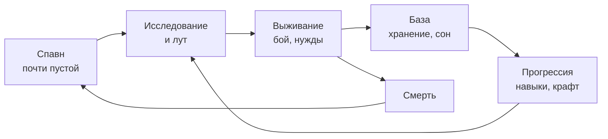
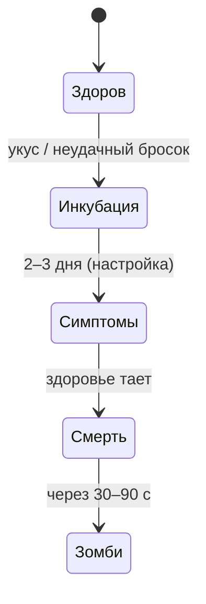
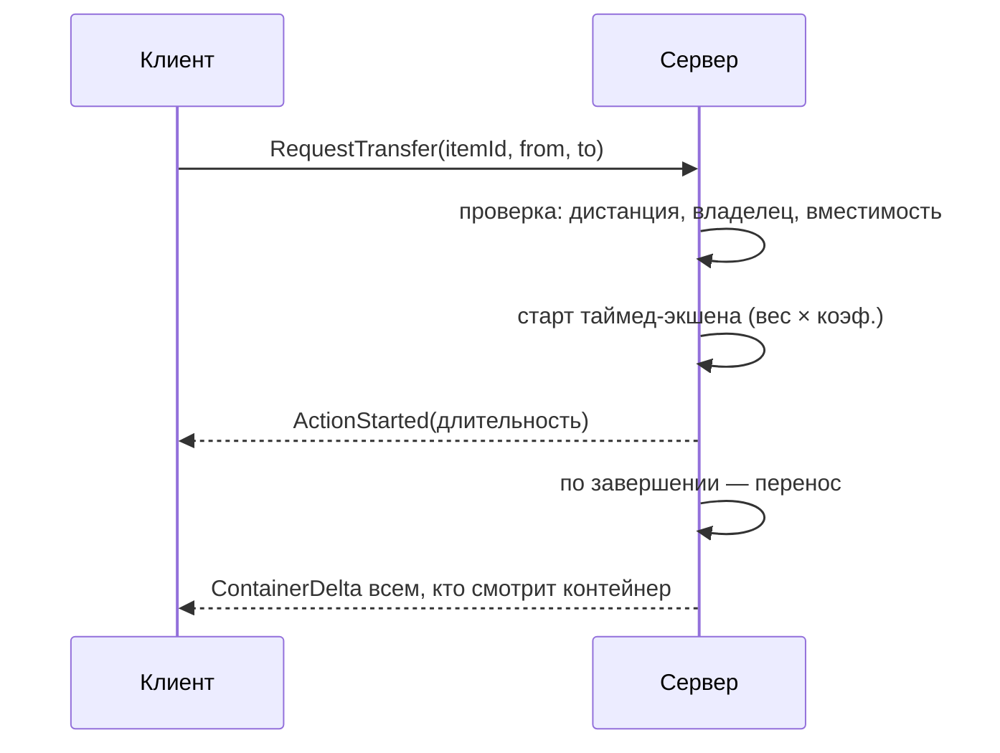
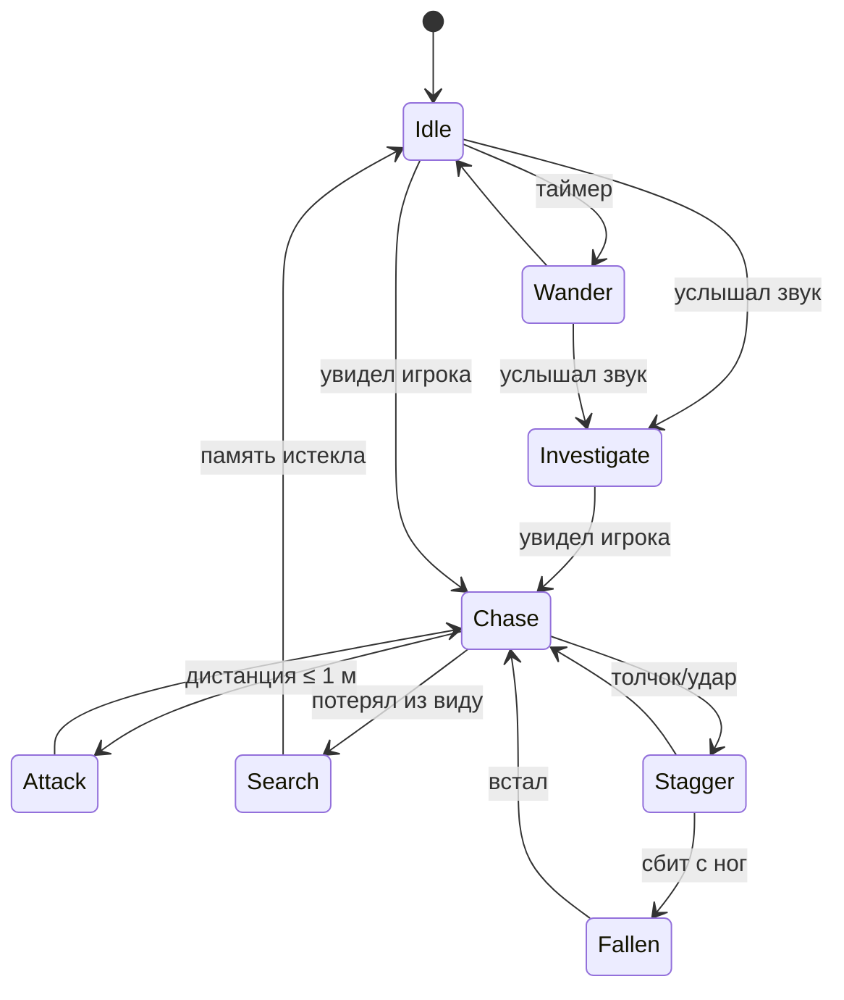
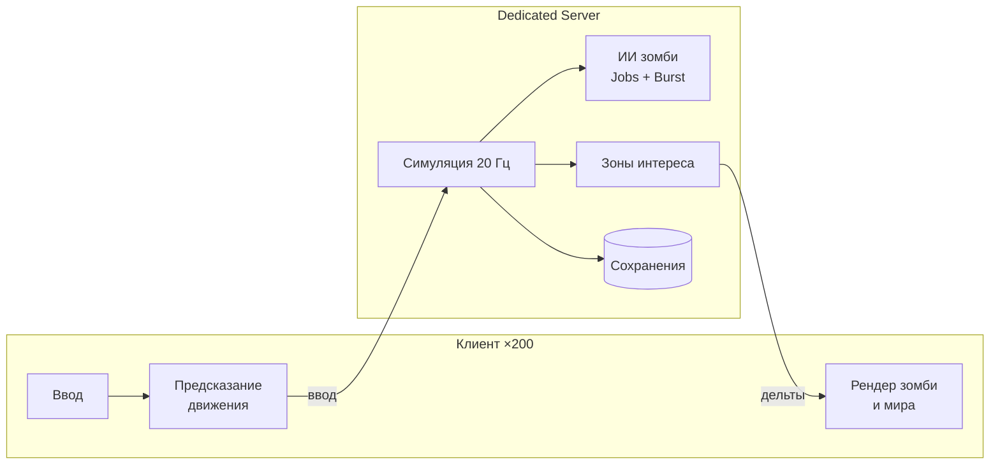
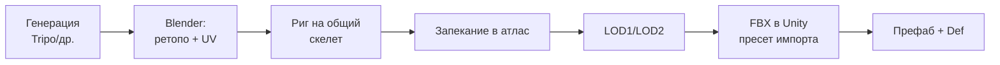

# GDD — Zomboid-like Survival (Unity 6 + FishNet)

Sep 22, 2026 · онлайн-версия: https://claude.ai/code/artifact/03b6e128-d994-4f2b-897f-ffa1e42b47cc

## 0. Как пользоваться документом

Цель: клон Project Zomboid (PZ) в 3D на Unity 6 + FishNet, который делает один человек. Сначала повторяем механики PZ один-в-один, потом добавляем свои. Каждый день начинается с раздела 17 (Дорожная карта), а не с бага.

**Порядок чтения:** разделы 1–2 — один раз, чтобы понять игру. Разделы 3–12 — спецификация механик, открываешь нужный раздел, когда берёшь задачу. Разделы 13–15 — технические правила, которые нельзя нарушать. Раздел 17 — план по дням. Раздел 18 — как работать.

**Ежедневный цикл (60–90 минут минимум, 1 задача = 1 день):**

1. Открыть раздел 17, взять первую незакрытую задачу текущего милестоуна.
2. Перечитать раздел механики, на который она ссылается (например, «см. 6.2»).
3. Сделать задачу до критерия готовности (DoD, раздел 18). Не больше.
4. Найденные баги НЕ чинить сразу, если они не блокируют задачу, — записать в Bug-лист (раздел 18.3).
5. Коммит в git с номером задачи, поставить галочку.
6. Раз в неделю (воскресенье) — «день долга»: только баги из списка и рефакторинг.

**Обозначения:**

- **\[PZ\]** — механика как в Project Zomboid, копируем.
- **\[3D\]** — отличие из-за 3D (в PZ изометрия и 2D-спрайты).
- **\[MP\]** — важно для мультиплеера, решать на сервере.
- **\[СВОЁ\]** — наша идея, делаем только после Milestone 8.
- Числа — стартовые значения для балансировки. Все они живут в ScriptableObject/конфиге, не в коде.

**Главное правило:** не начинать систему, пока предыдущий милестоун не играбелен. Лучше маленькая игра без багов, чем 20 наполовину сделанных систем.

## 1. Видение и столпы дизайна

**Питч:** «Это история о том, как ты умер». Хардкорная игра на выживание в заражённом округе, вид сверху (изометрическая 3D-камера), песочница без сюжета и победы. Игрок сам ставит цели: прожить месяц, построить базу, собрать машину, выжить с друзьями.

**Столпы (любая фича должна усиливать хотя бы один):**

1. **Одна ошибка — смерть.** Один укус может убить. Смерть перманентна для персонажа, мир остаётся.
2. **Тело — ресурс.** Голод, жажда, сон, травмы по частям тела и психика напрямую влияют на способности.
3. **Всё имеет вес и время.** Каждое действие — таймед-экшен с прогресс-баром; действие можно прервать.
4. **Шум — валюта.** Выстрел, разбитое окно, сигнализация машины собирают орду.
5. **Мир деградирует.** Вода и свет отключаются, еда гниёт, становится холоднее. Долгий срок = самодостаточность.
6. **Навыки, а не уровни.** Персонаж учится тому, что делает.

**Что берём из PZ и что нет:**

| Область | Копируем из PZ | Меняем |
| --- | --- | --- |
| Камера | Вид сверху, конус обзора | 3D, свободное вращение камеры на 90° или плавно |
| Мир | Тайловая сетка, этажи | Сетка 1×1 м в 3D, модульные стены |
| Системы тела | Полностью | — |
| Инвентарь | Списочный с весом | Визуал одежды/рюкзака на 3D-модели |
| Зомби | Настройки скорости/силы/чувств | Расчленёнка и регдолл \[СВОЁ/3D\] |
| Карта | Округ с городами | Стартуем с 1 посёлка \~500×500 м |
| Моды | Lua-моды | Не делаем до релиза; данные в SO/JSON |
| NPC | В PZ их нет | Не делаем (бэклог) |

**Целевые ограничения (жёсткие, влияют на все решения):**

| Параметр | Цель |
| --- | --- |
| Игроков на сервере | до 200 (тестовые вехи: 8 → 32 → 64 → 128 → 200) |
| Зомби в мире | 20 000–50 000 «виртуальных» (данные), до \~3 000 активных с ИИ на сервере, до 150 видимых у клиента |
| Тик сервера | 20 Гц (симуляция), ИИ зомби в потоках и с приоритетами по дистанции |
| Трафик | ≤ 30 КБ/с на игрока в среднем (200 игроков ≈ 6 МБ/с исходящего) |
| Карта | Цель \~4×4 км (город + посёлки + лес); старт — 1×1 км |
| Клиент | 60 FPS на GTX 1660 / RTX 3050, 16 ГБ ОЗУ |
| Сервер | Dedicated headless, 8 ядер / 16–32 ГБ, без рендера |
| Арт | Low/mid-poly: игрок 8–15k трис, зомби 3–6k трис + LOD, атласы текстур |

**Что это меняет по сравнению с коопом на 8 игроков:** обязательный interest management (каждый игрок видит только свою зону), зомби не NetworkObject-каждый а батчевая репликация, мир на чанках с выгрузкой, GPU-инстансинг и запечённая анимация для дальних зомби, лут генерируется при первом открытии, а не заранее. Детали — разделы 13–15.

## 2. Core loop и режимы игры

Решение: прогрессия = выживание и база (как в PZ), а не экстракция. Экстракция — возможный отдельный режим в бэклоге (раздел 19).

### 2.1 Циклы по масштабу

| Масштаб | Что делает игрок | Какие системы участвуют |
| --- | --- | --- |
| 30 секунд | Смотрит по сторонам, крадётся, бьёт 1–3 зомби, обыскивает шкаф | Движение, FOV, ближний бой, инвентарь, шум |
| 1 игровой день | Вылазка за лутом, возврат до темноты, еда, сон, лечение | Нужды, здоровье, день/ночь, готовка |
| 1 неделя | Выбор и укрепление базы, запас воды, чтение книг | Баррикады, навыки, книги |
| 1 месяц | Отключение воды/света, генератор, огород, машина | Деградация мира, фермерство, транспорт |
| 3+ месяцев | Зима, самодостаточность, зачистка города | Погода, температура, орды, рыбалка, ловушки |



Смерть возвращает на спавн новым персонажем; труп и база остаются в мире.

### 2.2 Смерть

- Здоровье тела = 0 → смерть. Если был заражён Knox — труп встаёт зомби через 30–90 игровых секунд с тем же инвентарём и одеждой \[PZ\].
- Экран смерти: «Вы прожили N дней M часов», убито зомби, причина смерти.
- В МП — респавн новым персонажем; опция сервера «сохранять X% опыта» (по умолчанию 0%).

### 2.3 Режимы и настройки песочницы

Пресеты \[PZ\]: **Apocalypse** (стандарт), **Survivor** (быстрые зомби, тяжелее), **Builder** (меньше зомби), **Custom Sandbox**. Все параметры — один `SandboxSettings` (ScriptableObject + JSON для сервера).

| Параметр | Значения | По умолчанию |
| --- | --- | --- |
| Плотность зомби | Низкая / Нормальная / Высокая / Инсане | Нормальная |
| Скорость зомби | Спринтеры / Быстрые шатуны / Шатуны / Случайно | Шатуны |
| Инфекция | Кровь+слюна / Только кровь / Все заражены / Нет | Кровь+слюна |
| Инкубация | Мгновенно / 0–30 с / 0–1 мин / 0–12 ч / 2–3 дня / 1–2 нед | 2–3 дня |
| Длина дня (реальное время) | 15 мин – 24 ч | 1 ч |
| Стартовая дата | Месяц + час | 9 июля, 09:00 |
| Отключение воды | Сразу / 0–30 дней / никогда | 0–30 дней |
| Отключение света | Сразу / 0–30 дней / никогда | 0–30 дней |
| Редкость лута | По категориям: очень редко … много | Нормально |
| Респавн лута / зомби | Выкл / каждые N часов | Выкл / 72 ч |
| XP-множитель | 0.1–10 | 1.0 |
| PvP (МП) | Вкл / Выкл / только вне safehouse | Выкл |

## 3. Персонаж: создание, профессии, черты

Персонаж = профессия + черты, сумма очков ≥ 0 \[PZ\]. Профессия даёт очки и стартовые уровни навыков; положительные черты стоят очки, отрицательные их дают.

### 3.1 Экран создания

1. Выбор стартовой точки (в v1 — одна).
2. Профессия (список слева, справа — бонусы).
3. Черты: два списка (положительные/отрицательные), счётчик очков, блокировка взаимоисключающих (Сильный ↔ Слабый).
4. Внешность: пол, телосложение, кожа, причёска, борода, стартовая одежда.
5. Имя. Превью 3D-модели с анимацией idle.

Стартовый инвентарь \[PZ\]: одежда, иногда ключ от дома спавна. Никакого оружия.

### 3.2 Профессии (v1 — первые 8, остальные позже)

| Профессия | Очки | Навыки на старте | Особенности |
| --- | --- | --- | --- |
| Безработный | +8 | — | Максимум свободы в чертах |
| Пожарный | 0 | Топор +1, Фитнес +1, Сила +1, Бег +1 | — |
| Полицейский | −4 | Прицеливание +3, Перезарядка +2, Фитнес +1 | — |
| Плотник | +2 | Плотничество +3, Короткое дробящее +1 | — |
| Медсестра | +2 | Первая помощь +2, Лёгкие ноги +1, Проворство +1 | — |
| Повар | +2 | Кулинария +3, Короткий клинок +1 | Знает все рецепты готовки |
| Фермер | +2 | Фермерство +3 | Знает рецепты спреев |
| Строитель | 0 | Короткое дробящее +3, Плотничество +1 | — |
| Механик (позже) | −4 | Механика +3, Короткое дробящее +1 | Знает все модели машин; Amateur Mechanic |
| Электрик (позже) | −4 | Электрика +3 | Знает генератор |

### 3.3 Черты (v1 — этот набор; каждая черта = один `TraitDefinition` со списком модификаторов)

| Черта | Очки | Эффект |
| --- | --- | --- |
| Сильный | −10 | Сила +4, больше отбрасывание |
| В форме (Athletic) | −10 | Фитнес +4, бег +20% |
| Везучий (Lucky) | −4 | Лут чуть лучше |
| Быстро учится | −6 | XP +30% |
| Зоркий глаз | −2 | Дальность видения +20% |
| Чуткий слух | −2 | Радиус осознания сзади больше |
| Хладнокровный (Brave) | −4 | Паника наступает редко |
| Аграрий и т.д. (Hobby) | −2…−6 | +навык + рецепты |
| Мало ест (Light Eater) | −4 | Голод растёт на 25% медленнее |
| Слабый | +10 | Сила −5 |
| Не в форме | +10 | Фитнес −5 |
| Трусливый | +2 | Паника быстрее |
| Неуклюжий | +2 | Шум шагов громче |
| Курильщик | +2 | Стресс без сигарет |
| Гемофилия | +5 | Кровотечения в 2 раза сильнее |
| Недальновидный | +2 | Дальность видения −30% |
| Медленно учится | +6 | XP −30% |
| Сонливый | +6 | Усталость быстрее |
| Слабый желудок | +3 | Быстрее отравление плохой едой |

### 3.4 Атрибуты тела (скрытые или в окне здоровья)

- **Сила (0–10)** — урон ближнего боя, переносимый вес (8 + Сила×0.5 ед.), отталкивание.
- **Фитнес (0–10)** — запас и восстановление стамины, скорость утомления.
- **Вес тела (кг)** — старт 80; ниже 65 и выше 100 дают штрафы к фитнесу/силе (см. 5.8).

### 3.5 Мудлы (иконки состояний)

Каждая нужда имеет 4 уровня статуса (мудла) \[PZ\]; иконка появляется справа на экране с цветом по уровню и тултипом. Мудлы: Голод, Жажда, Усталость, Вымотанность, Паника, Стресс, Скука, Несчастье, Боль, Болезнь, Тошнота, Перегруз, Кровотечение, Ранен, Гипотермия, Перегрев, Мокрый, Простуда, Сытость, Опьянение, Заражение (паранойя — показывается как «Болезнь»).

## 4. Навыки и прогрессия

Навыки растут от действия (learn by doing), 0–10 уровней на навык \[PZ\]. Книги не дают XP, а умножают получаемый XP; журналы дают рецепты.

### 4.1 Список навыков

| Группа | Навык | Растёт от | Влияет на | Милестоун |
| --- | --- | --- | --- | --- |
| Физические | Фитнес | Бег, бой, упражнения | Стамина, усталость | M3 |
| Физические | Сила | Бой, перенос тяжестей, упражнения | Урон, вес | M3 |
| Ловкость | Бег (Sprinting) | Спринт | Скорость спринта, расход стамины | M3 |
| Ловкость | Лёгкие ноги | Ходьба рядом с зомби | Шум шагов | M3 |
| Ловкость | Проворство | Движение в боевой стойке | Скорость в стойке | M3 |
| Ловкость | Скрытность | Присед рядом с зомби | Видимость для зомби | M3 |
| Ближний бой | Топор | Удары топорами | Урон, скорость, крит, износ | M3 |
| Ближний бой | Длинное дробящее | Биты, трубы | То же | M3 |
| Ближний бой | Короткое дробящее | Молотки, сковороды | То же | M3 |
| Ближний бой | Длинный клинок | Мачете, катана | То же | M5 |
| Ближний бой | Короткий клинок | Ножи | То же + шанс удара в голову | M3 |
| Ближний бой | Копьё | Копья | То же | M5 |
| Ближний бой | Обслуживание | Любой бой | Шанс не потерять прочность | M3 |
| Огнестрел | Прицеливание | Попадания | Точность, скорость наведения, крит | M5 |
| Огнестрел | Перезарядка | Перезарядка | Скорость перезарядки | M5 |
| Ремесло | Плотничество | Строительство, разбор мебели | Доступные постройки, их HP | M6 |
| Ремесло | Кулинария | Готовка | Питательность, рецепты | M4 |
| Ремесло | Фермерство | Посадка/уход | Состояние растений, урожай | M7 |
| Ремесло | Первая помощь | Лечение | Скорость лечения, информация о ранах | M4 |
| Ремесло | Электрика | Разбор техники | Генератор, ловушки | M7 |
| Ремесло | Металлообработка | Сварка | Металлические стены | M8 |
| Ремесло | Механика | Ремонт машин | Шанс успеха ремонта | M8 |
| Ремесло | Шитьё | Ремонт одежды | Заплатки, защита одежды | M6 |
| Выживание | Рыбалка | Ловля рыбы | Шанс улова, размер | M7 |
| Выживание | Ловушки | Ловушки на животных | Шанс поимки | M7 |
| Выживание | Собирательство | Поиск в лесу | Находки, радиус | M7 |

### 4.2 Опыт и уровни

- Стоимость уровней (обычные навыки, XP на каждый уровень): 75, 150, 300, 750, 1500, 3000, 4500, 6000, 7500, 9000.
- Фитнес/Сила: в 5 раз дороже, могут падать без нагрузки и при плохом весе тела.
- Множитель профессии: +1 от профессии/черты → ×1.25 XP, +2 → ×1.66, +3 → ×2; без бонуса → ×1 (боевые без бонуса — ×0.25 до ур. 1, балансить).
- Итоговый XP = база × профессия × книга × черта (Быстро/Медленно учится) × настройка сервера.
- XP начисляет только сервер \[MP\]; клиент никогда не сообщает «я получил XP». Репликация навыков — только владельцу (TargetRpc), другим 199 игрокам не нужна.

### 4.3 Книги и журналы

- **Книга навыка** — 5 томов на навык (ур. 0–2, 2–4, 4–6, 6–8, 8–10). Множитель ×3 / ×5 / ×8 / ×12 / ×16, действует пока уровень в диапазоне. Процент прочтения сохраняется.
- **Журнал/рецепт** — открывает рецепты крафта навсегда.
- **Развлекательные** (комиксы, газеты) — снижают скуку, стресс, несчастье.
- Чтение — таймед-экшен, нужен свет; прерывается, когда зомби появляется в поле зрения.

## 5. Нужды тела (Stats)

Все нужды — float 0–1 (или 0–100), считаются только на сервере в одном тике `StatsTick` раз в 1 игровую минуту \[MP\]. Владельцу уходят только изменившиеся значения (квантованные до byte), другим игрокам — ничего, кроме видимых эффектов (хромает, кашляет).

Игровое время: 1 игровой день = 1 реальный час (по умолчанию), т.е. 1 игровая минута = 2.5 реальных секунды. Все скорости ниже — в игровых часах.

### 5.1 Сводная таблица нужд

| Нужда | Рост (база) | Ускоряет | Снижается | Эффект на максимуме |
| --- | --- | --- | --- | --- |
| Голод | \~100% за 2–3 дня | Бег, холод, бой | Еда (ед. голода) | Слабость, потеря веса, затем урон здоровью |
| Жажда | \~100% за 1 день | Жара, бег, солёная еда | Вода, напитки | Урон здоровью, смерть за \~1 день |
| Усталость (сон) | \~100% за 20 ч бодрствования | Черта Сонливый, болезнь | Сон, кофе (временно) | Точность и урон ↓, медленнее действия, засыпание |
| Вымотанность (Endurance) | Падает от бега/боя/веса | Перегруз, низкий фитнес | Отдых, сидение | Нельзя бежать, удары слабее и медленнее |
| Стресс | От зомби рядом, ран, никотиновой ломки | Инфекция | Сигареты, алкоголь, таблетки | Точность ↓, несчастье ↑ |
| Скука | Внутри помещения без дел | Однообразная еда | Книги, ТВ, музыка, вкусная еда | Переходит в несчастье |
| Несчастье (Unhappiness) | От скуки, грязи, мокрой одежды, плохой еды | — | Книги, еда, антидепрессанты | Действия медленнее, плохой сон |
| Паника | Мгновенно, когда зомби внезапно появляются в поле зрения | Черта Трусливый | Время без угрозы, бета-блокаторы; привыкание с днями выживания | Точность ↓, обзор сужается, сердцебиение |
| Температура тела | 36.6 °C → к температуре среды | Мокрая одежда, ветер | Одежда, костёр, дом, горячая еда | Гипо-/гипертермия → урон, смерть |
| Мокрость | Дождь, пот | Нет зонта | Сухость, полотенце | Холод, риск простуды |
| Потливость | От нагрузки, жары | Тёплая одежда | Отдых | Мокрость ↑ |
| Опьянение | Алкоголь | — | Время | Шатает, точность ↓, стресс ↓ |

### 5.2 Еда

- У продукта: голод (−N), калории, углеводы/белки/жиры, стресс/скука/несчастье (±), срок свежести (дней свежее / дней до гнили), сырое/готовое/сгоревшее.
- Съесть можно целиком, ½, ¼ \[PZ\].
- Свежесть: Свежее → Чёрствое (эффект ×0.5) → Гнилое (болезнь и тошнота). Холодильник замедляет в 3–4 раза, морозилка останавливает.
- Консервы — не портятся, нужен открывашка/нож.
- **Важно для 200 игроков:** гниение не считается каждый тик. Храним `createdAtGameTime` и тип хранилища, свежесть вычисляется лениво при обращении.

### 5.3 Вода

- Источники: кран (пока водопровод работает), бутылки, унитаз (бачок), ванна, дождевой сборник, река/озеро.
- После отключения воды — вода в кранах только с подключённой бочкой на крыше.
- Неочищенная (Tainted) вода → болезнь. Кипячение на плите/костре делает её чистой.

### 5.4 Сон

- Спать можно на кровати, диване, полу (качество: хорошее / среднее / плохое → разное восстановление).
- Нельзя спать: зомби рядом, сильная боль, паника.
- Кошмары при высоком стрессе будят игрока раньше.
- **\[MP\] Сон в мультиплеере:** время не ускоряется (на 200 игроках это невозможно). Сон = выход из игры в кровати: при входе усталость снимается пропорционально прошедшему времени, либо сон в игре восстанавливает в 8× быстрее, персонаж беззащитен.

### 5.5 Выносливость и вес

- Спринт, удары, толчки тратят Endurance; скорость восстановления зависит от Фитнеса.
- Перегруз: каждая единица сверх лимита замедляет и скорее тратит выносливость; 4 уровня мудла «Перегруз».

### 5.6 Температура

- Тепло одежды считается по зонам тела (см. 7.4): изоляция и ветрозащита, мокрая одежда теряет до 70% тепла.
- Температура в помещении = улица + бонус (закрытые окна, печь, комната). Для упрощения: температура на комнату, не на тайл.

### 5.7 Психика

- Паника снижается пассивно и с каждым прожитым днём (привыкание) \[PZ\].
- Несчастье 100% → депрессия: медленнее всё, хуже сон.

### 5.8 Вес тела и питание

- Калории за день: баланс > +X → вес растёт, < −X → падает. Вес меняется медленно (\~0.1–0.3 кг/день).
- Зоны: истощён (<50) — урон и фитнес ↓; недовес (<65); норма (65–85); лишний (85–100); ожирение (>100) — бег и выносливость ↓.
- Для v1 можно отложить (см. роадмап M7).

## 6. Здоровье и медицина

Общее здоровье (0–100) — вычисляемое, урон наносится по частям тела \[PZ\]. Одна система `BodyDamage` на сервере; визуальная расчленёнка — отдельный клиентский слой, только для зомби.

### 6.1 Части тела (17, как в PZ)

| Часть | Урон по общему здоровью | Последствия травм |
| --- | --- | --- |
| Голова | Высокий | Оглушение |
| Шея | Очень высокий | Сильное кровотечение |
| Верх торса, Низ торса | Средний | — |
| Пах | Средний | — |
| Плечо L/R, Предплечье L/R | Низкий | Удары слабее и медленнее |
| Кисть L/R | Низкий | Медленнее действия, точность ↓ |
| Бедро L/R, Голень L/R | Низкий | Хромота, скорость ↓ |
| Стопа L/R | Низкий | Хромота; стекло без обуви |

В коде сейчас 8 частей (`HealthSystem`) — расширяем до 17. У каждой части: HP 0–100, список ран, боль, повязка (чистая/грязная), шина, инородное тело, инфекция.

### 6.2 Типы ран

| Рана | Откуда | Кровотечение | Лечение | Заживает | Шанс Knox от зомби |
| --- | --- | --- | --- | --- | --- |
| Царапина | Зомби, стекло, падение | Слабое | Дезинфекция + бинт | 3–7 дней | \~7% |
| Рваная рана (Laceration) | Зомби, острые предметы | Среднее | Дезинфекция + бинт, лучше шитьё | 7–14 дней | \~25% |
| Укус | Только зомби | Сильное | Бинт (не спасёт) | 10–20 дней | 100% |
| Глубокая рана | Пуля, нож, стекло | Сильное | Шитьё или бинт | 10–20 дней | — |
| Пуля/стекло в ране | Огнестрел, окна | Постоянное | Пинцет, потом шитьё | Не заживает, пока не вынуто | — |
| Ожог | Огонь | Нет | Бинт | 20–40 дней | — |
| Перелом | Падение с высоты, авария, удар | Нет | Шина (доска/палка + бинт) | 30–60 дней, с шиной быстрее | — |
| Вывих/ушиб | Падение, удар | Нет | Отдых, обезболивающее | 1–3 дня | — |

Проценты заражения — близко к PZ (приблизительно), вынести в SandboxSettings.

### 6.3 Защита одеждой

Когда зомби атакует часть тела: берём все слои одежды на этой части → у каждого слоя шанс блокировать укус/царапину (`biteDefense`, `scratchDefense`, %) → если блок, одежда получает дыру в этой зоне и теряет защиту там. Заплатки (Шитьё) возвращают часть защиты. Сильный удар и пуля одежда не блокирует (только броня — бэклог).

### 6.4 Кровотечение, боль, инфекция ран

- Каждая незабинтованная кровоточащая рана отнимает HP части тела каждый тик. Гемофилия ×2.
- Боль суммируется по ранам → мудл «Боль», замедляет действия, мешает спать. Снимается обезболивающими (временно).
- Грязная повязка или рана без дезинфекции → шанс обычной инфекции: заживление останавливается, боль растёт. Лечится дезинфекцией и антибиотиками.
- Повязка пачкается со временем (и сразу при новом кровотечении) → нужно менять. Грязный бинт можно прокипятить.

### 6.5 Инфекция Knox (зомби-вирус)



- Инфекция скрыта от игрока: он видит только «Тошноту» и «Лихорадку», как при обычной простуде или паранойе \[PZ\]. В этом весь страх.
- Лечения нет. Ампутация — \[СВОЁ\], бэклог.
- Статус инфекции хранится только на сервере и никогда не уходит клиенту в явном виде \[MP\] — иначе читеры его прочитают.

### 6.6 Болезни

- **Простуда:** шанс, если долго мокрый и холодно. Чихание/кашель = шум (привлекает зомби). Проходит сама за 3–5 дней, таблетки глушат симптомы.
- **Пищевое отравление:** гнилая/сырая еда, грязная вода. Тошнота → урон здоровью.
- **Отравление** (отбеливатель, ядовитые грибы) — смертельно без лечения.
- **Отравление газом** (генератор в закрытом помещении) — M7.
- **Заражение воздушным путём** (старое PZ «от трупов»): много трупов в помещении → болезнь. Мотивирует убирать трупы и сжигать их.

### 6.7 Медицинские предметы

| Предмет | Действие |
| --- | --- |
| Бинт / тряпка (чистая, грязная) | Останавливает кровь; тряпка из разорванной одежды |
| Спирт / дезинфектор / алкоголь | Дезинфекция раны |
| Игла + нить / хирургическая игла | Шитьё глубоких ран |
| Пинцет | Извлечь пулю/стекло |
| Шина (доска/палка + бинт) | Перелом |
| Обезболивающее | Боль ↓ на несколько часов |
| Антибиотики | Лечат обычную инфекцию ран |
| Бета-блокаторы | Паника ↓ |
| Снотворное | Помогает уснуть |
| Антидепрессанты | Несчастье ↓ (с задержкой) |
| Травы (собирательство) | Слабые аналоги таблеток и припарок |

### 6.8 Окно здоровья (UI)

Силуэт тела, части красятся от зелёного до красного. Клик по части → список ран и кнопки действий (забинтовать, дезинфицировать, зашить, вынуть). Можно лечить другого игрока \[MP\]. Уровень Первой помощи определяет, видит ли игрок точное время заживления.

## 7. Инвентарь, контейнеры, одежда

Решение: списочный инвентарь с весом и вместимостью, как в PZ — не сетка Tarkov. Сетка в 2–3 раза дороже в UI и репликации и не даёт ничего механикам PZ.

### 7.1 Модель данных предмета

Два слоя — это главное правило всей игры:

- **`ItemDefinition` (ScriptableObject)** — неизменяемый шаблон: id (ushort), имя, вес, иконка, префаб на земле, категория, теги (`Tag.CanOpenCans`, `Tag.Sharp`), список компонентов (Food, Weapon, Clothing, Container, Drainable, Literature, Medical).
- **`ItemInstance` (чистый C#-класс/struct)** — живой предмет: uint instanceId, defId, состояние (прочность), заполненность (вода/бензин/патроны), свежесть, грязь/кровь/мокрость, дыры, вложенный контейнер.

Предмет в инвентаре **НЕ** является GameObject или NetworkObject. Предмет на земле — это запись в контейнере «земля тайла» + клиентский визуал. Сейчас в проекте `box2` — NetworkObject, и это уже даёт ошибки в `error_dump.txt`; на 200 игроках тысячи таких объектов положат сервер.

### 7.2 Контейнеры

- Любой контейнер (инвентарь игрока, рюкзак, шкаф, багажник, труп, земля) = `ItemContainer { id, capacity, List<ItemInstance> }`.
- Рюкзак: вместимость и **снижение веса** (школьный рюкзак 15 ед./−30%, походный — 18/−80%, большой — 28/−85%) \[PZ, приблизительно\].
- Слоты на теле: спина (рюкзак), руки (основная/вторичная), пояс (2 быстрых слота), кобура, слот спины для длинного оружия.
- Основной инвентарь без сумки: 8 ед. + бонус Силы; сверх лимита — перегруз (5.5).
- Сумки не вложены больше 1 уровня (сумка в сумке можно носить, но снижение веса не суммируется).

### 7.3 Перемещение предметов \[MP\]



Клиент только просит; изменяет данные сервер. Содержимое чужого контейнера отправляется клиенту только когда он его открыл (подписка на контейнер). Перетаскивание пачкой = один запрос со списком id.

### 7.4 Одежда

- Слоты \[PZ\]: шапка, маска, очки, шарф, футболка, рубашка, свитер, куртка, перчатки, нижнее бельё, брюки, носки, обувь, пояс, рюкзак. Для v1 — шапка, верх (2 слоя), куртка, брюки, обувь, перчатки, рюкзак.
- У каждой вещи: какие части тела покрывает, `biteDefense`, `scratchDefense`, тепло, ветрозащита, штраф к скорости (тяжёлая куртка), дыры по частям, грязь, кровь, мокрость.
- Одежду можно разорвать на тряпки, постирать, зашить.
- **\[3D\]** Одежда видна на модели: модульные SkinnedMesh на одном скелете, под курткой скрываем футболку (маски скрытия). Детали в 15.2. Кровь/грязь — вершинный цвет или параметр шейдера, без новых текстур.
- &#91;MP\] Другим игрокам реплицируется только внешний вид: массив defId по слотам + уровень крови (несколько байт), а не весь инвентарь.

### 7.5 Износ и ремонт

- Оружие ближнего боя: шанс потерять 1 ед. прочности при попадании = 1 / (ConditionLowerChance + Обслуживание×2) \[PZ-подобно\].
- Ремонт: клей, изолента, гвозди; каждый последующий ремонт менее эффективен.

### 7.6 UI инвентаря

- Две панели: слева «Мой инвентарь» (вкладки = сумки), справа «Лут» (вкладки = контейнеры в радиусе 1 тайла + земля) \[PZ\].
- Строка: иконка, имя, кол-во, вес, состояние; группировка одинаковых. Перетаскивание, двойной клик, ПКМ-меню (Съесть, Выпить, Надеть, Разобрать…). Кнопка «Взять всё».
- Сверху — итоговый вес / лимит.

## 8. Бой

Бой — медленный и весомый: зажать ПКМ (стойка), ЛКМ (удар/выстрел) \[PZ\]. Попадания считает сервер; клиент сразу проигрывает анимацию и звук, чтобы не было задержки.

### 8.1 Ближний бой

- **Параметры оружия (`MeleeWeaponDef`):** мин/макс урон, дальность (м), угол удара, скорость, макс. целей за удар (1–3), шанс крита, множитель крита, отбрасывание, расход выносливости, прочность, шанс износа, двуручное, навык, шум удара.
- **Формула урона** (стартовая):

```latex
D = \mathrm{rand}(D_{min}, D_{max}) \cdot (1 + 0.1 \cdot S_{weapon}) \cdot (0.8 + 0.05 \cdot Str) \cdot M_{end} \cdot M_{pain} \cdot M_{crit}
```

где S — уровень навыка оружия, Str — Сила, M\_end — штраф усталости (0.5–1), M\_pain — боль в руках.

- **Промах и толчок:** удар без оружия/ПРОБЕЛ = толчок (shove): зомби отшатывается или падает. Лежачего зомби можно добить ударом ногой (stomp) — частый способ выжить без оружия \[PZ\].
- **Падение зомби:** шанс сбить с ног от тяжёлого оружия и силы; только что сбитый зомби встаёт 3–6 с.
- **Криты / бесшумное убийство:** нож + подкрастись сзади = шанс убить с одного удара в голову.
- **Направление удара** \[3D\]: сектор перед игроком (Physics.OverlapSphere + угол) с выбором ближайших целей — без триггеров на мечах и без физики конечностей. Сервер считает по позициям зомби на момент удара (с учётом лаг компенсации до 150 мс).
- **Попадание по частям тела зомби:** у зомби один HP, часть тела выбирается случайно с весами (голова чаще при стомпе и крите) — это нужно только для расчленёнки. Без хитбоксов на костях — это критично для производительности на 3000 зомби.

### 8.2 Огнестрел

- **Параметры (`FirearmDef`):** урон, дальность, точность, скорость наведения, отдача (время до следующего выстрела), тип патрона, ёмкость, магазин/поштучно, **радиус шума** (пистолет \~50 м, дробовик \~100 м, винтовка \~150 м), шанс осечки при плохом состоянии.
- **Попадание — не физическая баллистика, а бросок шанса** \[PZ\]: шанс = точность оружия + Прицеливание×k − дистанция − паника − усталость − движение − темнота. Цель — ближайший в конусе прицеливания (угол сужается с навыком). Один raycast на стены. Дешево и честно для сервера.
- Дробовик: до 3–5 целей в конусе.
- Перезарядка — таймед-экшен; снаряжение магазинов патронами — отдельное действие.
- Модули (M5+): прицел, глушитель (шум ×0.3), приклад, фонарь.
- Пуля в игрока \[MP, PvP\]: то же + рана «пуля в ране» или «глубокая рана» в случайной части тела.

### 8.3 Шум и стелс

Шум — единая система `WorldSound`: позиция, радиус (м), громкость. Сервер находит зомби в радиусе через пространственную сетку (не Physics!) и даёт им точку интереса.

| Источник | Радиус, м |
| --- | --- |
| Шаг (присед / ходьба / бег / спринт) | 1 / 4 / 8 / 12 (× Лёгкие ноги, × Неуклюжий) |
| Удар ближним оружием | 5–15 |
| Разбитое окно | 20 |
| Вылом двери / строительство | 20 |
| Выстрел | 50–150 |
| Сигнализация дома/машины | 150–300, повторяется |
| Генератор | 20 постоянно |
| Кашель/чихание | 5–8 |
| Двигатель машины / гудок | 20 / 60 |

- Стелс: присед снижает заметность, темнота — ещё больше, фонарь — наоборот. Скрытность снижает дистанцию, на которой тебя видят.
- Действия, которые бывают тихими и громкими: открыть окно vs разбить.

### 8.4 Двери, окна, преграды (связано с боем)

- Дверь: открыть/закрыть/запереть (ключ) → у двери HP, зомби ломают; взлом ломом/топором.
- Окно: открыть, разбить, убрать осколки, пролезть (с осколками — рана со стеклом). Занавески — зомби не видят внутрь.
- Перелазить заборы (низкие — быстро, высокие — с шансом провала при низкой силе).

## 9. Зомби

Зомби поодиночке слабы, опасны толпой \[PZ\]. Главное техническое решение: зомби — это **данные в массиве на сервере**, а не GameObject с NavMeshAgent и не NetworkObject. Текущий `ZombieController` (NavMeshAgent + `FindWithTag("Player")` каждый кадр) годится для прототипа, но не для 3000 активных зомби.

### 9.1 Параметры зомби (в SandboxSettings) \[PZ\]

| Параметр | Значения | По умолчанию |
| --- | --- | --- |
| Скорость | Спринтер (\~5.5 м/с) / Быстрый шатун (\~2.5) / Шатун (\~1.2) | Шатун |
| Сила | Сильный / Нормальный / Слабый | Нормальный |
| Стойкость (HP) | Крепкий / Нормальный / Хрупкий | Нормальный |
| Зрение | Орлиное / Нормальное / Плохое | Нормальное |
| Слух | Острый / Нормальный / Плохой | Нормальный |
| Память | Долгая / Нормальная / Короткая / Нет | Нормальная (\~30 с поиска) |
| Смекалка | Открывают двери / Нет | Нет |
| Ползающие под машинами | Да / Нет | Да |
| Фейковая смерть (встают) | % | 1% |

Здоровье каждого зомби случайно варьируется ±20%, чтобы удары были непредсказуемы.

### 9.2 Чувства

- **Зрение:** конус \~120°, дальность \~20 м днём / \~8 м ночью. Модификаторы: присед игрока, Скрытность, темнота, фонарь, туман, дождь. Проверка линии видимости — по сетке тайлов (стены из данных карты), а не Physics.Raycast, и не чаще 2–4 раз в секунду.
- **Слух:** реагирует на `WorldSound` (8.3). Стены глушат звук ×0.5.
- **Память:** потеряв цель, идёт к последней известной точке и ищет N секунд.
- **Стадность:** зомби, который видит, как другой гонится, идёт за ним.

### 9.3 Состояния ИИ



Доп. состояния: **Thump** (ломится в дверь/окно/баррикаду), **Crawl** (нет ног — ползёт), **Eat** (ест труп), **Lunge** (бросок на последние 1.5 м), **Climb** (перелезает низкие заборы, падает через окна).

### 9.4 Атака зомби

- Зомби схватывает → бросок защиты одеждой → тип раны (царапина / рваная / укус).
- Шанс укуса растёт с числом зомби вокруг и если атакуют сзади.
- **Окружение («смерть в толпе»):** 3+ зомби с разных сторон → шанс сбить игрока и съесть = мгновенная смерть \[PZ\].
- Игрок при захвате не может бежать \~0.5 с.

### 9.5 Симуляция населения (как держать 20 000+ зомби)

| Уровень | Где | Что считается | Частота |
| --- | --- | --- | --- |
| Виртуальный | Вся карта, дальше 150 м от игроков | Только счётчик зомби на чанк + миграция орд между чанками | Раз в 10 с |
| Спящий | 60–150 м | Позиция, дешёвое блуждание, реакция на громкий звук | 1–2 Гц |
| Активный | До 60 м от игрока | Полный ИИ, чувства, путь | 10–20 Гц |

- Зомби переходят между уровнями по дистанции до ближайшего игрока. Виртуальный чанк «материализуется»: создаются N записей в случайных точках чанка (вне видимости игроков).
- Данные зомби: `struct ZombieState { int id; float3 pos; half rot; byte state; byte hp; ushort outfitId; byte flags(без руки/ноги…); int targetId; }` — \~32 байта. Массив `NativeArray`, ИИ в Jobs + Burst.
- Путь: флоу-филд от каждого игрока по сетке тайлов (радиус \~60 м) + простое раздвигание соседей. Много зомби идут к одному игроку — один расчёт поля на всех. NavMesh оставить можно только для дальних миграций орд.
- **Репликация:** каждому клиенту — батч состояний зомби в его зоне интереса (до 150 штук), 10 Гц, квантованные позиции (\~8 байт на зомби), дельты. Клиент интерполирует. События (удар, смерть, отрыв руки) — отдельными reliable-сообщениями. См. 13.3.

### 9.6 Орды и мета-события

- **Миграция:** виртуальные группы медленно дрейфуют между чанками — зачищенная зона не остаётся пустой навсегда.
- **Вертолётное событие** \[PZ\]: в случайный день 6–10 вертолёт летит за игроком/группой и собирает орду (звук с большим радиусом). В МП — по одной случайной группе игроков.
- **Выстрелы / сигнализации вдалеке** — случайные звуки, перемещающие зомби.

### 9.7 Трупы и расчленёнка

- Труп зомби = контейнер (лут по таблице его наряда). Исчезает через N игровых дней; можно сжечь или сложить в мешок. Лимит трупов на чанк (старые удаляются).
- **Расчленёнка \[СВОЁ/3D\]:** сервер хранит только битовую маску отсутствующих частей (1 байт: голова, руки L/R, ноги L/R). Всё остальное — клиент. Геймплейный эффект: без ног → ползёт, без рук → только укус, голова → смерть. Шанс отрыва зависит от урона и типа оружия (рубящее ×3). Оторванная часть — пуловый объект, исчезает через 60 с, лимит 50 штук на клиенте.

### 9.8 Вариативность внешности

Наряды (`ZombieOutfitDef`): полицейский, врач, строитель, военный, бегун, обычный горожанин… Наряд = набор одежды + таблица лута + цветовая вариация. Зоны карты задают, какие наряды там (у больницы — врачи).

## 10. Мир

Мир — сетка тайлов 1×1 м с этажами (высота этажа 3 м), разбитая на чанки 32×32 м. Сетка — источник правды для стен, дверей, контейнеров, звука, видимости и пути зомби; 3D-модели — только визуал.

### 10.1 Карта

- **Старт (M3–M6):** 1×1 км — посёлок на \~40 домов, магазин, заправка, полиция, клиника, лес, река. Хватает на тесты до 32 игроков.
- **Цель (200 игроков):** \~4×4 км — город + 3–4 посёлка + военная база + фермы + трасса. Ориентир плотности: \~12 игроков на км².
- Карта собирается из **модульных префабов-зданий** (дом типа A/B/C, магазин…). Инструмент в редакторе «запечь чанки» превращает сцену в данные тайлов (стены, двери, окна, комнаты, контейнеры, зоны спавна).
- Клиент грузит чанки в радиусе \~150 м (Addressables / субсцены), сервер держит в памяти данные всех чанков (без мешей).

### 10.2 Здания и комнаты

- Каждая комната имеет тип (кухня, спальня, ванная, гараж, склад магазина…) → определяет лут в контейнерах \[PZ\].
- **\[3D\] Скрытие крыши и верхних этажей:** когда игрок внутри — крыша и этажи выше скрываются, стены между камерой и игроком уходят в полупрозрачность/срез. Стены делать сразу модульными, чтобы это работало.
- Двери домов часто заперты (ключ — в доме или у зомби-владельца). Шанс сигнализации в доме \~5%.

### 10.3 Лут

- **Таблицы (`LootTable` SO):** контейнер × тип комнаты → список (предмет, вес шанса, мин/макс кол-во), число бросков. Пример: «Холодильник на кухне»: молоко, яйца, мясо, газировка.
- **Ленивая генерация:** содержимое контейнера создаётся при первом открытии (или при первой загрузке чанка сервером) и сохраняется. Не храним сотни тысяч предметов заранее.
- Множители редкости по категориям из SandboxSettings.
- Респавн лута \[MP\]: через N часов, только в контейнерах, которые пусты, не в safehouse и где никого нет рядом. Для 200 игроков без респавна карта опустеет за несколько дней — включен по умолчанию.

### 10.4 Время и смена дня

- Игровое время — одно на сервер, синхронизируется раз в 10 с. День 06:00–21:00 летом, короче зимой.
- Ночь по-настоящему тёмная: без фонаря видно 3–5 м. Зомби ночью опционально активнее (настройка).
- Сезоны: лето → осень → зима. Зимой не растут растения, холод опасен.

### 10.5 Погода

- Состояния: ясно, облачно, дождь, гроза, туман, снег, метель. Температура улицы (°C) и ветер.
- Геймплей: дождь мочит и глушит звук (зомби слышат ×0.7), туман — видимость, гроза — гром привлекает зомби, дождевые сборники наполняются.
- Погода едина на всю карту (на 4×4 км хватит), сервер шлёт только смену состояния.

### 10.6 Деградация мира

| Событие | Когда | Последствия |
| --- | --- | --- |
| Отключение воды | Случайно в дни 0–30 | Краны пусты; вода только из запасов и природы |
| Отключение света | Случайно в дни 0–30 | Холодильники выключаются (еда гниёт), свет и плиты — только от генератора |
| Зарастание | Постепенно, месяцы | Трава на дорогах, старение зданий (визуально, M8+) |
| Пожары | От игроков, редкие случайные | Здание сгорает (бэклог) |

### 10.7 Видимость игрока (FOV)

- Игрок видит зомби/игроков только в конусе взгляда (\~150°) и не за стенами; всё остальное затемнено \[PZ\]. Сзади — маленький радиус осознания (Чуткий слух увеличивает).
- В проекте уже есть `FieldOfView` + `VisibilityTarget` — оставить как клиентский визуал (меш конуса + скрытие рендереров).
- **\[MP\] Анти-воллхак:** сервер не шлёт клиенту других игроков, которых тот точно не может видеть (далеко + за стенами). Для v1 хватит простой дистанции; проверка стен — позже.

## 11. Крафт, строительство, самодостаточность

Все рецепты — данные (`RecipeDef` SO), все действия — таймед-экшены на сервере. Одна система крафта обслуживает готовку, разбор, ремонт и медицину.

### 11.1 Крафт

- `RecipeDef`: ингредиенты (предмет или тег + кол-во, расходуется или нет — молоток не расходуется), результат, время, навык+уровень, нужный журнал, нужна ли станция (плита, верстак), XP.
- Источник ингредиентов: инвентарь + контейнеры рядом (радиус 1–2 м).
- Примеры v1: разорвать одежду → тряпки; тряпка + кипяток → стерильный бинт; разобрать мебель → доски + гвозди; палка + нож → заточенная палка (копьё); доска + гвозди → доска с гвоздями.
- UI: окно крафта с фильтрами по категориям, поиск, серые недоступные рецепты с причиной; и ПКМ-меню на предмете \[PZ\].

### 11.2 Разбор мебели и перестановка

- Мебель можно разобрать (молоток/пила/отвёртка) → материалы.
- Мебель можно поднять и переставить (весит много) \[PZ\].
- Изменения мира хранятся как дельты к исходным данным чанка (удалён объект X, добавлен Y) — так сохранение остаётся маленьким.

### 11.3 Баррикады и строительство

- **Баррикада окна/двери:** до 4 досок (молоток + 2 гвоздя на доску), каждая добавляет HP. Металлические листы — сварка (M8).
- **Строительство по сетке 1×1 м:** стены (деревянная рама → ур. 1/2/3 по Плотничеству), двери, окна, полы, лестницы, заборы, ящики-хранилища, дождевой сборник, костёр.
- Режим строительства: призрак-превью (зелёный/красный), поворот R, подтверждение → таймед-экшен.
- У каждой постройки HP; зомби в состоянии Thump бьют по ней. Много зомби = быстрее ломают.
- **\[MP\] Safehouse:** игрок заявляет дом своим (если прожил в нём N часов и он свободен). Внутри: чужие не могут строить/ломать/брать, пока не приглашены. Лимит 1 safehouse на игрока, истекает если не заходил 7 реальных дней.
- **\[MP\] Лимиты на 200 игроков:** макс. число построек на игрока/на чанк, чтобы никто не застроил карту и не убил сервер.

### 11.4 Готовка

- Плита (электро/газ), костёр, барбекю, микроволновка. Посуда: кастрюля, сковорода, чайник.
- Составные блюда \[PZ\]: суп, рагу, салат, сэндвич — кидаешь ингредиенты, питательность складывается, Кулинария даёт бонус.
- Состояние: сырое → готовое → пережаренное → сгоревшее (и пожар, если забыл).
- Консервирование (банки + уксус + сахар) — для зимы, M7.

### 11.5 Фермерство

- Вспахать грядку (лопата), посадить семена, поливать (лейка/дождь), собрать. У растения: фаза (семя → росток → созрело → сгнило), вода, здоровье, болезни (тля, плесень).
- Для сервера: растения не тикают каждую минуту — пересчёт раз в игровой час и при загрузке чанка (догоняем пропущенное время).

### 11.6 Рыбалка, ловушки, собирательство

- **Рыбалка:** удочка + наживка, закинуть в воду, шанс улова по навыку и времени суток. Сети — пассивно.
- **Ловушки:** ставятся в лесу с приманкой, шанс поимки раз в час (кролик, птица, мышь). Рядом с игроком не срабатывают.
- **Собирательство:** режим поиска на местности — ягоды, грибы (есть ядовитые), травы, палки, камни, черви. Точки генерируются по зонам (лес, поле, город).
- **Животные** (бэклог, как в PZ B42): куры, коровы, охота.

### 11.7 Электричество и генератор

- Генератор (нужен журнал): бензин (расход/час), состояние, радиус питания \~20 м / 3 этажа, шум.
- В закрытом помещении — отравление угарным газом (смерть) \[PZ\].
- Запитанные здания: свет, холодильник, плита, ТВ/радио.

## 12. Транспорт

Машины — поздняя система (M8): дорогая в сети и физике, нужна большая карта. На 1×1 км она не нужна.

### 12.1 Машина и её детали \[PZ\]

| Деталь | Влияет на |
| --- | --- |
| Двигатель (состояние 0–100) | Заводится ли, макс. скорость, шум |
| Аккумулятор (заряд) | Запуск, фары, радио |
| Бак (литры) | Запас хода |
| Шины ×4 (давление, состояние) | Управляемость |
| Тормоза, подвеска | Управляемость |
| Двери, стёкла, капот | Защита от зомби в салоне |
| Багажник, бардачок, сиденья | Контейнеры |

### 12.2 Механика

- Ключ — у зомби-владельца рядом, в бардачке или в доме рядом. Без ключа — завести напрямую (Электрика + Механика 1+) с риском провала.
- Сигнализация у части машин → громкий звук на минуту.
- Заправка: канистра, заправка (пока есть свет, или с генератором), слив из других машин.
- Ремонт: снять/поставить деталь (инструменты, Механика, знание модели), шанс сломать.
- Столкновения: сбивает зомби (урон по скорости), урон машине и водителю от ударов (переломы).
- Зомби могут разбить стекло и вытащить из машины.

### 12.3 Технические рамки

- Простая аркадная физика (своя модель без WheelCollider или WheelCollider с упрощениями), водитель — владелец с предсказанием, сервер валидирует скорость.
- Лимит машин на карте \~300–500; физика включена только у тех, в которых кто-то сидит или которые движутся. Стоящие — статичные контейнеры из данных чанка.

## 13. Мультиплеер (FishNet, до 200 игроков)

Архитектура: выделенный headless-сервер с полным авторитетом; клиент шлёт только ввод и запросы, предсказывает только своё движение. Правило № 1: **NetworkObject — только у игроков, машин и менеджеров**. Зомби, предметы, двери, контейнеры — данные, которые рассылают менеджеры пачками.

### 13.1 Схема



Каждый клиент получает только то, что в его зоне интереса; сервер пишет сохранения в фоне.

### 13.2 Настройки FishNet

| Компонент | Решение |
| --- | --- |
| Transport | Tugboat (UDP, LiteNetLib); лимит клиентов 220 (запас на админов) |
| TimeManager | Tick rate 20 (симуляция), physics mode = TimeManager |
| ObserverManager | Distance/Grid condition для игроков и машин: радиус \~120 м, гистерезис +20 м |
| Движение игрока | Client-side prediction (FishNet Prediction: Replicate/Reconcile) — ввод → сервер симулирует → сверка |
| Состояние игрока для других | SyncVar/SyncList только для видимого: одежда, оружие в руках, поза (стоит/присел/лежит), хромота |
| Личные данные | TargetRpc владельцу: нужды, здоровье, инвентарь, навыки |
| Массовые данные | Broadcast / RPC на менеджерах с собственной сериализацией (Writer/Reader): зомби, чанки, контейнеры |
| Каналы | Unreliable — позиции зомби; Reliable — события, инвентарь, удары |

### 13.3 Менеджеры репликации (сервер)

| Менеджер | Что шлёт | Частота | Бюджет на клиента |
| --- | --- | --- | --- |
| `ZombieReplicator` | Спавн/деспавн + позиции зомби в AOI (до 150) | 10 Гц | \~12 КБ/с |
| `ZombieEvents` | Удар, смерть, падение, отрыв части | По событию | \~1 КБ/с |
| `WorldStateSync` | Дельты чанков: двери, окна, постройки, предметы на земле | При входе в чанк + дельты | всплески |
| `ContainerService` | Содержимое открытых контейнеров | По подписке | всплески |
| `SoundBroadcaster` | Громкие звуки других (выстрелы, сигнализации) | По событию | мало |
| `GameClock` | Время, погода | Раз в 10 с | мало |
| Игроки (NetworkObject) | Сетевой трансформ + видимое состояние соседей в AOI | 20 Гц | \~8 КБ/с при 20 соседях |

Итого ≈ 20–30 КБ/с на игрока → при 200 игроках 4–6 МБ/с (\~50 Мбит/с) исходящего с сервера. Нужен сервер с каналом от 100 Мбит/с.

### 13.4 Античит по умолчанию

- Каждый ServerRpc валидирует: ты владелец? ты жив? дистанция ≤ N? предмет у тебя? кулдаун прошёл?
- Rate limit на все RPC (например, ≤ 20 запросов инвентаря в секунду), иначе кик.
- Скорость движения считает сервер (prediction) — спидхак невозможен.
- Скрытые данные (инфекция, чужие инвентари, зомби за стенами далеко) не уходят на клиент.
- Лог подозрительных действий + админ-команды (kick, ban, teleport, spectate).

### 13.5 Сохранения

- Хранилище: SQLite на сервере (файлы для чанков — тоже ок). Таблицы: players, chunk\_deltas, containers, safehouses, vehicles, world\_state.
- Игрок сохраняется при выходе и каждые 5 минут; чанки — при изменении (dirty-флаг) пачкой раз в 30 с, в фоновом потоке.
- Формат данных с версией (`saveVersion`) и миграциями — иначе каждый патч будет вайпать мир.
- Бэкап базы раз в час, хранить 48 штук.

### 13.6 Вход и сессии

- Вход по логину из Steam (позже) или по токену (на тестах). Whitelist опционально.
- Очередь при полном сервере.
- Дисконнект: персонаж остаётся в мире 10 с (защита от «выхода из боя»), затем сохраняется и исчезает.
- Чат: общий, локальный (радиус 30 м), фракция; голос — бэклог (лучше готовое решение вроде Vivox).
- Фракции (группы игроков): общий safehouse, метки на карте, без friendly fire по настройке.

### 13.7 Нагрузочное тестирование

Бот-клиенты: headless-билд клиента с флагом `-bot`, который ходит случайно, бьёт зомби и открывает контейнеры. Запуск 50 ботов на одной машине. Каждый милестоун с M2 заканчивается прогоном: тик сервера меньше 25 мс, трафик в бюджете.

## 14. Техническая архитектура Unity

Стек: Unity 6 (сейчас 6000.6.2f1), FishNet, New Input System, ScriptableObject-данные, Jobs + Burst для зомби. Главный принцип: **логика — чистый C# без MonoBehaviour, MonoBehaviour — только мостик к сцене и сети**. Так логику можно тестировать без Play Mode и гонять на сервере без сцены. Глубокие детали по каждой системе — во вкладке «Техспека».

Технические детали по каждой системе: [Techspec.md](Techspec.md)

### 14.1 Рендер-пайплайн: перейти с HDRP на URP

Проект сейчас на HDRP. Для цели «60 FPS на GTX 1660, 150 зомби в кадре, вид сверху, low-poly» рекомендую **URP**: дешевле кадр, проще шейдеры, GPU Resident Drawer и инстансинг работают отлично, меньше сюрпризов в билдах. Переход сейчас стоит 1–2 дня, через полгода — недели. Задача в Milestone 0.

### 14.2 Структура папок и сборок (asmdef)

```
Assets/_Game/
  Core/            Zomboid.Core.asmdef       — чистый C#: данные, математика, время, события
  Data/            Zomboid.Data.asmdef       — ScriptableObject-дефиниции (Item, Recipe, Trait…)
  Simulation/      Zomboid.Sim.asmdef        — нужды, здоровье, инвентарь, крафт, зомби-ИИ (без UnityEngine где можно)
  World/           Zomboid.World.asmdef      — чанки, тайлы, лут, сохранения
  Net/             Zomboid.Net.asmdef        — FishNet: игрок, репликаторы, сериализаторы
  Client/          Zomboid.Client.asmdef     — визуал, анимации, камера, FOV, звук, гор
  UI/              Zomboid.UI.asmdef         — интерфейс
  Server/          Zomboid.Server.asmdef     — только серверный код (define UNITY_SERVER)
  Editor/          Zomboid.Editor.asmdef     — инструменты: запекание чанков, валидатор данных
  Tests/           EditMode + PlayMode
Assets/Art/        — модели, текстуры, анимации (сейчас разбросаны по Assets/)
Assets/GameData/   — ассеты SO (уже есть: Items, LootTables, Crafting…)
```

Зависимости только вниз: UI → Client → Net → Simulation/World → Data → Core. Simulation ничего не знает про UI и сеть.

### 14.3 Игровой цикл сервера

| Частота | Системы |
| --- | --- |
| 20 Гц (каждый сетевой тик) | Движение игроков, бой, таймед-экшены, активные зомби |
| 10 Гц | Репликация зомби, пересчёт флоу-филдов |
| 2 Гц | Зрение зомби, AOI игроков, спящие зомби |
| 1 игровая минута (2.5 с) | Нужды, здоровье, заживление |
| 1 игровой час | Растения, ловушки, генераторы, погода |
| 10 с | Виртуальные зомби (миграция), синхронизация времени |
| 30 с | Сохранение грязных чанков |

Один `ServerScheduler` распределяет работу по тикам (не все 200 игроков считаются в одном тике — размазываем). Бюджет тика: 50 мс при 20 Гц, цель — не больше 25 мс.

### 14.4 Данные (ScriptableObject)

- Все дефиниции регистрируются в `DefRegistry` с числовыми id (ushort). В сети и сохранениях — только id, никогда строки и ссылки на ассеты.
- Редакторный валидатор: дубли id, пустые иконки, рецепты с несуществующими предметами — запускается перед билдом.
- Импорт таблиц (CSV → SO) для баланса сотен предметов — уже есть зачаток `AutoDataCreator`, развить.

### 14.5 Клиентский бюджет кадра (16.6 мс)

| Статья | Бюджет |
| --- | --- |
| Рендер (GPU) | ≤ 10 мс; ≤ 1500 draw calls после батчинга; ≤ 1.5 млн трис |
| Анимация зомби (CPU) | ≤ 3 мс на 150 зомби: ближние 30 — Animator, остальные — запечённая анимация в текстуре (VAT) + GPU-инстансинг |
| Логика + сеть | ≤ 2 мс |
| UI | ≤ 1 мс (не перестраивать инвентарь каждый кадр) |
| GC | 0 аллокаций в кадр в основном цикле |

### 14.6 Общие технические правила

- Запрещено в игровом цикле: `Find*`, `FindWithTag`, `Resources.FindObjectsOfTypeAll`, `GetComponent` в Update, LINQ, `new` в горячих путях. (Сейчас это есть в `ZombieController` и `InventoryManager`.)
- Связи между системами — через явные ссылки при инициализации (один `GameBootstrap` создаёт сервисы) и C#-события. Без синглтонов-монобехавиоров везде.
- Пулы объектов для всего, что часто появляется: визуал зомби, части тел, частицы крови, звуки, декали, UI-строки.
- Русские комментарии — ок, имена классов и методов — английские; тексты игры — в таблицах локализации (Unity Localization), не в коде.

## 15. Арт и анимационный пайплайн

Ты делаешь арт сам (генерация 3D — в проекте уже есть Tripo-модель), поэтому пайплайн должен быть одинаковым для каждой модели. Сгенерированные модели почти всегда нужно чистить: ретопология до бюджета, нормальный риг, атлас текстур.

### 15.1 Общий стиль

- Стилизованный реализм, low/mid-poly, приглушённая палитра американской провинции 90-х (как PZ). Камера сверху → детали лиц не нужны, важны силуэты и цвет одежды.
- Единый масштаб: 1 юнит = 1 м, рост персонажа 1.8 м, дверь 1×2.1 м, этаж 3 м, стена 0.2 м.

### 15.2 Персонажи (игроки и зомби — один скелет)

- **Один гуманоидный скелет (Unity Humanoid)** для мужского/женского тела и зомби → анимации переиспользуются (ретаргетинг).
- **Модульное тело:** голова, торс, руки L/R, ноги L/R — отдельные SkinnedMesh на одном скелете. Это и для одежды, и для расчленёнки (скрыть руку = выключить меш и включить «культю»).
- **Одежда:** скинится на тот же скелет; в `ClothingDef` — маска, какие части тела скрыть под ней (чтобы не было протыкания). На зомби одежду запекаем в 1 меш на наряд (меньше draw calls).
- **Бюджеты:**

| Ассет | LOD0 | LOD1 | LOD2 | Текстура |
| --- | --- | --- | --- | --- |
| Игрок (тело + одежда) | 12k трис | 6k | 2k | 1024 атлас |
| Зомби | 5k | 2.5k | 800 | 512 атлас |
| Оружие в руке | 1.5k | 500 | — | общий атлас оружия |
| Предмет на земле | 300–800 | — | — | общий атлас предметов |
| Мебель | 500–2k | 300 | — | общий атлас интерьера |
| Машина | 15k | 5k | 1k | 1024 |

### 15.3 Пайплайн одной модели



На каждый тип ассета — Preset импорта в Unity (масштаб, Humanoid, сжатие), чтобы не настраивать руками.

### 15.4 Список анимаций (с приоритетом)

| Приоритет | Игрок | Зомби |
| --- | --- | --- |
| M1 | Idle, Walk (8 направлений или blend), Run, Sprint, Crouch idle/walk | — |
| M2 | Удар одноручный, двуручный, толчок, стомп, получение удара, смерть, подбор предмета | Idle, Walk (шатун, 2–3 варианта), Run, атака/захват, укус, получение удара, падение вперёд/назад, подъём, смерть |
| M3 | Есть, пить, бинтовать, читать, спать, сидеть, лут контейнера (стоя/наклон) | Ползание, удары в дверь (Thump), поедание трупа |
| M5 | Прицеливание и выстрел (пистолет/винтовка), перезарядка | Спринтер-бег, бросок |
| M6 | Строить (молоток), перелезание забора, окно, хромота | Перелезание через забор/окно |
| M8 | Сесть в машину, руль, ремонт | — |

- Источники: Mixamo (бесплатно, хороший старт), свои в Blender, из видео (mocap-сервисы). Для игрока — верхний слой Animator (Avatar Mask) для действий руками при движении.
- Движение — программное (скорость из кода), анимация только визуал (без root motion) — иначе предсказание в сети ломается.

### 15.5 Зомби на клиенте в большом количестве

- До 30 ближайших — полноценный Animator + регдолл при смерти + расчленёнка.
- 30–150 — Vertex Animation Texture (VAT) + GPU-инстансинг: тысячи зомби почти бесплатно. Анимации walk/idle/run/attack запекаются в текстуру инструментом (есть готовые на GitHub и Asset Store).
- Переход между режимами — по дистанции, с гистерезисом.

### 15.6 Расчленёнка и кровь

- В проекте уже есть `GoreSystem` + `BodyPart` с префабами оторванных частей — оставить как чисто клиентский визуал, убрать из него нанесение урона (`mainHealth.TakeDamage`).
- На каждую отрываемую часть: меш части (как отдельный рендерер), меш «культи» на теле, префаб отлетающей части (из пула).
- Кровь: декали на полу (URP Decal Projector, лимит 200, старые исчезают), частицы при ударе, кровь на одежде — параметр шейдера.

### 15.7 Окружение

- Модульный кит зданий на сетке 1 м: стена, стена с окном, стена с дверью, угол, пол, крыша, лестница. Из него собираются все дома — минимум уникальных моделей.
- Для старта разумно взять готовый low-poly пак города (Synty и аналоги) как заглушку и заменять своим артом постепенно.

## 16. UI/UX и аудио

UI — только отображение данных с сервера и отправка запросов; никакой игровой логики. Рекомендую UI Toolkit для окон (инвентарь, крафт, здоровье — списки и таблицы) и uGUI для мировых меток; сейчас в проекте uGUI — можно остаться, если привычнее.

### 16.1 Экраны и окна

| Элемент | Содержимое | Клавиша | Милестоун |
| --- | --- | --- | --- |
| Главное меню | Играть, сервера, настройки, выход | — | M1 |
| Список серверов | IP/избранное, пинг, игроки | — | M2 |
| Создание персонажа | См. 3.1 | — | M4 |
| HUD | Мудлы справа, быстрые слоты 1–9, оружие в руках и патроны, часы/дата, температура | — | M2–M4 |
| Инвентарь + лут | См. 7.6 | Tab / I | M2 |
| Здоровье | См. 6.8 | H | M4 |
| Навыки + характеристики | Уровни, прогресс, множители, черты | L | M3 |
| Крафт | См. 11.1 | B | M6 |
| Карта | Исследованная территория, метки (бумажные карты открывают районы) | M | M6 |
| Прогресс-бар действия | Над головой, очередь действий | — | M2 |
| Контекстное меню мира | ПКМ по объекту: баррикадировать, разобрать, спать… | ПКМ (вне боевой стойки) | M3 |
| Чат, список игроков, фракция | См. 13.6 | Enter / Tab | M6 |
| Экран смерти | См. 2.2 | — | M2 |
| Настройки | Графика, звук, управление (ребинд через Input System) | Esc | M3 |

### 16.2 Управление (по умолчанию)

WASD — движение относительно камеры; мышь — направление взгляда; Shift — бег (зажать), Alt — спринт; C — присед; ПКМ (зажать) — боевая стойка, ЛКМ — удар/выстрел; Пробел — толчок/стомп; E — взаимодействие; R — перезарядка; Q — крикнуть (привлечь зомби); 1–9 — слоты; колесо — зум камеры; средняя кнопка/Q-E — поворот камеры \[3D\]. Всё — в `InputSystem_Actions` (уже есть), никаких `Keyboard.current.iKey` в коде.

### 16.3 Правила UX

- Любое действие дольше 0.3 с имеет прогресс-бар и отменяется движением.
- Игрок всегда видит, почему нельзя («Нужен молоток», «Слишком тяжело»).
- Персонаж говорит фразы над головой \[PZ\]: «Я голоден», «Мне нужен свет».
- UI масштабируется (75–150%), работает от 1280×720 до 4K.

### 16.4 Аудио

- **Звук — геймплейная информация:** стоны зомби за стеной должны быть слышны и локализуемы раньше, чем зомби виден. 3D-звук с затуханием, приглушение за стенами (лоу-пасс по сетке стен).
- Категории: шаги (по поверхностям), удары/попадания, выстрелы (с эхом для дальних), зомби (стоны idle/агро/атака), UI, эмбиент (день/ночь/дождь/внутри дома), музыка (тихая + боевые стингеры, как в PZ).
- Бюджет: ≤ 32 голоса одновременно; стоны зомби — только от 8 ближайших + общий «гул толпы», громкость от числа зомби рядом.
- Источники: freesound (проверять лицензию CC0/CC-BY), паки с Asset Store, своя запись стонов.

## 17. Дорожная карта (по дням)

Путь от нынешних набросков до клона PZ на 200 игроков — 9 милестоунов, \~170 рабочих дней. «День» = одна рабочая сессия 2–4 часа; если задача не влезла — она переезжает на завтра, а не растёт вширь. Каждый милестоун заканчивается играбельным билдом и проверкой критериев готовности.

| Милестоун | Суть | Дней | Игроков в тесте |
| --- | --- | --- | --- |
| M0 «Расчистка» | Привести наброски к архитектуре | 8 | 2 |
| M1 «Фундамент» | Игрок, камера, сеть, мир на тайлах, предметы | 18 | 4 |
| M2 «Первая кровь» | Зомби на сервере, ближний бой, смерть | 22 | 8 |
| M3 «Тело» | Нужды, навыки, шум/стелс, двери/окна | 20 | 16 |
| M4 «Медицина и еда» | Раны, Knox, лечение, еда, готовка, персонаж | 20 | 16 |
| M5 «Орда» | Масштаб зомби (Jobs/VAT), огнестрел | 20 | 32 |
| M6 «База» | Крафт, строительство, safehouse, сохранения, чат | 22 | 32 |
| M7 «Долгая игра» | Время/погода, деградация, ферма, генератор | 20 | 64 |
| M8 «Город на 200» | Карта 4×4 км, машины, нагрузка 200 | 30 | 200 |

### M0 «Расчистка» — что уже есть и что с ним сделать

Аудит проекта `Zombie/` (30 скриптов, \~2100 строк):

| Что есть | Вердикт |
| --- | --- |
| `PlayerMovement` (CharacterController, движение на клиенте) | Переписать на prediction (M1) — сейчас клиент-авторитет, спидхак возможен |
| `IsometricCamera` | Оставить, доработать поворот/зум |
| `FieldOfView`, `VisibilityTarget` | Оставить как клиентский визуал |
| `HealthSystem` (8 частей) + `CharacterHealth` + `BodyPart` | Две параллельные системы здоровья → слить в одну серверную `BodyDamage` (M4); `BodyPart` → только визуал |
| `GoreSystem` | Оставить для зомби, только клиент |
| `PlayerSurvival` | Перенести логику в чистый C# на сервер (M3) |
| `ItemData`/`WeaponData`/`ClothingData`/`ConsumableData` | Основа хорошая → превратить в `ItemDefinition` + компоненты, добавить числовой id |
| `InventoryManager` (список SO на клиенте, `Resources.FindObjectsOfTypeAll`) | Переписать: серверный `ItemContainer` + `ItemInstance` (M1) |
| `PickupItem` + `box2` как NetworkObject | Убрать NetworkObject с предметов (отсюда ошибки в `error_dump.txt`) |
| `ZombieController` (NavMeshAgent, FindWithTag) | Временно оставить, заменить в M2 |
| `PlayerCombat`, `WeaponManager`, `EquipmentManager`, `ClothingManager` | Пересобрать под серверный инвентарь (M2) |
| HDRP | Перейти на URP (M0) |
| Сцена `OutdoorsScene` в корне Assets, `Scenes/` пуста | Навести порядок |

- [ ] День 1 — Версионирование: решить Git (+LFS) или остаться на Plastic (уже настроен). Первый чистый коммит. `.gitignore` для Library/Temp/Logs.
- [ ] День 2 — Переход HDRP → URP: пакет, Render Pipeline Converter, материалы. Проверить, что сцена выглядит нормально.
- [x] День 3 — Структура папок и asmdef по 14.2. Перенести скрипты и арт в `_Game/` и `Art/`. Проект компилируется.
- [x] День 4 — Сцены: `Boot` (NetworkManager, сервисы), `MainMenu`, `World_Test`. Убрать демо FishNet HUD (ошибка NullReference в логе).
- [x] День 5 — `GameBootstrap` + `ServerScheduler` (пустые системы с тиками из 14.3), логгер с категориями.
- [x] День 6 — Dedicated Server билд (Build Profile «Server»), запуск из терминала, клиент из редактора подключается.
- [x] День 7 — Multiplayer Play Mode (2 клиента в редакторе) или ParrelSync. Скрипт «собрать сервер + запустить».
- [x] День 8 — Буфер: добить ошибки консоли до нуля. **DoD M0:** серверный билд + 2 клиента, 0 ошибок в консоли.

### M1 «Фундамент»

- [x] День 1 — Input: все действия из 16.2 в `InputSystem_Actions`, обёртка `PlayerInput` → структура ввода `MoveInput { dir, look, flags }`.
- [x] День 2–4 — Движение с prediction (FishNet Replicate/Reconcile): ходьба, бег, присед, поворот к мыши. Тест с искусственным пингом 150 мс (FishNet Latency Simulator).
- [x] День 5 — Камера: следование, зум, поворот, сглаживание; курсор → точка в мире на плоскости этажа.
- [x] День 6–7 — Анимации игрока: Animator с blend tree (idle/walk/run/sprint/crouch), страф относительно взгляда, синхронизация у других игроков. Без root motion.
- [x] День 8 — Модель игрока: прогнать текущую Tripo-модель через пайплайн 15.3 (риг, модульные части).
- [x] День 9–10 — Мир на тайлах: `WorldGrid`, `Chunk`, `TileData` (стены/двери/окна по 4 сторонам, пол, комната). Инструмент запекания сцены в тайлы + gizmo-отладка.
- [x] День 11 — Модульный кит здания (заглушки-кубы) + 2 тестовых дома. Скрытие крыши/верхних этажей, когда игрок внутри.
- [x] День 12 — `ItemDefinition` + компоненты + `DefRegistry` с ushort id. Миграция существующих ItemData. Валидатор данных. (Реализовано: загрузка из CSV, автоперевод на 3 языка, автогенерация префабов с NetworkObject).
- [x] День 13–14 — `ItemInstance`, `ItemContainer`, серверный `InventoryService` (добавить/убрать/перенести, вес), репликация владельцу дельтами. (Реализовано: через FishNet SyncList<ItemInstance> на сервере).
- [ ] День 15 — Контейнеры в мире (шкаф, земля тайла) + подписка на открытый контейнер.
- [x] День 16 — Взаимодействие E: подсветка, подобрать, открыть дверь (пока без HP), таймед-экшен с прогресс-баром. (Реализовано: `PlayerInteraction` (сфера), `IInteractable`, `WorldItem`, серверная валидация дистанции).
- [x] День 17 — UI инвентаря v1: две панели, перетаскивание, вес, «Взять всё». (Реализовано: красивый генератор `UIGenerator.cs`, биндинг на SyncList, табы, вес, слоты).
- [ ] День 18 — Буфер + плейтест на 4 клиентах. **DoD M1:** 4 игрока ходят без дёрганий при пинге 150 мс, заходят в дома, обыскивают шкафы, перекладывают предметы; сервер отклоняет нечестные запросы.

### M2 «Первая кровь»

- [ ] День 1 — `ZombieState` + `ZombieManager` на сервере (массив, спавн в точках), пока без Jobs.
- [ ] День 2–3 — `ZombieReplicator`: спавн/деспавн по AOI, позиции 10 Гц квантованно; клиентский пул визуалов + интерполяция.
- [ ] День 4 — Модель зомби + анимации M2 из 15.4 (можно Mixamo).
- [ ] День 5–6 — Путь: флоу-филд по сетке тайлов от игрока (радиус 60 м), обход стен, раздвигание соседей.
- [ ] День 7–8 — ИИ-состояния Idle/Wander/Chase/Attack/Search, зрение по конусу + линия по тайлам.
- [ ] День 9 — Атака зомби → урон игроку (пока единый HP), смерть игрока, экран смерти, респавн.
- [ ] День 10 — Экипировка оружия в руки из инвентаря (сервер), визуал в руке у всех.
- [ ] День 11–13 — Ближний бой по 8.1: стойка, удар, сектор на сервере с лаг-компенсацией, урон, смерть зомби, труп.
- [ ] День 14 — Толчок, падение зомби, стомп, Stagger.
- [ ] День 15 — Выносливость: тратится на удары/бег, влияет на урон и спринт.
- [ ] День 16 — Износ оружия и поломка.
- [ ] День 17 — Расчленёнка зомби: битовая маска на сервере + существующий `GoreSystem` на клиенте.
- [ ] День 18 — Кровь: частицы, декали с лимитом.
- [ ] День 19 — Звуки боя и зомби (стоны, удары), 3D-звук.
- [ ] День 20 — Лут с трупов зомби; простые лут-таблицы для шкафов (ленивая генерация).
- [ ] День 21 — Бот-клиент v1 (ходит и бьёт) для тестов.
- [ ] День 22 — Буфер + плейтест. **DoD M2:** 8 игроков + 300 зомби; удары чувствуются сочно, без задержки; тик сервера меньше 25 мс; трафик меньше 30 КБ/с на игрока.

### M3 «Тело»

- [ ] День 1 — `GameClock` (игровое время, дата, синхронизация), часы в HUD.
- [ ] День 2–3 — `StatsSystem` (чистый C#): голод, жажда, усталость, выносливость, стресс, скука, несчастье, паника. Перенос логики из `PlayerSurvival`. Тесты.
- [ ] День 4 — Мудлы в HUD (4 уровня, тултипы), репликация владельцу.
- [ ] День 5 — Эффекты нужд на геймплей (модификаторы скорости/урона/точности через единый `StatModifiers`).
- [ ] День 6 — Есть/пить (целиком/½/¼), бутылки, кран.
- [ ] День 7 — Сон на кровати (МП-вариант из 5.4), сидение.
- [ ] День 8–9 — Навыки: `SkillSet`, XP, уровни, множители; XP за бой и бег. Окно навыков.
- [ ] День 10 — Влияние навыков на бой и движение (формула 8.1).
- [ ] День 11 — Книги навыков (чтение как таймед-экшен, множитель XP).
- [ ] День 12–13 — `WorldSound` + слух зомби + состояние Investigate; шум шагов, ударов, крика Q.
- [ ] День 14 — Стелс: присед, Скрытность/Лёгкие ноги, свет → модификаторы зрения зомби.
- [ ] День 15–16 — Двери и окна с HP: запереть, сломать, разбить окно, пролезть; зомби Thump; дельты чанков в `WorldStateSync`.
- [ ] День 17 — Занавески, перелазание заборов (игрок и зомби).
- [ ] День 18 — FOV-визуал (существующий `FieldOfView`) + серверный фильтр видимости игроков по дистанции.
- [ ] День 19 — Окружение зомби = смерть в толпе; перегруз.
- [ ] День 20 — Буфер + плейтест. **DoD M3:** можно прожить 3 игровых дня: есть, пить, спать, прятаться; зомби слышат и ломят двери; навыки растут; 16 игроков стабильно.

### M4 «Медицина и еда»

- [ ] День 1–2 — `BodyDamage`: 17 частей, раны, кровотечение, боль, общее здоровье. Удалить `HealthSystem`/`CharacterHealth`. Тесты.
- [ ] День 3 — Атака зомби → часть тела → защита одеждой → тип раны (9.4, 6.3).
- [ ] День 4 — Knox: инкубация, симптомы, смерть, поднятие трупа игрока зомби с его одеждой и лутом.
- [ ] День 5–6 — Лечение: бинт, дезинфекция, шитьё, пинцет, шина, таблетки; грязные повязки, инфекция ран, заживление.
- [ ] День 7 — Окно здоровья (6.8), лечение другого игрока.
- [ ] День 8 — Переломы и хромота (анимация), падение с высоты.
- [ ] День 9 — Болезни: простуда, пищевое отравление, болезнь от трупов.
- [ ] День 10 — Еда: свежесть (ленивый расчёт), гниль, консервы + открывашка, холодильник.
- [ ] День 11–12 — Готовка: плита, кастрюля, составные блюда (суп/рагу), сырое/готовое/сгоревшее, Кулинария.
- [ ] День 13 — Вода: грязная/чистая, кипячение, наполнение ёмкостей.
- [ ] День 14–15 — Одежда v1: слоты, надеть/снять, защита, тепло, визуал на модели с масками скрытия, репликация внешнего вида.
- [ ] День 16 — Рюкзаки (вместимость, снижение веса), слоты пояса.
- [ ] День 17–18 — Создание персонажа: профессии, черты (`TraitDef` → модификаторы), внешность, стартовая одежда.
- [ ] День 19 — Наряды зомби (3–5 штук) + лут по наряду.
- [ ] День 20 — Буфер + плейтест. **DoD M4:** полный PZ-цикл «укус — страх — смерть — зомби», царапину можно вылечить, еда гниёт, готовка работает.

### M5 «Орда»

- [ ] День 1–3 — ИИ зомби на Jobs + Burst: `NativeArray<ZombieState>`, состояния и движение в job, пространственный хеш для соседей. Замер: 3000 активных меньше 5 мс.
- [ ] День 4–5 — Уровни симуляции (виртуальный/спящий/активный), материализация чанков, миграция.
- [ ] День 6–7 — VAT: запечь анимации зомби, GPU-инстансинг для дальних, переход в Animator для ближних. Замер: 150 зомби в кадре = 60 FPS на целевом железе.
- [ ] День 8 — Стадность, состояния Lunge/Crawl/Eat, фейковая смерть.
- [ ] День 9 — Оптимизация репликации: дельты, приоритет по дистанции (дальние зомби реже), профиль трафика.
- [ ] День 10 — Вертолётное событие и случайные дальние звуки.
- [ ] День 11–13 — Огнестрел: `FirearmDef`, прицеливание (конус), бросок попадания, отдача, шум 50–150 м.
- [ ] День 14 — Патроны, магазины, перезарядка, осечки.
- [ ] День 15 — Дробовик (несколько целей), модули (глушитель).
- [ ] День 16 — Анимации стрельбы, дульная вспышка, звуки с эхом.
- [ ] День 17 — PvP-урон (с настройкой сервера), пули в ране.
- [ ] День 18 — Длинные клинки и копья (оставшиеся навыки ближнего боя).
- [ ] День 19 — Нагрузочный тест: 32 бота + 5000 зомби.
- [ ] День 20 — Буфер. **DoD M5:** орда из 200+ зомби на выстрел без просадки FPS и тика; 32 игрока стабильны.

### M6 «База»

- [ ] День 1–2 — Сохранения: SQLite, игроки, дельты чанков, контейнеры, версия формата, фоновая запись. Тест «убить сервер → поднять → всё на месте».
- [ ] День 3 — Вход игрока по токену, персонаж привязан к аккаунту, повторное подключение, бэкапы.
- [ ] День 4–5 — Крафт: `RecipeDef`, серверный `CraftingService`, ингредиенты из контейнеров рядом, окно крафта, ПКМ-меню.
- [ ] День 6 — Разбор мебели, перенос мебели.
- [ ] День 7 — Баррикады на окна/двери (доски, HP).
- [ ] День 8–10 — Строительство: режим с превью, стены/полы/двери/ящики/лестницы, уровни Плотничества, зомби ломают постройки.
- [ ] День 11 — Safehouse: заявка, права, приглашения, истечение.
- [ ] День 12 — Лимиты построек, анти-гриф вне safehouse.
- [ ] День 13 — Шитьё: дыры на одежде, заплатки, тряпки; ремонт оружия.
- [ ] День 14–15 — Чат (общий/локальный), список игроков, фракции.
- [ ] День 16 — Админ-команды, логи подозрительных действий, rate limit на RPC.
- [ ] День 17 — Карта (M): исследованная территория, метки.
- [ ] День 18–19 — Карта посёлка 1×1 км: 40 домов, магазин, полиция, клиника, лут-таблицы по комнатам.
- [ ] День 20 — Респавн лута и зомби по правилам 10.3.
- [ ] День 21–22 — Буфер + плейтест на несколько дней реального времени. **DoD M6:** сервер живёт неделю без вайпа, игроки строят и укрепляют базы, это уже игра — **первый закрытый альфа-тест с друзьями**.

### M7 «Долгая игра»

- [ ] День 1–2 — Сезоны и погода: состояния, температура улицы, визуал дождя/тумана/снега, смена дня и ночи с освещением.
- [ ] День 3–4 — Температура тела, мокрость, потливость, гипо-/гипертермия, тепло комнат.
- [ ] День 5 — Отключение воды и света; холодильники гаснут.
- [ ] День 6–7 — Генератор: топливо, радиус, шум, угарный газ; Электрика.
- [ ] День 8 — Дождевой сборник, бочка на крыше → краны.
- [ ] День 9–11 — Фермерство: грядки, 5–6 культур, полив, болезни, урожай, сезоны, семена.
- [ ] День 12 — Консервирование.
- [ ] День 13 — Рыбалка.
- [ ] День 14 — Ловушки.
- [ ] День 15 — Собирательство (режим поиска, ягоды/грибы/травы).
- [ ] День 16 — Вес тела и калории; падение Фитнеса/Силы; упражнения.
- [ ] День 17 — Развлечения (ТВ, радио, комиксы), привыкание к панике.
- [ ] День 18 — Сжигание трупов, лимиты трупов.
- [ ] День 19 — Нагрузочный тест 64 бота.
- [ ] День 20 — Буфер. **DoD M7:** игрок может прожить зиму на самодостаточности; 64 игрока стабильны.

### M8 «Город на 200»

- [ ] День 1–3 — Стриминг чанков на клиенте (Addressables/субсцены), выгрузка, LOD зданий, окклюзия.
- [ ] День 4–10 — Карта 4×4 км: город, 3 посёлка, военная база, фермы, дороги, леса, река. Зоны спавна и нарядов зомби.
- [ ] День 11–15 — Машины: 3 модели, физика, сеть (водитель — владелец), топливо, ключи, багажник, столкновения с зомби.
- [ ] День 16–18 — Механика: детали, ремонт, завести напрямую, сигнализация; Металлообработка.
- [ ] День 19–22 — Масштаб сервера: профилирование на 128 и 200 ботах, размазывание работы по тикам, оптимизация горячих мест.
- [ ] День 23 — Анти-воллхак по стенам, очередь входа.
- [ ] День 24–25 — Хостинг: Linux-сервер, авторестарт, мониторинг (тик, игроки, трафик, RAM), бэкапы.
- [ ] День 26–27 — Графика и настройки качества, профиль клиента на слабом железе.
- [ ] День 28–30 — Открытый стресс-тест с живыми игроками. **DoD M8:** 200 игроков одновременно, тик меньше 40 мс, клиент 60 FPS, сервер живёт без падений 72 часа → **клон PZ готов, дальше — свои фичи (раздел 19)**.

## 18. Правила работы

Цель этих правил — чтобы день заканчивался галочкой, а не новым багом.

### 18.1 Definition of Done (задача готова, когда…)

1. Работает на выделенном сервере + 2 клиентах, а не только в хост-режиме редактора.
2. Работает при искусственном пинге 150 мс и потере пакетов 2%.
3. 0 ошибок и предупреждений в консоли.
4. Все числа — в SO/конфиге, не в коде.
5. Клиент не может сжульничать (сервер проверяет запрос).
6. Для логики без сцены есть EditMode-тест (нужды, инвентарь, раны, крафт, формулы).
7. Профайлер: нет аллокаций в кадр и скачков тика сервера.
8. Коммит с номером задачи: `M2-D11: melee hit detection on server`.

### 18.2 Еженедельный ритм

- Пн–Сб: задачи из роадмапа по порядку.
- Вс: день долга — баги из списка (по приоритету), рефакторинг, плейтест 20 минут, обновить этот документ.
- После милестоуна: билд, видео 1–2 минуты (виден прогресс), тег в гите.

### 18.3 Работа с багами

| Приоритет | Что это | Когда чинить |
| --- | --- | --- |
| P0 — блокер | Краш, нельзя подключиться, потеря сохранения, текущая задача не делается | Сразу |
| P1 — важный | Механика работает неправильно, дюп, рассинхрон | В ближайший день долга |
| P2 — мелочь | Визуал, текст, редкий случай | В буферные дни милестоуна |

- Запись бага: что делал → что ожидал → что получил → сервер или клиент → лог.
- Список багов — в GitHub Issues / Trello / отдельной вкладке этого документа.
- Правило 30 минут: если баг не понятен за 30 минут — записать, добавить логи, переключиться.

### 18.4 Отладка и инструменты

- Игровая консоль (\~) с командами: `spawn zombie 50`, `give axe`, `set hunger 0.9`, `time 22:00`, `god`, `tp x y`, `infect`. Делать в M1 — экономит сотни часов.
- Оверлей F3: FPS, пинг, тик сервера, зомби в AOI, трафик in/out, чанк.
- Gizmo-режимы: сетка тайлов, флоу-филд, состояния зомби, радиусы звука.
- Уже есть `LogDumper` и `DamageTester` — влить в консоль.

### 18.5 Версионирование

- Ветка `main` всегда собирается и запускается. Крупные переделки (зомби на Jobs, URP) — в отдельной ветке.
- LFS для FBX, PNG, WAV. Коммит минимум раз в день.
- Тег на каждый милестоун: `m0`, `m1`…

### 18.6 Чего НЕ делать до M8

- Не добавлять свои фичи из раздела 19.
- Не полировать графику раньше механики: заглушки-кубы нормально.
- Не делать 20 предметов, пока не работает один.
- Не переписывать работающую систему «покрасивее» вне дня долга.

## 19. Бэклог своих фич (после M8)

Сюда записываешь идеи, когда они приходят, — и возвращаешься к плану. До M8 ни одна из них не делается.

| Идея | Откуда | Сложность | Зависит от |
| --- | --- | --- | --- |
| Режим экстракции (рейд с выходом, сташ) | Tarkov | Высокая | Инвентарь, карта, сохранения |
| Броня и баллистика по классам | Tarkov | Средняя | Огнестрел, BodyDamage |
| Ампутация после укуса (шанс выжить) | Своё | Средняя | Knox, модульное тело |
| Особые зомби (толстяк, крикун, в броне) | Своё | Средняя | ИИ зомби |
| NPC-выжившие, торговцы | Своё | Высокая | ИИ, диалоги |
| Животные и охота | PZ B42 | Средняя | ИИ, фермерство |
| Пожары с распространением | PZ | Средняя | Мир на тайлах |
| Базовые станки (кузница, верстак) | PZ B42 | Средняя | Крафт |
| Голосовой чат по расстоянию, рации | PZ MP | Средняя | Сеть |
| Сезоны сервера с вайпом и наградами | Своё | Низкая | Сохранения |
| Моды (данные из JSON, потом скрипты) | PZ | Высокая | DefRegistry |
| Первое лицо внутри зданий | Своё | Высокая | Камера, анимации |

### Архитектурные решения (M1)
1. **Система ввода и взаимодействия:** Используется новая Input System. Для сбора ввода перемещения есть `MoveInput`, а взаимодействие (E) считывается локально клиентом и отправляет ServerRpc (например, `TryInteract` в `PlayerInteraction`).
2. **Предметы и префабы:** 300+ предметов парсятся из CSV-базы. Для каждого создается `ItemDefinition` (ScriptableObject) и физический префаб (с `WorldItem` и `NetworkObject`) с помощью редакторских скриптов (`ItemPrefabGenerator`).
3. **Decoupling Камеры и UI от Симуляции:** `IsometricCamera` и `InventoryUI` лежат в `Client` assembly и не могут быть связаны напрямую с сервером из `Sim`. Используется паттерн Наблюдатель: `PlayerControllerNet.OnLocalPlayerSpawned` (static event), который вызывается в `OnStartClient`, позволяя камере и интерфейсу самостоятельно найти локального игрока.
4. **UI Генерация:** Верстка UI вынесена в код Editor-скриптов (`UIGenerator.cs`), чтобы гарантировать чистоту иерархии, правильность layout-групп и TextMeshPro-шрифтов без ручной возни в редакторе.
