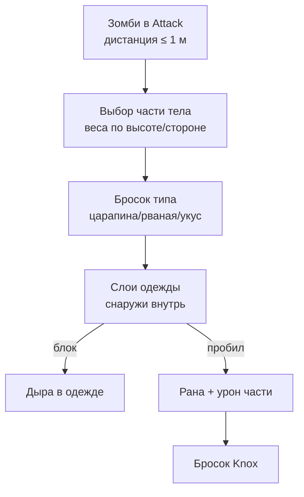
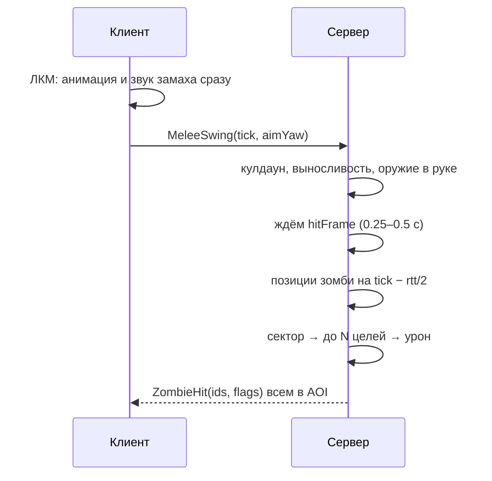

# Техспека

На каждую систему из GDD: классы, структуры данных, алгоритмы, сетевые сообщения и бюджеты. Код — схематичный C#, чтобы было понятно, что писать; имена совпадают с разделами GDD.

## T0. Общие контракты (Core)

Этот слой пишется в M0–M1 и больше не меняется: все остальные системы опираются на него.

### T0.1 Идентификаторы

| Тип | Формат | Где живёт |
| --- | --- | --- |
| `DefId` | ushort (0 = нет) | Шаблоны: предметы, рецепты, черты, наряды. Назначается в редакторе один раз и никогда не меняется |
| `ItemUid` | uint, счётчик сервера | Каждый живой предмет; счётчик сохраняется в БД |
| `ContainerId` | ulong: тип (8 бит) + ключ (56 бит) | Игрок/тайл/машина/труп/сумка |
| `ZombieId` | int, индекс в массиве + поколение | Защита от ссылок на переиспользованный слот |
| `TileCoord` | struct { short x, y; sbyte z } | Мировая сетка 1 м; z = этаж |
| `ChunkCoord` | struct { short cx, cy } = tile / 32 | Чанки |
| `PlayerId` | int = FishNet ClientId (сессия) + `AccountId` string (постоянный) | Сеть / БД |

### T0.2 Время

```csharp
public sealed class GameClock {
    public double WorldMinutes;          // игровые минуты с начала мира (источник правды)
    public float MinutesPerRealSecond;   // 24*60 / (длина дня в секундах), по умолчанию 0.4
    public void Advance(float realDt) => WorldMinutes += realDt * MinutesPerRealSecond;
    public int Day => (int)(WorldMinutes / 1440);
    public float HourOfDay => (float)(WorldMinutes % 1440) / 60f;
}
```

- Все скорости в конфигах — «в игровой час», системы умножают на `gameHoursDelta`. Смена длины дня не ломает баланс.
- Для «ленивых» систем (гниение, растения) храним метку `WorldMinutes` и считаем состояние при обращении.
- Клиент получает `(WorldMinutes, serverTick)` раз в 10 с и экстраполирует.

### T0.3 Планировщик сервера

```csharp
public interface IServerSystem { void Init(ServerContext ctx); }
public interface ITickSystem : IServerSystem { void Tick(in TickInfo t); }   // 20 Гц
public interface IIntervalSystem : IServerSystem { float IntervalSec { get; } void Run(in TickInfo t); }

// Размазывание: система над N сущностями обрабатывает за тик только срез
for (int i = t.TickIndex % Buckets; i < players.Count; i += Buckets) Update(players[i], dt * Buckets);
```

- Порядок в тике (фиксирован): входящие запросы → движение игроков → таймед-экшены → бой → зомби (запуск job) → звуки → системы-интервалы → завершение job зомби → репликация.
- Каждая система замеряется (`ProfilerMarker`) и пишет время в оверлей F3 / мониторинг.

### T0.4 Таймед-экшены (основа всего геймплея PZ)

```csharp
public abstract class TimedAction {
    public float Duration;                 // сек, посчитано с учётом навыков/модификаторов
    public bool StopOnMove = true, StopOnAim = true;
    public abstract bool IsValid(PlayerSim p); // проверяется каждый тик (предмет ещё у тебя? дистанция?)
    public virtual void OnStart(PlayerSim p) {}
    public virtual void OnTick(PlayerSim p, float dt) {}  // например, еда съедается постепенно
    public abstract void OnComplete(PlayerSim p);
    public virtual void OnCancel(PlayerSim p) {}
    public byte AnimId;                    // что проиграть у всех
}
```

- У игрока — очередь `Queue<TimedAction>` (до 10), выполняется по одному. Клиент получает `ActionStarted(id, duration, animId)` и `ActionEnded(id, result)`.
- Примеры: `EatAction`, `TransferItemAction`, `BandageAction`, `BarricadeAction`, `CraftAction`, `ReadAction`, `ClimbWindowAction`.

### T0.5 События и связи

- Внутри сервера — обычные C#-события на сервисах (`BodyDamage.OnWound`, `Inventory.OnChanged`) + одна шина `GameEvents` для редких глобальных (`PowerShutOff`, `HelicopterEvent`).
- `ServerContext` хранит ссылки на все сервисы (World, Zombies, Items, Clock, Sounds, Saves) — передаётся в `Init`. Никаких `FindObjectOfType`.

### T0.6 Случайность и конфиг

- `Unity.Mathematics.Random` с сидом мира для генерации лута (сид чанка = hash(worldSeed, chunk)) — одинаковый лут при перезапуске до первого открытия.
- `SandboxSettings` (SO в редакторе, JSON на сервере `server/sandbox.json`) + `BalanceConfig` (SO) со всеми коэффициентами из GDD. Клиент получает нужную часть настроек при входе.

## T1. Персонаж, черты, навыки (GDD 3–4)

### T1.1 Состав игрока на сервере

```csharp
public sealed class PlayerSim {                 // чистый C#, живёт в PlayerRegistry
    public int ClientId; public string AccountId;
    public CharacterProfile Profile;           // профессия, черты, внешность (неизменны)
    public Stats Stats;                        // T2
    public BodyDamage Body;                    // T3
    public PlayerInventory Inventory;          // T4
    public SkillSet Skills;
    public ModifierStack Mods;                 // итоговые множители (пересчёт по dirty-флагу)
    public ActionQueue Actions;                // T0.4
    public float3 Position; public float Yaw; public MoveState Move; // от контроллера
}
// PlayerNet : NetworkBehaviour — тонкий мост: принимает RPC, вызывает сервисы, шлёт TargetRpc
```

### T1.2 Модификаторы — единый механизм для черт, нужд, ран, одежды

```csharp
public enum StatKey : byte { MoveSpeed, SprintSpeed, MeleeDamage, AttackSpeed, Accuracy, AimSpeed,
    EnduranceDrain, EnduranceRegen, CarryCapacity, HungerRate, ThirstRate, FatigueRate,
    PanicGain, XpGain, VisionRange, HearingRange, FootstepNoise, ActionSpeed, BleedRate, ... }

public struct Modifier { public StatKey Key; public ModOp Op; public float Value; public ushort SourceId; }
// ModOp: Add | Mul. Итог = (base + ΣAdd) × ΠMul, затем clamp из BalanceConfig

public sealed class ModifierStack {
    readonly List<Modifier> _all; readonly float[] _cache = new float[(int)StatKey.Count]; bool _dirty;
    public void SetSource(ushort sourceId, ReadOnlySpan<Modifier> mods); // заменить все моды источника
    public float Get(StatKey k);          // пересчёт кэша только если dirty
}
```

Источники модов: черты (постоянно), мудлы нужд (пересчёт раз в игровую минуту), раны/боль (при изменении), одежда (при надевании), перегруз (при изменении веса), лекарства (с таймером). Клиент-владелец получает только `MoveSpeed`/`SprintSpeed` для предсказания движения.

### T1.3 Данные

```csharp
[CreateAssetMenu] public class TraitDef : ScriptableObject {
    public ushort Id; public string NameKey, DescKey; public Sprite Icon;
    public int Cost;                        // отрицательный = даёт очки
    public TraitDef[] Excludes;
    public Modifier[] Modifiers;
    public SkillBonus[] SkillBonuses;       // {skill, levels}
    public RecipeDef[] KnownRecipes;
}
[CreateAssetMenu] public class ProfessionDef : ScriptableObject {
    public ushort Id; public int Points; public SkillBonus[] SkillBonuses;
    public TraitDef[] FreeTraits; public RecipeDef[] KnownRecipes; public ItemDef[] StartItems;
}
```

Валидация создания персонажа — на сервере: сумма очков ≥ 0, нет исключающих пар, id существуют. Клиент шлёт `CreateCharacterRequest { professionId, traitIds[], appearance }`.

### T1.4 Навыки

```csharp
public enum SkillId : byte { Fitness, Strength, Sprinting, Lightfoot, Nimble, Sneak,
    Axe, LongBlunt, ShortBlunt, LongBlade, ShortBlade, Spear, Maintenance,
    Aiming, Reloading, Carpentry, Cooking, Farming, FirstAid, Electrical,
    Metalworking, Mechanics, Tailoring, Fishing, Trapping, Foraging, Count }

public sealed class SkillSet {
    public byte[] Level = new byte[(int)SkillId.Count];
    public float[] Xp = new float[(int)SkillId.Count];          // XP внутри текущего уровня
    public float[] BoostMul = new float[(int)SkillId.Count];    // от профессии/черт
    public byte[] BookTier = new byte[(int)SkillId.Count];      // прочитанный том (0 = нет)
    public event Action<SkillId, byte> OnLevelUp;
    public void AddXp(SkillId s, float baseXp, in XpContext ctx);
}
```

```latex
XP_{final} = XP_{base} \cdot M_{prof} \cdot M_{book} \cdot M_{trait} \cdot M_{server}
```

- M\_book действует, если `level` в диапазоне прочитанного тома (том k → уровни 2k−2 … 2k).
- Таблицы стоимости уровней — в `BalanceConfig.SkillXpTable` и `PassiveXpTable` (Фитнес/Сила).
- Источники XP (база для старта): попадание оружием 1–2, убийство +2, спринт 1/сек, ходьба рядом с зомби 0.5/сек, постройка 5–20, лечение 5–10, блюдо 3–10.
- Репликация: `TargetRpc SkillXpDelta(skill, level, xp)` не чаще раза в 1 сек на навык (агрегируем) + `SkillLevelUp` сразу.

## T2. Нужды (GDD 5)

### T2.1 Данные

```csharp
public sealed class Stats {
    public float Hunger, Thirst, Fatigue, Endurance = 1, Stress, Boredom, Unhappiness, Panic,
                 Wetness, Sweat, Drunk;            // 0..1
    public float BodyTempC = 36.6f, WeightKg = 80, CaloriesToday;
    public double LastSleepEnd, AwakeSinceMinutes;
    public byte[] MoodleLevels = new byte[(int)MoodleId.Count];   // 0..4, для UI и модификаторов
}

[CreateAssetMenu] public class NeedsConfig : ScriptableObject {
    public float HungerPerHour = 0.017f;    // ~100% за 60 игровых часов
    public float ThirstPerHour = 0.042f;    // ~100% за 24 ч
    public float FatiguePerHour = 0.05f;    // ~100% за 20 ч
    public AnimationCurve EnduranceRegenByFitness;
    public MoodleThresholds[] Thresholds;  // пороги 4 уровней для каждого мудла
    public MoodleEffects[] Effects;        // какие Modifier даёт каждый уровень
}
```

### T2.2 Порядок расчёта (`StatsSystem`, раз в игровую минуту, размазано по игрокам)

1. Собрать контекст: активность за минуту (доля времени спринт/бег/бой — считает контроллер движения), температура комнаты/улицы, дождь, спит ли, зомби в радиусе 10 м (из пространственного хеша T6).
2. Обновить нужды: `Hunger += HungerPerHour × dtH × Mods.Get(HungerRate) × activityMul`, аналогично остальные.
3. Температура тела: `ΔT = k × (T_env_effective − T_body)`, где T\_env\_effective учитывает изоляцию одежды, мокрость, ветер; инерция большая (минуты игрового времени).
4. Психика: паника от числа видимых зомби (серверный счётчик из зрения игрока), скука в помещении без дела, перетекание скуки в несчастье.
5. Последствия: голод/жажда/температура на максимуме → `Body.ApplyGenericDamage(x)`.
6. Пересчитать уровни мудлов; если уровень изменился → `Mods.SetSource(MoodleSource, ...)` + событие для репликации и фразы персонажа.

Выносливость — исключение: считается каждый сетевой тик (20 Гц), потому что влияет на спринт и удары. Клиент предсказывает её локально для плавности и сверяется с сервером (входит в reconcile-состояние движения).

### T2.3 Сон в мультиплеере

- `SleepAction`: проверки (нет зомби в 15 м, боль ниже порога, паника 0) → состояние Sleeping: усталость − `8 × FatiguePerHour × bedQuality`, голод/жажда ×0.5, камера затемнена, пробуждение от урона или громкого звука рядом.
- Выход из игры в кровати → флаг `LoggedOutInBed` → при входе усталость снимается пропорционально прошедшему игровому времени (макс. 100%), голод/жажда растут с капом (не умираешь офлайн).

### T2.4 Репликация

- `TargetRpc StatsSnapshot` — раз в игровую минуту, только изменившиеся поля: битовая маска (ushort) + значения byte (0–255). \~10–20 байт.
- Мудлы — отдельно `MoodleChanged(id, level)` сразу (для отзывчивости UI).
- Другим игрокам: только флаги видимых эффектов (`VisualFlags`: хромает, пьян, мокрый, спит) в SyncVar byte.

### T2.5 Тесты (EditMode)

- «Игрок без еды умирает от жажды за 24–36 игровых часов» (симуляция 1440 тиков).
- «Смена длины дня не меняет скорость нужд в игровых часах».
- «Черта Мало ест замедляет голод на 25%».

## T3. Здоровье (GDD 6)

### T3.1 Структуры

```csharp
public enum BodyPartId : byte { Head, Neck, TorsoUpper, TorsoLower, Groin,
    UpperArmL, UpperArmR, ForearmL, ForearmR, HandL, HandR,
    ThighL, ThighR, ShinL, ShinR, FootL, FootR, Count }   // 17

public enum WoundKind : byte { Scratch, Laceration, Bite, DeepWound, Burn, Fracture, Bruise }

public struct Wound {
    public WoundKind Kind; public float Severity;     // 0..1, уменьшается при заживлении
    public float HealTimeLeftH;                        // игровые часы
    public bool Bleeding, Disinfected, Stitched, Splinted, HasForeignObject;
    public float InfectionLevel;                       // обычная инфекция 0..1
}

public struct BodyPartState {
    public float Health;                  // 0..100
    public FixedList64Bytes<Wound> Wounds;
    public BandageState Bandage;          // None/Clean/Dirty + впитанная кровь
    public float Pain;
}

public sealed class BodyDamage {
    public BodyPartState[] Parts = new BodyPartState[(int)BodyPartId.Count];
    public float Overall;                 // вычисляемое
    public KnoxState Knox;                // серверный секрет
    public List<Disease> Diseases;        // простуда, отравление…
    public event Action<BodyPartId, Wound> OnWound;
}
```

### T3.2 Общее здоровье

```latex
Overall = 100 - \sum_{p} w_p \cdot (100 - H_p) - D_{generic}
```

где w\_p — вес части (шея 0.5, голова 0.35, торс 0.2, конечности 0.05–0.08), D\_generic — урон от голода/жажды/болезней/Knox. Overall ≤ 0 → смерть. Веса — в `HealthConfig`.

### T3.3 Конвейер атаки зомби по игроку



- Шанс укуса: `base 0.1 + 0.1 × (зомби в 1.5 м − 1) + (сзади ? 0.15 : 0)`, clamp 0.05–0.6; рваная \~0.3; остальное — царапина. Значения — в конфиге.
- Защита слоя: `P(block) = defense[kind] / 100 × (1 − holeInZone)`. Блок → `holes |= zoneBit`, прочность одежды −.
- Knox: укус → 100%; рваная → 25%; царапина → 7% (из SandboxSettings).

### T3.4 Тик здоровья (раз в игровую минуту)

1. Кровотечение: для каждой раны `Bleeding && Bandage==None` → `Health −= bleedRate[kind] × Mods(BleedRate)`. Повязка намокает → Dirty.
2. Заживление: `HealTimeLeftH −= dtH × healMul`, где healMul ↑ от сна, сытости, шины/шва; = 0 при инфекции или инородном теле.
3. Инфекция раны: грязная повязка или нет дезинфекции → шанс в час роста `InfectionLevel`.
4. Боль = Σ severity × painWeight, минус эффект обезболивающего.
5. Естественная регенерация части без ран (медленно, только если не голоден).
6. Knox: инкубация → `KnoxState.Stage` (0 скрыто, 1 «тошнота», 2 «лихорадка», 3 урон в час до смерти).
7. Пересчёт Overall, модификаторов (боль, хромота, раненые руки), события для UI.

### T3.5 Лечение (таймед-экшены)

| Действие | Условие | Время (с) | Результат |
| --- | --- | --- | --- |
| `BandageAction` | бинт/тряпка | 4 − 0.25×ПП | Bandage = Clean/Dirty, Bleeding = false |
| `DisinfectAction` | спирт | 3 | Disinfected, InfectionLevel = 0 |
| `StitchAction` | игла + нить | 10 − 0.5×ПП | Stitched, ускорение заживления; боль при низком ПП |
| `RemoveObjectAction` | пинцет | 8 | HasForeignObject = false (шанс успеха от ПП) |
| `SplintAction` | доска/палка + бинт | 6 | Splinted, перелом заживает ×2 |
| `TakePillsAction` | таблетки | 2 | Временный Modifier с таймером |

ПП = уровень Первой помощи. Лечение другого игрока = тот же экшен с `target != self`, проверка дистанции ≤ 1.5 м каждый тик.

### T3.6 Репликация и смерть

- Владельцу: `BodySnapshot` при изменении (17 × \[health byte, woundsMask, bandage byte\] ≈ 60 байт), без Knox. Точное время заживления — только если ПП ≥ 4.
- Лечащему другого — тот же снимок пациента на время открытого окна.
- Смерть: `PlayerDied(cause)` → сервер создаёт контейнер-труп с инвентарём; если Knox — таймер 30–90 с, затем `ZombieManager.SpawnFromCorpse(corpse, outfit=текущая одежда)`, лут переносится в зомби.
- Удалить из проекта: `HealthSystem`, `CharacterHealth`, `DamageTester` (→ консольная команда `damage part kind`).

## T4. Инвентарь и предметы (GDD 7)

### T4.1 Дефиниция — композиция вместо наследования

```csharp
[CreateAssetMenu] public class ItemDef : ScriptableObject {
    public ushort Id; public string NameKey; public Sprite Icon;
    public GameObject WorldPrefab;          // визуал на земле/в руке (клиент)
    public float Weight; public ItemCategory Category; public ItemTag Tags;  // [Flags] CanOpenCans, Sharp, Hammer…
    public int MaxStack = 1;                 // стакаются только предметы без состояния (патроны, гвозди)
    [SerializeReference] public ItemComponent[] Components;  // FoodComp, WeaponMeleeComp, FirearmComp,
                                             // ClothingComp, ContainerComp, DrainableComp, LiteratureComp, MedicalComp
    public T Get<T>() where T : ItemComponent;  // кэшируется в DefRegistry при старте
}
```

Миграция: текущие `ItemData`/`WeaponData`/`ClothingData`/`ConsumableData` → редакторный скрипт конвертирует в `ItemDef` + компоненты, `itemID` (string) → ushort через таблицу соответствия.

### T4.2 Живой предмет

```csharp
public sealed class ItemInstance {
    public uint Uid; public ushort DefId; public ushort Count = 1;
    public byte Condition = 100;            // прочность
    public float Fill;                      // Drainable: вода/бензин/отбеливатель
    public double CreatedAt;                // WorldMinutes для свежести
    public byte CookState, Dirt, Blood, Wet;
    public uint Holes;                      // битовая маска зон одежды
    public ushort AmmoCount; public ushort MagazineDefId;   // огнестрел
    public ItemContainer Inner;             // сумка / кастрюля с ингредиентами
    public Dictionary<byte, float> Extra;   // редкие поля (не аллоцировать, если не нужно)
}

public sealed class ItemContainer {
    public ContainerId Id; public float Capacity; public float WeightReduction; // 0..1 для сумок
    public readonly List<ItemInstance> Items;
    public uint Version;                    // ++ при каждом изменении — для дельт и защиты от гонок
    public float TotalWeight;               // кэш
}
```

### T4.3 Транзакции (защита от дюпа)

```csharp
public enum TransferResult : byte { Ok, NotFound, NoAccess, TooFar, NoSpace, Busy, VersionMismatch }

// единственная точка перемещения предметов в игре
public TransferResult Transfer(PlayerSim who, uint itemUid, ContainerId from, ContainerId to, ushort count);
```

- Проверки по порядку: предмет существует в `from` → у игрока есть доступ к обоим (свой, или в радиусе 1.5 м, или safehouse разрешает) → вместимость `to` → предмет не занят другим таймед-экшеном.
- Перенос атомарный: удалить из from и добавить в to в одном методе (сервер однопоточный по логике — гонок нет). Два игрока берут один предмет → второй получает NotFound.
- Длительность `TransferItemAction` = `0.2 + weight × 0.15` с (мгновенно внутри своего инвентаря).

### T4.4 Репликация

- Контейнеры игрока — владельцу всегда. Чужие — по подписке: `OpenContainer(id)` → `ContainerFull(id, version, items[])`; далее `ContainerDelta(id, fromVersion, ops[])` всем подписчикам; отписка при уходе дальше 3 м.
- Дельта-операции: `Add(itemBlob)`, `Remove(uid)`, `Update(uid, fieldsMask, values)`. Рассинхрон версий → клиент запрашивает `ContainerFull`.
- Сериализация предмета: uid(4) + defId(2) + fieldsMask(2) + только нестандартные поля ≈ 8–16 байт. Кастомный Writer/Reader для FishNet.

### T4.5 Одежда и внешний вид

```csharp
public class ClothingComp : ItemComponent {
    public ClothingSlot Slot; public byte Layer;     // 0 бельё → 3 верхняя одежда
    public BodyPartMask Covers;                       // [Flags] по 17 частям
    public byte BiteDef, ScratchDef, Insulation, Wind; public float SpeedPenalty;
    public BodyPartMask HidesBodyMeshes;              // скрыть меши тела под одеждой
    public ushort VisualId;                           // ссылка на SkinnedMesh-префаб в ClothingVisualRegistry
}
```

Внешний вид для других: `SyncList<ushort> WornVisuals` (до 12 штук) + `SyncVar ushort HandMain/HandOff` + `SyncVar byte BloodLevel`. Клиент собирает персонажа из пула мешей на общем скелете.

### T4.6 Предметы на земле

- Земля — контейнер тайла (`ContainerId(Floor, tile)`), создаётся при первом броске. Визуал: клиент рисует до 8 предметов на тайл из пула (если больше — «куча»).
- Данные земли входят в `ChunkSnapshot` при входе в чанк (только defId + позиция для визуала), полные данные — при открытии.
- Удалить: `PickupItem` как NetworkObject, `Resources.FindObjectsOfTypeAll` в `InventoryManager`.

## T5. Бой и шум (GDD 8)

### T5.1 Конвейер удара ближним оружием



- Лаг-компенсация: кольцевой буфер позиций активных зомби за последние 8 тиков (400 мс), откат не больше 150 мс. Хранится в `NativeArray<float2>[8]` рядом с `ZombieState`.
- Сектор: запрос к пространственному хешу (радиус = range) → фильтр угла → сортировка по дистанции → первые `MaxHits` → проверка стены между игроком и целью по тайлам.
- Исход на цель: урон (формула GDD 8.1) → бросок крита → бросок падения (knockdown = weapon.Knockback × Str-множитель) → бросок отрыва части → XP → износ оружия.
- Клиент не ждёт ответа для анимации замаха; реакция зомби (кровь, отшатывание) — по ответу сервера. Опционально: косметическое предсказание брызг крови на клиенте.

### T5.2 Данные оружия

```csharp
public class WeaponMeleeComp : ItemComponent {
    public SkillId Skill; public float MinDmg, MaxDmg, Range, AngleDeg, SwingTime, HitFrame;
    public byte MaxHits; public float CritChance, CritMul, Knockback, EnduranceCost;
    public byte ConditionMax, ConditionLowerChance; public bool TwoHanded;
    public float NoiseRadius; public float DismemberMul; public byte AnimSet;
}
public class FirearmComp : ItemComponent {
    public ushort AmmoDefId; public ushort MagazineDefId; public byte Capacity;
    public float Damage, Range, BaseAccuracy, AimTime, RecoilDelay, SpreadDeg, NoiseRadius;
    public byte Pellets;  // дробовик > 1
    public float JamChanceAtZeroCondition;
}
```

### T5.3 Огнестрел

- Прицеливание: пока зажат ПКМ, `aimProgress` растёт 0→1 за `AimTime × mods`; конус сужается от `SpreadDeg×2` до `SpreadDeg`.
- Выстрел на сервере: кандидаты в конусе (хеш) → первый по дистанции с чистой линией (тайлы) → `P(hit) = clamp(BaseAccuracy + 0.05×Aiming − 0.01×dist − panic − fatigue − moving − dark, 0.05, 0.95)` → при промахе шанс задеть следующего.
- Один выстрел = `WorldSound(pos, NoiseRadius)` + `ShotFired(shooter, dir, hitPoint)` всем в AOI (трассер, звук) + `SoundBroadcaster` игрокам дальше AOI, но в радиусе слышимости (далёкий выстрел).
- PvP: та же схема, цель-игрок берётся из истории позиций игроков (FishNet хранит для prediction), попадание → `Body.AddWound(randomPart, DeepWound|ForeignObject)`.

### T5.4 WorldSound

```csharp
public struct WorldSound { public float3 Pos; public float Radius; public byte Kind; public int SourcePlayer; }
// SoundSystem: очередь за тик → в job зомби: для каждого звука — запрос к хешу в радиусе
// эффективный радиус = Radius × hearingMul(sandbox) × (стена между ? 0.5 : 1) × (дождь ? 0.7 : 1)
// зомби в Idle/Wander/Search → Investigate(target = Pos + шум 0..2 м)
```

- Виртуальные зомби: звуки с радиусом 80+ м сдвигают миграцию соседних чанков к источнику — так стрельба «собирает орду» со всего района.
- Стелс-заметность игрока (для зрения зомби): `visibility = base × (crouch 0.5) × (1 − 0.05×Sneak) × lightLevel(tile) × (flashlight ? 2 : 1)` — считается раз в 0.5 с на игрока и кладётся в `NativeArray<PlayerSenseData>` для job зомби.

## T6. Зомби (GDD 9)

### T6.1 Данные (Structure of Arrays для Burst)

```csharp
public struct ZombieCore {            // горячие данные, читаются каждый тик
    public float2 Pos; public float Yaw; public float2 Vel;
    public ZState State; public byte SubState; public float StateTimer;
    public int TargetPlayer;          // -1 = нет
    public float2 InterestPoint; public float Memory;
    public sbyte Floor; public byte Flags;   // Crawler, NoArmL, NoArmR, NoLegs, FakeDead, Sprinter
}
public struct ZombieCold {            // холодные, редко
    public float Health; public ushort OutfitId; public uint LootSeed; public ushort Generation;
}
public sealed class ZombieStore {
    public NativeList<ZombieCore> Core; public NativeList<ZombieCold> Cold;
    public NativeList<byte> SimLevel;          // 0 вирт, 1 спящий, 2 активный
    public NativeArray<float2>[] PosHistory;   // 8 тиков для лаг-компенсации
    public NativeQueue<int> FreeSlots;
}
```

Память: 50 000 зомби × \~64 байта ≈ 3.2 МБ. Виртуальные зомби вообще не занимают слотов — только счётчик `ChunkPopulation[chunk]` (ushort).

### T6.2 Тик зомби (сервер, 20 Гц для активных)

| Шаг | Job | Частота | Что делает |
| --- | --- | --- | --- |
| 1 | `BuildSpatialHashJob` | 20 Гц | Сетка 2×2 м: cell → список индексов (NativeParallelMultiHashMap) |
| 2 | `SenseJob` | 2–4 Гц (размазано по индексу) | Зрение: игроки в конусе и дальности → LOS по тайлам (DDA); слух: звуки тика |
| 3 | `DecideJob` | 20 Гц | Переходы состояний (GDD 9.3), таймеры, память |
| 4 | `SteerJob` | 20 Гц | Направление: флоу-филд цели / прямая к точке интереса + раздвигание соседей (сепарация) |
| 5 | `MoveJob` | 20 Гц | Интеграция, коллизия со стенами по тайлам (не PhysX), остановка у закрытых дверей → Thump |
| 6 | главный поток | 20 Гц | События из job (атака, удар по двери) → BodyDamage/World |

Бюджет: 3000 активных меньше 5 мс на 8 ядрах. Главное — никаких managed-объектов в job, все данные мира (стены тайлов) для job — в `NativeArray<TileFlags>` активных чанков.

### T6.3 Флоу-филды

- На каждого игрока, за которым гонятся ≥ 1 зомби: BFS/Dijkstra по сетке тайлов в окне 128×128 вокруг игрока, учёт стен/дверей/окон/этажей (лестницы = рёбра). Результат — `NativeArray<byte>` направлений (8 сторон).
- Пересчёт, когда игрок сместился на другой тайл, но не чаще 10 Гц; Burst-job, \~0.3 мс на поле. На 200 игроках в худшем случае \~200 полей, распараллелено.
- Игроки в одном месте (группа) → одно поле на нескольких (multi-source BFS).
- Зомби вне окна поля — идут прямо к цели с обходом по правилу «вдоль стены».

### T6.4 Уровни симуляции

- Раз в 0.5 с `SimLevelJob`: дистанция до ближайшего игрока (через сетку игроков 32 м) → уровень с гистерезисом 10 м.
- **Материализация:** игрок подошёл к чанку на 150 м → `ChunkPopulation[c]` зомби создаются в случайных проходимых тайлах (веса по зонам: улица/дома), наряд — из `ZoneDef` чанка. **Дематериализация:** все игроки дальше 200 м → зомби в Idle удаляются, счётчик +1 (зомби в Chase не трогаем).
- Миграция (раз в 10 с): доля популяции перетекает в соседние чанки по градиенту «интереса» (громкие звуки, целевая плотность зоны), ограничение максимума на чанк.
- Респавн: раз в N часов чанки ниже целевой плотности добирают до X% (не в safehouse и не в видимости).

### T6.5 Репликация зомби

```csharp
// на клиента: множество видимых зомби = активные в радиусе 60 м, сортировка по дистанции, макс 150
struct ZombieSpawnMsg { int id; ushort outfit; byte flags; short x, y; sbyte floor; byte yaw; byte state; }  // 13 байт
struct ZombieMoveMsg  { ushort localIdx; short dx, dy; byte yaw; byte state; }                        // 8 байт
// позиция: сантиметры относительно центра чанка клиента (short → ±327 м), yaw 256 шагов
```

- `localIdx` — индекс в таблице видимых этого клиента (выдаётся при Spawn), чтобы не гонять int id.
- Приоритет: ближе 15 м — 10 Гц, 15–35 м — 5 Гц, дальше — 2 Гц; стоящие (скорость 0, состояние то же) — не шлём.
- Клиент держит буфер интерполяции 100–150 мс и рисует зомби «в прошлом» — именно поэтому серверу нужна лаг-компенсация удара (T5.1).
- События (reliable): `ZombieHit(id, dmgFlags, dirByte)`, `ZombieKnockdown(id)`, `ZombieDismember(id, partMask)`, `ZombieDied(id, corpseContainerId)`, `ZombieAttack(id, targetPlayer)` — для анимаций.

### T6.6 Клиентский визуал

- `ZombieViewPool`: предсоздано 40 полных (Animator + расчленёнка) и буфер инстансов VAT на 200. Видимые сортируются по дистанции → 30 ближайших получают полный визуал.
- Анимация из `state` + скорости интерполяции; случайный сдвиг фазы и скорости анимации от id — чтобы толпа не шла синхронно.
- Смерть: регдолл только у полных (до 10 одновременно), через 3 с — замена на статичный труп (запечённая поза).

## T7. Мир (GDD 10)

### T7.1 Тайлы и чанки

```csharp
[Flags] public enum TileFlags : ushort { Walkable=1, WallN=2, WallW=4, DoorN=8, DoorW=16, WindowN=32, WindowW=64,
    Indoor=128, StairsUp=256, StairsDown=512, Water=1024, BlocksSight=2048, LowFence=4096 }
// стены хранятся только на северной и западной грани тайла (южная = северная соседа) — как в PZ

public sealed class ChunkData {                  // 32×32 × этажи (до 4)
    public ChunkCoord Coord;
    public NativeArray<TileFlags> Flags;         // для job зомби и LOS
    public byte[] RoomId;                        // индекс комнаты → RoomDef (тип, температура)
    public List<WorldObject> Objects;           // двери, окна, мебель-контейнеры, постройки
    public ushort ZoneId; public ushort ZombiePopulation;
    public uint Version; public bool Dirty;      // для репликации и сохранения
}
public struct WorldObject { public uint Id; public ushort DefId; public TileCoord Tile; public byte Rot;
    public ushort Hp; public byte State; public ulong ContainerKey; }   // дверь: State = open/locked/barricade level
```

Память карты 4×4 км: 125×125 = 15 625 чанков × 1024 тайла × \~1.5 этажа × 2 байта ≈ 48 МБ — ок для сервера целиком в памяти.

### T7.2 Запекание карты (редактор)

1. Сцена-источник: здания из модульного кита, на каждом модуле компонент `TileAuthoring` (что это: стена/дверь/окно, какая грань).
2. На мебели — `ContainerAuthoring` (тип контейнера для лут-таблицы, вместимость). На комнатах — `RoomVolume` (тип комнаты). Зоны — `ZoneVolume` (город/лес/ферма, плотность зомби, наряды).
3. Меню `Tools/Bake World` → проход по всем authoring-компонентам → `world.bin` (бинарный файл чанков) + проверки (дверь без стены, комната без типа, недостижимые тайлы).
4. Сервер грузит только `world.bin` + дельты из БД; сцены с мешами ему не нужны.

### T7.3 Зоны интереса (AOI)

- Сетка игроков по чанкам. Для каждого игрока — множество «подписанных» чанков (радиус 4 чанка ≈ 128 м).
- Вход в чанк → `ChunkSnapshot(coord, version, objectsState[], floorItemsVisual[])`; далее `ChunkDelta` всем подписчикам. Клиент кэширует версию — при повторном входе, если версия та же, снапшот не нужен.
- Игроки (NetworkObject) — FishNet ObserverManager с условием дистанции/сетки (синхронно с чанками).

### T7.4 Лут

```csharp
[CreateAssetMenu] public class LootTable : ScriptableObject {
    public ContainerType Container; public RoomType[] Rooms;   // где применяется
    public int RollsMin, RollsMax; public float EmptyChance;
    public Entry[] Entries;   // {ItemDef item; float weight; int min, max; LootCategory cat}
}
// Generate(container, seed): rng = new Random(hash(worldSeed, containerKey))
// for rolls: pick weighted entry; weight *= sandbox.Rarity[cat]; Lucky → +10% бросков
```

- Генерация — при первом `OpenContainer` или первой материализации чанка; флаг `Generated` + время генерации сохраняются.
- Респавн: фоновая система раз в игровой час проходит N случайных чанков без игроков, пустые контейнеры с возрастом больше X часов → сброс флага.

### T7.5 Двери и окна

- Состояния двери: Closed/Open/Locked/Broken + `BarricadeLevel 0..4` + Hp. Окна: Closed/Open/Smashed/SmashedClean + занавеска + баррикада.
- Каждое изменение → обновить `TileFlags` (проходимость/видимость) → инвалидировать флоу-филды в радиусе → `ChunkDelta`.
- Thump: зомби у закрытой двери с целью за ней → урон двери раз в 1.5 с; звук удара (радиус 15 м) собирает соседей.

### T7.6 Свет, погода, температура комнат

- `lightLevel(tile)` для стелса: день/ночь (кривая от часа) × внутри помещения (0.6) + источники (лампы при электричестве, костёр, фонари). Сервер считает грубо, клиент рисует красиво.
- `WeatherSystem`: марковская цепь состояний с вероятностями по сезону, смена раз в 2–8 игровых часов, плавные переходы (`intensity 0..1`). Температура улицы = сезонная синусоида + суточная + шум.
- Температура комнаты: `T_room → T_out + insulation(окна целы, двери закрыты) + heaters`, пересчёт раз в игровой час только для комнат с игроками рядом.

## T8. Крафт, строительство, фермерство (GDD 11)

### T8.1 Рецепты

```csharp
[CreateAssetMenu] public class RecipeDef : ScriptableObject {
    public ushort Id; public string NameKey; public RecipeCategory Category;
    public Ingredient[] Inputs;     // {ItemDef item | ItemTag tag; ushort count; bool keep; float fillUse}
    public Output[] Outputs;        // {ItemDef item; ushort count; float chance}
    public float TimeSec; public SkillReq[] Skills; public bool NeedsLearning;
    public StationType Station;     // None / Stove / Workbench / Fire
    public SkillXp[] XpReward; public byte AnimId;
}
```

- `CraftingService.FindAvailable(player)`: собирает предметы из инвентаря + контейнеров в радиусе 2 м в словарь `defId/tag → count` и проверяет рецепты. Для UI — на клиенте тот же код (из Simulation-сборки), сервер перепроверяет.
- `CraftAction`: резервирует ингредиенты (флаг Busy), по завершении списывает и создаёт выход; отмена снимает Busy.
- Готовка — особый случай: «блюдо» = `ItemInstance` с `Inner`-контейнером ингредиентов; питательность = Σ ингредиентов × (1 + 0.05 × Кулинария). Приготовление на плите: плита = WorldObject с контейнером и таймером, `CookState` растёт по времени (лениво от метки включения).

### T8.2 Строительство

```csharp
[CreateAssetMenu] public class BuildableDef : ScriptableObject {
    public ushort Id; public BuildKind Kind;  // WallEdge / Floor / Object / DoorEdge / Stairs
    public Ingredient[] Cost; public ItemTag[] Tools; public SkillReq Skill;
    public ushort MaxHp; public float TimeSec; public GameObject Visual; public TileFlags FlagsApplied;
    public PlacementRule Rule;               // нужен пол, нельзя на дороге, только внутри…
}
```

- Клиент: режим призрака, локальная проверка `Rule` для цвета. Сервер: `BuildRequest(defId, tile, edge, rot)` → проверка правил, safehouse, лимитов, ресурсов → `BuildAction` → новый `WorldObject` + обновление `TileFlags` + `ChunkDelta`.
- Разрушение: HP → 0 → удаление + часть материалов на землю. Разбор игроком — `DismantleAction`.
- Лимиты: `MaxBuildablesPerPlayer` (напр. 500), `MaxBuildablesPerChunk` (300) — храним счётчики.

### T8.3 Safehouse

```csharp
public sealed class Safehouse { public int Id; public string OwnerAccount; public List<string> Members;
    public RectInt Area; public sbyte FloorMin, FloorMax; public double LastVisit; }
// SafehouseService.CanModify(player, tile) — вызывается из Transfer, Build, Dismantle, Barricade, Door
```

### T8.4 Фермерство

```csharp
public struct PlantState { public ushort CropDefId; public double PlantedAt, LastUpdate;
    public float Growth, Water, Health; public byte Disease; }
// CropDef: дней до созревания, нужная вода, сезоны, урожай min/max, шанс болезни
// Simulate(plant, now): догоняет (now − LastUpdate) часами с учётом дождей из истории погоды
```

- История погоды хранится как список интервалов дождя за 30 дней — чтобы огород вдали от игроков мог «догнать» время одним вызовом.
- Рыбалка/ловушки — тот же принцип: состояние + метка времени, бросок улова при проверке (число прошедших часов × шанс).

### T8.5 Электричество

- `PowerGrid`: глобальный флаг `GridOn` до отключения; после — только генераторы. Генератор запитывает тайлы в радиусе 20 м и этажи ±1 (кэшируем множество комнат).
- Приборы (холодильник, плита, лампа) спрашивают `IsPowered(tile)`; холодильник меняет коэффициент гниения — и фиксирует момент смены (для ленивого расчёта свежести по интервалам).

## T9. Транспорт (GDD 12)

```csharp
public sealed class VehicleSim {
    public uint Id; public ushort ModelDefId; public float3 Pos; public quaternion Rot; public float3 Vel;
    public float Fuel, Battery; public byte[] PartCondition;   // двигатель, шины×4, тормоза, двери, стёкла…
    public int[] Seats;                                         // clientId или -1
    public ContainerId Trunk, Glovebox; public bool Locked, AlarmArmed; public uint KeyId;
}
```

- Стоящая машина — WorldObject в чанке (без NetworkObject). Кто-то сел за руль → сервер спавнит NetworkObject `VehicleNet` из пула, владелец = водитель. Вышел и машина остановилась → обратно в WorldObject.
- Движение: prediction как у игрока (Replicate: газ/тормоз/руль), простая аркадная модель (велосипедная модель + сцепление от шин), столкновения со стенами по тайлам + капсулы для других машин.
- Зомби: сервер ищет зомби в прямоугольнике перед машиной (хеш) → урон `k × speed²`, knockdown, урон машине и торможение. Зомби у двери стоящей машины → Thump по стеклу.
- Расход топлива и износ — раз в секунду на сервере. Шум двигателя = `WorldSound` раз в секунду.
- Бюджет: одновременно едущих ≤ 60. Репликация — FishNet NetworkTransform с интерполяцией, 20 Гц, только игрокам в AOI.

## T10. Сетевой протокол (GDD 13)

Все сообщения — структуры с ручной сериализацией (FishNet `Writer`/`Reader` extension-методы), передаются как Broadcast или RPC на менеджерах. Никаких строк и ссылок на ассеты — только id.

### T10.1 Клиент → сервер

| Сообщение | Поля | Канал | Лимит/с |
| --- | --- | --- | --- |
| Replicate (движение) | dir, yaw, flags (run/sprint/crouch/aim) | Unreliable, каждый тик | 20 |
| `MeleeSwing` | tick, aimYaw | Reliable | 4 |
| `FireWeapon` | tick, aimYaw, aimProgress | Reliable | 10 |
| `Shove` / `Stomp` | tick, aimYaw | Reliable | 4 |
| `Interact` | worldObjectId, verb | Reliable | 10 |
| `OpenContainer` / `CloseContainer` | containerId | Reliable | 10 |
| `TransferItems` | from, to, uid\[\] (до 50), counts | Reliable | 10 |
| `UseItem` | uid, verb (eat/drink/read/equip/wear…), portion | Reliable | 10 |
| `Heal` | targetPlayer, part, verb, itemUid | Reliable | 5 |
| `Craft` | recipeId, count | Reliable | 5 |
| `Build` / `Dismantle` / `Barricade` | defId, tile, edge, rot / objectId | Reliable | 5 |
| `CancelAction` | — | Reliable | 10 |
| `Chat` | channel, text (≤ 200 символов) | Reliable | 2 |
| `CreateCharacter` | professionId, traitIds\[\], appearance | Reliable | 1 |

Превышение лимита → сообщение отбрасывается + счётчик нарушений; 3 превышения за 10 с → кик.

### T10.2 Сервер → клиент

| Сообщение | Кому | Канал | Частота |
| --- | --- | --- | --- |
| Reconcile (движение) | владелец | Unreliable | 20 Гц |
| `ZombieSpawnBatch` / `ZombieDespawnBatch` | AOI | Reliable | по событию |
| `ZombieMoveBatch` | AOI | Unreliable | 2–10 Гц по приоритету |
| `ZombieEventBatch` (hit/knockdown/dismember/died/attack) | AOI | Reliable | по событию, батч за тик |
| `ChunkSnapshot` / `ChunkDelta` | подписчики чанка | Reliable | по событию |
| `ContainerFull` / `ContainerDelta` | подписчики контейнера | Reliable | по событию |
| `StatsSnapshot`, `MoodleChanged`, `BodySnapshot`, `SkillXpDelta` | владелец | Reliable | раз в игр. минуту / по событию |
| `ActionStarted` / `ActionEnded` | владелец + AOI (для анимации) | Reliable | по событию |
| `ShotFired`, `MeleeVisual` | AOI | Unreliable | по событию |
| `DistantSound` | в радиусе слышимости | Unreliable | по событию |
| `ClockSync` (время, погода) | все | Reliable | раз в 10 с |
| SyncVar/SyncList игрока (одежда, руки, VisualFlags) | наблюдатели FishNet | Reliable | при изменении |

### T10.3 Бюджет трафика (один игрок в городе, худший случай)

| Поток | Расчёт | КБ/с |
| --- | --- | --- |
| Зомби | 150 × 8 Б × средне 5 Гц + заголовки | \~7 |
| Игроки-соседи | 20 × \~20 Б × 20 Гц | \~8 |
| Свой reconcile | \~40 Б × 20 Гц | \~0.8 |
| События, чанки, контейнеры | в среднем | \~3–5 |
| Итого |  | **\~20 (пики до 40)** |

Измерять фактический трафик по типам сообщений в F3-оверлее с M2 и сравнивать с этой таблицей.

### T10.4 Правила

- Сервер никогда не доверяет полям клиента кроме «намерения»; `tick` из запроса ограничивается диапазоном \[now − 150 мс, now\].
- Один файл `NetMessages.cs` со всеми структурами + `ProtocolVersion` (клиент с другой версией не подключается).
- Тесты сериализации: «записал → прочитал → равно» для каждой структуры.

## T11. Сохранения (GDD 13.5)

SQLite (пакет `sqlite-net` или `Microsoft.Data.Sqlite`), режим WAL, запись только из одного фонового потока `SaveWorker`. Игровой поток сериализует снимок в byte\[\] и кладёт в очередь — никакого диска в тике.

| Таблица | Ключ | Содержимое | Когда пишется |
| --- | --- | --- | --- |
| `meta` | key | saveVersion, worldSeed, WorldMinutes, nextItemUid, даты отключения воды/света | раз в 30 с |
| `accounts` | account\_id | бан, роль, последний вход | при входе |
| `characters` | account\_id | blob: профиль, stats, body, skills, позиция, инвентарь; alive | выход, раз в 5 мин, смерть |
| `chunk_deltas` | cx, cy | blob: изменённые/удалённые/добавленные WorldObject, population, растения | dirty, раз в 30 с |
| `containers` | container\_id | blob предметов, generated, genTime | dirty, раз в 30 с |
| `safehouses` | id | owner, members, area | при изменении |
| `vehicles` | id | VehicleSim blob | dirty, раз в 30 с |
| `factions` | id | имя, участники | при изменении |
| `audit_log` | autoinc | время, игрок, событие (кик, подозрение, админ-команда, смерть) | сразу |

- Blob-формат: `[version:ushort][payload]` с собственным `BinaryWriter`. Каждый blob имеет свою версию → миграция `Upgrade(vN → vN+1)` при чтении. Новые поля — только в конец.
- `DefId` нельзя переиспользовать: удалённый предмет помечается `Deprecated` и при загрузке заменяется на «хлам».
- Бэкап: `VACUUM INTO 'backup_YYYYMMDD_HH.db'` раз в час, хранить 48; перед запуском новой версии сервера — обязательный бэкап.
- Корректное выключение (SIGTERM / команда `quit`): стоп приёма игроков → сохранить всё dirty → дождаться `SaveWorker` → выход. Падение — теряем максимум 30 с мира и 5 мин персонажа.
- Дюп через сохранения: игрок и контейнер, участвовавшие в одной передаче, пишутся в одной транзакции БД (SaveWorker группирует по «эпохе»).

## T12. Клиент (GDD 14–16)

### T12.1 Камера

- Ортографическая или перспектива с узким FOV (20–25°) на дистанции — выбрать в M1 (перспектива даёт глубину, орто — чистый PZ-вид). Угол 45–55°, зум 8–30 м.
- Поворот по 90° с плавным переходом (проще для скрытия стен) или свободный; лёгкое смещение к курсору (look-ahead до 3 м) в боевой стойке.
- Курсор → мир: пересечение луча с плоскостью `y = floor × 3 + 1` (без физики), потом тайл под курсором для взаимодействия.

### T12.2 Скрытие этажей и стен

- Каждый модуль здания знает `floor` и `buildingId`. Игрок в здании B на этаже F → у B скрыть всё с floor больше F + крышу (меняем слой рендера или shadowsOnly, без SetActive — дешевле).
- Стены между камерой и игроком: шейдерный «вырез» (dither по расстоянию до игрока в экране) — один глобальный параметр шейдера, без рейкастов.

### T12.3 FOV и видимость

- Существующий `FieldOfView` (меш конуса) → перевести на расчёт по тайлам (shadowcasting по сетке в радиусе 40 м, 10 Гц) → текстура видимости → пост-эффект затемнения невидимых зон.
- `VisibilityTarget` на зомби/игроках: не в видимой зоне → скрыть рендерер (плавно за 0.2 с), но звуки остаются.

### T12.4 Анимация игроков

- Animator: слой Base (локомоция: 2D blend tree по локальной скорости относительно взгляда), слой UpperBody с Avatar Mask (стойка, удары, действия), слой Additive (хромота, ранения).
- Параметры для чужих игроков вычисляются из интерполированного движения + SyncVar-состояния (crouch/aim) + `ActionStarted.AnimId`. Никакого NetworkAnimator на 200 игроках — лишний трафик.
- Дальние игроки (дальше 40 м): Animator culling mode = Cull Update Transforms, упрощённый LOD.

### T12.5 Звук

- `AudioService` с пулом 32 AudioSource, приоритеты (выстрелы и атаки выше шагов), лимит однотипных звуков за кадр.
- Приглушение за стенами: раз в 0.2 с для занятых источников DDA по тайлам → число стен → Low-pass cutoff + громкость.
- Гул толпы: один зацикленный источник, громкость = f(число зомби в 15 м), позиция = центр масс зомби.

### T12.6 UI

- Архитектура: `ClientState` (зеркало данных владельца: статы, тело, инвентарь, навыки, открытые контейнеры) с событиями `Changed` → презентеры окон подписываются и перерисовывают только изменившееся. UI никогда не лезет в NetworkBehaviour напрямую.
- Списки инвентаря — виртуализация (ListView в UI Toolkit или пул строк в uGUI) — контейнер на 300 предметов не должен тормозить.
- Действия UI → `ClientCommands` (единая точка отправки запросов из T10.1) → оптимистичный вид «в процессе» до ответа сервера.
- Все строки — через ключи локализации (`NameKey`), русский и английский с первого дня.
